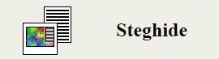

##Airport (forensics, 200p)

##PL version
`for ENG version scroll down`

Dostajemy folder z czteroma nieoznaczonymi zdjęciami lotnisk i następującym pngem:

>Steghide is a steganography program that is able to hide data in various kinds of image- and audio-files.

Próbujemy uruchomić program na jpgu (na pngach niczego nie wykrywa) i dostajemy zapytanie o hasło.

Warto byłoby dowiedzieć się, co to za lotniska, używając google images dostajemy taką oto listę:
  * José Martí International Airport
  * Hong Kong International Airport
  * Los Angeles International Airport
  * Toronto Pearson International Airport

Jak możnaby je połączyć w jedną całość? A na przykłąd używając kodów lotnisk :)

Odpalamy program i jako hasło wklepujemy `HAVHKGLAXYYZ`, dostajemy flagę iH4t3A1rp0rt5

#ENG version

We are give a folder with four undescribed airport photos and an icon:

>Steghide is a steganography program that is able to hide data in various kinds of image- and audio-files.

We try to run steghide on the jpg file (png returns no results) but we are asked for a password.

It's time we found out what theese airport are, using google images we get following list:
  * José Martí International Airport
  * Hong Kong International Airport
  * Los Angeles International Airport
  * Toronto Pearson International Airport

How can we merge them into a password? Let's try airport codes!

We run steghide again and this time input `HAVHKGLAXYYZ`, the program runs for some time and returns iH4t3A1rp0rt5, hooray!
