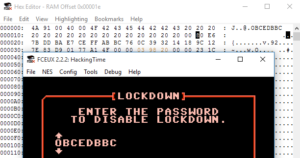

## Hacking Time (re, 200p, 180 solves)

### PL
[ENG](#eng-version)

> We’re getting a transmission from someone in the past, find out what he wants.  
> [HackingTime.nes](HackingTime.nes)

Pobieramy udostępniony plik, który okazuje się obrazem aplikacji na Nintendo Entertainment System, 8-bitową konsolę, którą każdy zna i lubi :). Zadanie polega na podaniu hasła, które jednocześnie będzie flagą w tym zadaniu.

Zamiast statycznie analizować to zadanie, spróbujemy rozwiązać je "na żywo" w emulatorze FCEUX z jego zintegrowanym debuggerem. Krótka eksperymentacja pozwala nam stwierdzić, że sprawdzenie hasła oprócz zmiany samego bufora z hasłem w pamięci modyfikuje nam również bajty od offsetu `0x1e`.



Ustawiamy w takim razie read breakpoint na tym adresie i przy ponownej próbie sprawdzenia hasła trafiamy na następujący fragment:

```gas
 00:8337:A0 00     LDY #$00
>00:8339:B9 1E 00  LDA $001E,Y @ $001E = #$80
 00:833C:D0 08     BNE $8346
 00:833E:C8        INY
 00:833F:C0 18     CPY #$18
 00:8341:D0 F6     BNE $8339
 00:8343:A9 01     LDA #$01
 00:8345:60        RTS -----------------------------------------
 00:8346:A9 00     LDA #$00
 00:8348:60        RTS -----------------------------------------
 ```

Jest to pętla, która sprawdza nam `0x18` znaków zaczynając od naszego offsetu `0x1e`. Jeżeli któryś z bajtów nie wynosi 0 to funkcja wychodzi z wartością 0, a w przeciwnym wypadku z 1. Bezpośrednia zmiana IP na instrukcję spod `0x8343` i wznowienie programu potwierdza nam komunikatem o sukcesie, że to jest celem zadania. Musimy zatem wprowadzić takie hasło by bajty spod offsetu `0x1e` wynosiły same zera. Możemy dokonać statycznej analizy albo literka po literce zbruteforce'ować nasze hasło (a to dzięki temu, że zmiana następnych liter nie zmienia nam bajtów poprzednich). Postanowiliśmy skorzystać z tej drugiej metody.

Hasłem oraz flagą okazał się ciąg: `NOHACK4UXWRATHOFKFUHRERX`. Cała aplikacja jest oczywiście zabawnym nawiązaniem do filmu "Kung Fury" :)!

### ENG version

> We’re getting a transmission from someone in the past, find out what he wants.  
> [HackingTime.nes](HackingTime.nes)

We download the file, which turns out to be a image of an application for Nintendo Entertainment System, 8-bit console which everyone knows and likes :). The task was to get the password, which is also a flag.


Instead of doing a static code analysis, we try to solve it "live" in FCEUX emulator with integrated debugger. Short experimentation enables us to notice that password check, apart from changing the password buffer itself, modified also some bytes from offset `0x1e`.


So we place a read breakpoint at this address and at the next password check we find this fragment:

```gas
 00:8337:A0 00     LDY #$00
>00:8339:B9 1E 00  LDA $001E,Y @ $001E = #$80
 00:833C:D0 08     BNE $8346
 00:833E:C8        INY
 00:833F:C0 18     CPY #$18
 00:8341:D0 F6     BNE $8339
 00:8343:A9 01     LDA #$01
 00:8345:60        RTS -----------------------------------------
 00:8346:A9 00     LDA #$00
 00:8348:60        RTS -----------------------------------------
 ```

It's a loop which checks `0x18` characters starting with the offset `0x1e`. If any of the bytes is not 0 the function returns with 0, otherwise it returns with 1. Changing IP manually for the instruction at `0x8343` and resuming the execution ensures us with a success dialog that this is the point of the task. We have to put there a password so that bytes from offset `0x1e` are all zeroes. We could do a static code analysis or try to brute force the password character by character (mostly because changing next characters does not affect previous bytes). We decided to do the latter.

The password and the flag was `NOHACK4UXWRATHOFKFUHRERX`. Whole application is, of course, connected with the movie "Kung Fury" :)!