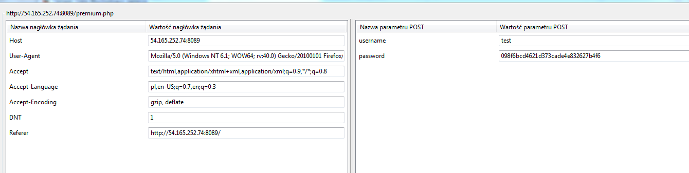
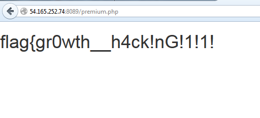

## Lawn Care Simulator (web, 200p, 450 solves)
`http://54.165.252.74:8089/`

### PL Version
`for ENG version scroll down`

Zadanie polegało na zalogowaniu się do konta premium w internetowym symulatorze hodowania trawy.
Standardowe próby wykonania SQL Injection na polach formularza nie przyniosły efektów, ale pozwoliły zaobserwować, że dane wpisane w pole z hasłem są hashowane po stronie przeglądarki jeszcze przed wysłaniem. 

Zajęliśmy się więc podmienianiem parametrów w formularzu po operacji hashowania. Co prawda pole z hasłem po stronie przeglądarki było sprawdzane aby upewnić się że nie jest puste, ale za pomocą Tamper Data sprawdziliśmy co się stanie jeśli wyślemy puste hasło dla losowego użytkownika...

Tym samym zupełnie przypadkiem ominęliśmy praktycznie wszystkie pułapki zastawione przez autorów zadania i nie musieliśmy poświęcać cennego czasu na analizę kodu strony (do którego można było uzyskać dostęp poprzez link w źródle strony). Późniejsza analiza pozwoliła stwierdzić, że przypadkiem wykorzystaliśmy faktyczną lukę w skrypcie, nie tą zamierzoną przez autorów zadania :)

### ENG Version

The task was to log-in on a premium account in an internet lawn care simulator.
Standard approach with SQLInjection on form fields yielded no results, however we noticed that data from password field are hashed on webbrowser side before sending to the server.

Therefore we tried substituting fields values after the hashing operation. While the client-side verification was checking for empty password field, we could easily change the request parameters with Tampter Data and we checked what will happen if we send empty password for a random user...

By doing this we basically went around all the traps set-up by authors of this task and we didn't have to spend out precious time on the analysis of PHP code of this website (which could be accessed by following a link in the source). Later analysis revealed that we exploited an actual vulnerability of the script, not the one the authors intended us to use :)