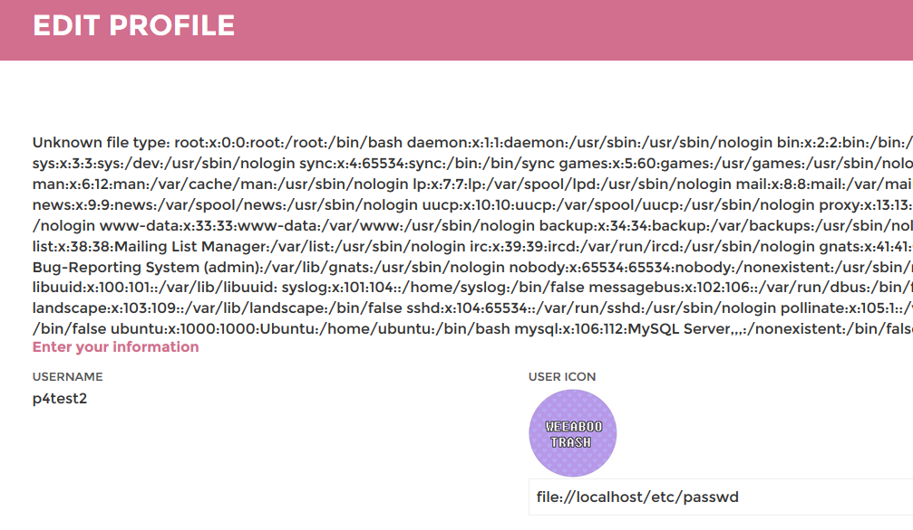
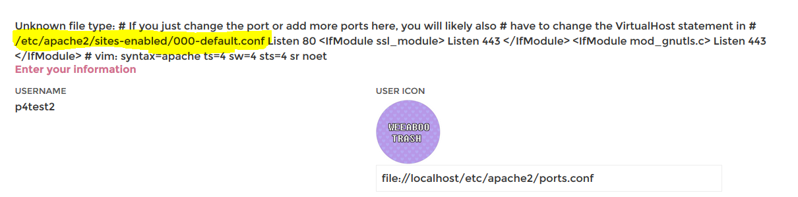
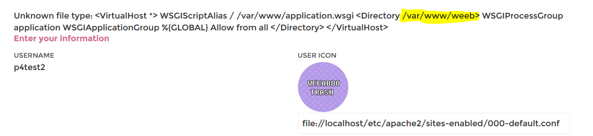

## Weebdate (web, 500p, 69 solves)

### PL Version
`for ENG version scroll down`

Zadanie polegało na zdobyciu hasła oraz sekretnego kodu `TOTP` wykorzystywanego do podwójnej autentykacji dla użytkownika pewnego serwisu internetowego. Zadania nie udało nam sie finalnie rozwiązać, ale jedynie z braku czasu (znaleźliśmy kluczową podatność na kilka minut przed końcem CTFa). Niemniej kilkanaście minut więcej wystarczyłoby na uporanie się z zadaniem, bo wiedzieliśmy jak należy to zrobić. To co udało nam się ustalić jest na tyle wartościowe, że postanowiliśmy to opisać.

Hasło użytkownika można było uzyskać za pomocą słownikowego brute-force, ponieważ strona informowała nas czy niepoprawne podaliśmy hasło czy kod weryfikujący. W efekcie nawet bez kodu mogliśmy spokojnie brute-forceować samo hasło.
Problemem był sekretny kod pozwalający na generowanie kodów TOTP. Udało nam się zaobserwować, że kod jest generowany na bazie pierwszych 4 znaków loginu oraz adresu IP, ale nie wiedzieliśmy nadal w jaki sposób powstaje kod. Nie wiedzieliśmy także skąd wziąć adres IP użytkownika (niemniej przypuszczaliśmy że tylko fragment adresu IP jest brany pod uwagę i możliwe że tu także będzie się dało coś wykonać prostym brute-force).

W zadaniu szukaliśmy podatności dość długo analizując wszelkie aspekty jakie przychodziły nam do głowy - SQL Injection, Cookies, XSS...
Kluczem do zadania okazał się formularz edycji naszego profilu gdzie mogliśmy podać link do pliku z awatarem. Serwer próbował otworzyć ten plik w trakcie zapisywania zmian w profilu ale nie obsługiwał błędów w sposób poprawny, niewidoczny dla użytkownika. 
W efekcie podanie niepoprawnego URLa wyświetlało nam kilka cennych informacji - językiem w którym napisana była strona był `python` a awatar był otwierany przez `urllib.urlopen()`. Dodatkowo podanie ścieżki do pliku który nie jest obrazkiem powodowało wyświetlenie `zawartości tego pliku w logu błędu`.
Istotnym aspektem funkcji urllib.urlopen() jest to, że można ona otwierać nie tylko pliki zdalne ale także `lokalne`. 
Pierwsze próby były nieudane ponieważ próba otwarcia pliku z lokalnej ścieżki kończyła sie błędem. Okazało się, że server wymaga podania parametru `netpath`, więc dodajemy `localhost` do naszej lokalnej ścieżki i próbujemy otworzyć:
`file://localhost/etc/passwd`



Operacja zakończyła się powodzeniem więc wiedzieliśmy, że mamy możliwość czytania plików na serwerze. Zaczęliśmy od sprawdzenia gdzie jest uruchomiona aplikacja którą sie zajmujemy. Czytanie:
`file://localhost/proc/self/cmdline`
Pozwoliło stwierdzić że jest to `/usr/sbin/apache2-kstart`
Przeanalizowaliśmy więc pliki konfiguracyjne:
`file://localhost/etc/apache2/ports.conf`



`file://localhost/etc/apache2/sites-enabled/000-default.conf`



Co pozwoliło nam poznać ścieżkę do aplikacji. Następnie wyświetliśmy zawartość pliku `server.py` który wykorzystywał plik `utils.py`
`file://localhost/var/www/weeb/server.py`
`file://localhost/var/www/weeb/utils.py`

W pliku `utils.py` znajdujemy brakujący element układanki:
```
def generate_seed(username, ip_address): 
	return int(struct.unpack("I", socket.inet_aton(ip_address))[0]) + struct.unpack("I", username[:4].ljust(4,"0"))[0] 

def get_totp_key(seed): 
	random.seed(seed) return pyotp.random_base32(16, random)
```
Widzimy, że nasze przypuszczenia były słuszne - pod uwagę branę są 4 pierwsze litery loginu oraz pierwszy oktet adresu IP. Ale widzimy także w jaki sposób te dane są wykorzystywane - oba elementy są rzutowane do intów i dodawane a następnie wykorzystywane jako seed dla randoma.
Niestety na tym etapie skończył się nam czas. Niemniej rozwiązanie z tego miejsca jest już zupełnie oczywiste:
Znamy login ofiary a jeden oktet IP ma zaledwie 255 potencjalnych wartości. Możemy więc wygenerować wszytskie potencjalne sekretne klucze a następnie wykorzystać je w połączeniu z poznanym hasłem do brute-forcowania formularza logowania - końcu testujemy zaledwie 255 możliwości.

### ENG Version

The challenge was to find a password and a secret `TOTP` code for two factor authentication of a certain dating website. We didn't manage to get flag for this task, however only for the lack of time (we found the key vulnerability just a couple of minutes before the CTF ended). Nevertheless we could have done it with some more time, because we knew exacly how to proceed. We consider work on this task worth of a write-up.

The password could have been extracted using a dictionary brute-force approach since the website was informing us if the password for incorrect or if the user&pass where correct if the verification code was wrong. This means you could simply brute-force only password to begin with.
The real issue was to get the secret for TOTP code generation. We managed to notice that the code takes into consideration only first 4 letters of login and the IP address of the user but we didn't know how those values become the secret. We also didn't know how to get the IP address of the user (we did suspect that only a part of the IP is used and maybe this could be brute-forced as well).

We tried for a long time to find some vulnerabilities using standard approach - SQL Injection, Cookies analysis, XSS...
The key to the task was the form for editing user profile, where we could supply a link to a picture with avatar. The server after submitting a new avatar link was trying to access the file and the error handling was not done properly - user could see part of the error message.
This enables us to realise that the server is running on `python` and that avatar is opened using `urllib.urlopen()`. Supplying a path to a non-picture file was also displaying `contents of the file in the error message`.
It is worth noting that urllib.urlopen() function can be used to open both remote and `local files`.
First attempts were unsuccessful and we got an error. It seemed that server is validating if `netpath` parameter is specified to make sure that someone is not opening a local file. So we supply the `localhost` parameter and try again with:
`file://localhost/etc/passwd`


This operation was finally successful and we were sure we can read files on the server. We started off with checking what are we actually runing:
`file://localhost/proc/self/cmdline`
This leads us to realise we are running on `/usr/sbin/apache2-kstart`
So we analysed apache config files:
`file://localhost/etc/apache2/ports.conf`


`file://localhost/etc/apache2/sites-enabled/000-default.conf`


Which gave us the location for the application we are interested in. Next we dump `server.py` file which was importing `utils.py`
`file://localhost/var/www/weeb/server.py`
`file://localhost/var/www/weeb/utils.py`

And in `utils.py` we find the missing piece to our problem:
```
def generate_seed(username, ip_address): 
	return int(struct.unpack("I", socket.inet_aton(ip_address))[0]) + struct.unpack("I", username[:4].ljust(4,"0"))[0] 

def get_totp_key(seed): 
	random.seed(seed) return pyotp.random_base32(16, random)
```
We can see that our assumptions were correct - only first 4 letters of the login are taken into consideration and first octet of IP address. We can also finally see how those data are used - casted to int, added and used as seed for random.
Unfortunately this was the moment when our time run out. Still, from this point the rest of the solution is quite clear:
We know the login and single IP octet has only 255 values. We can simply generate all potential secrets and brute-force the login using our brute-forced password.