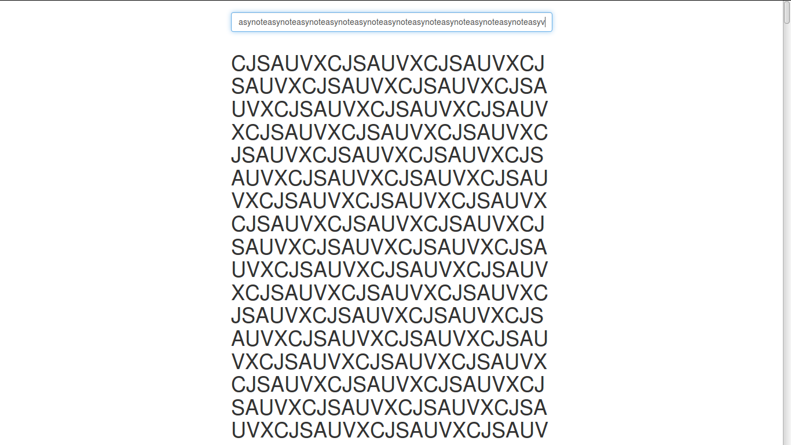

# Writeup CSAW CTF 2015

Uczestniczyliśmy (msm, Rev, Shalom, other019 i nazywam) w MMA CTF, i znowu spróbujemy opisać zadania z którymi walczyliśmy (a przynajmniej te, które pokonaliśmy).

insert lanie_wody into writeup;

Ogólne wrażnia:
Konkurs miał kilka ciekawych zadań, ale jednak troche odbiegał od tego czego można oczekiwać po ctf'ie z prawdziwego zdarzenia. Niektóre zadania opierały się na zgadywaniu tego co autorzy mieli na myśli, szczególnie w zadaniu notesy i airport.

insert lanie_wody into writeup;

A teraz opisy zadań po kolei.

# Tytuł zadania (Kategoria, [ilość punktów]p, [ilość rozwiązań] solves)

Opis zadania opis zadania opis zadania opis zadania \
opis zadania opis zadania opis zadania opis zadania \
opis zadania opis zadania opis zadania opis zadania \
opis zadania opis zadania opis zadania opis zadania \
opis zadania opis zadania

# lista zadań do opisania:

* web 100 K_{Stairs}
* web 200 Lawn Care Simulator
* exploit 100 precision
* exploit 300 FTP 2
* exploit 400 memeshop
* exploit 500 rhinoxorus
* crypto 50 ones_and_zer0es
* crypto 50 whiter0se
* crypto 40 zer0-day
* ~~crypto 100 notesy~~
* reversing 200 Hacking Time
* reversing 300 FTP
* reversing 500 wyvern
* ~~forensics 100 Keep Calm and CTF~~
* forensics 100 Transfer
* ~~forensics 100 Flash~~
* forensics 150 pcapin
* forensics 200 airport
* forensics 400 sharpturn
* recon 100 Julian Cohen
* recon 100 Alexander Taylor
* trivia 100 Trivia 1
* trivia 100 Trivia 2
* trivia 100 Trivia 3
* trivia 100 Trivia 4
* trivia 100 Trivia 5
* trivia 100 Math aside, we are all black hats Now

## Flash (forensics, 100p, 809 solves)
Treść zadania brzmi `We were able to grab an image of a harddrive. Find out what's on it.`. Dostajemy 128MB obraz dysku. Nie myślałem nawet o tym, żeby go montować, bo spodziewalem sie pustego dysku (pisząc writeup pokusiłem się o to i się nieźle zdziwiłem :P ). Pierwszą rzeczą jaka przyszła mi do głowy był `photorec`, który nie znalazł nic ciekawego, dlatego wykonałem `strings flash_c8429a430278283c0e571baebca3d139.img | grep flag`.
Dostajemy flagę `flag{b3l0w_th3_r4dar}`.
## Keep Calm and CTF (forensics, 100p, 1064 solves)
Treść brzmi `My friend sends me pictures before every ctf. He told me this one was special.
Note: this flag doesn't follow the "flag{}" format`
Oprucz tego dostajemy dość przyjemnie wyglądający obrazek.
Pierwszą rzeczą jaką robimy w takich sytuacjach jest przejrzenie hexdumpu, tak na wszelki wypadek. Może na końcu jest dopisany jeszcze jeden plik np. .zip albo .png z flagą. Ja robie to poleceniem `xxd img.jpg | less`.
```
0000000: ffd8 ffe0 0010 4a46 4946 0001 0101 0048  ......JFIF.....H
0000010: 0048 0000 ffe1 0058 4578 6966 0000 4d4d  .H.....XExif..MM
0000020: 002a 0000 0008 0003 0128 0003 0000 0001  .*.......(......
0000030: 0002 0000 0213 0003 0000 0001 0001 0000  ................
0000040: 8298 0002 0000 001d 0000 0032 0000 0000  ...........2....
0000050: 6831 6431 6e67 5f69 6e5f 346c 6d30 7374  h1d1ng_in_4lm0st
0000060: 5f70 6c61 316e 5f73 6967 6837 0000 ffdb  _pla1n_sigh7....
```
I mamy następną flagę.
## Notesy (crypto, 100p, 1064 solves)
`http://54.152.6.70/
The flag is not in the flag{} format.
HINT: If you have the ability to encrypt and decrypt, what do you think the flag is?
HINT: https://www.youtube.com/watch?v=68BjP5f0ccE`

Pod wskazanym adresem znajduje się strona z textboxem który szyfruje wpisany text.

Już wiecie co jest flagą? My też nie wiedzieliśmy jak ją wydobyć… przez 20 godzin… trzymając ją w rękach….

Strona robiła zapytanie get do skryptu encrypt.php, który jako parametr m przyjmował wiadomość do zaszyfrowania.

Już po godzinie stwierdziliśmy, że zależność między literkami przedstawia się następująco
```
ABCDEFGHIJKLMNOPQRSTUVWXYZ
UNHMAQWZIDYPRCJKBGVSLOETXF
```

Próbowaliśmy naprawdę nieschematycznego myślenia ale nic nie pomogło. Dopiero pierwsza wskazówka przyniosła nam myśl, że flagą musi być klucz, a z racji, że to szyfr przestawieniowy kluczem będzie `UNHMAQWZIDYPRCJKBGVSLOETXF`. Najbardziej fustrujące zadanie z jakim się ostatnio spotkałem.
# Zakończenie

insert into writeup(content) values lanie_wody;

Zachęcamy do komentarzy/pytań/czegokolwiek.
