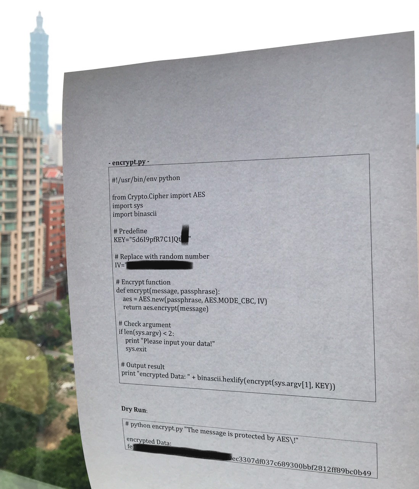

## AES (crypto, 200p)

### PL Version
`for ENG version scroll down`

Zadanie polegało na odzyskaniu wektora inicjalizacyjnego IV dla szyfru AES na podstawie znajomości wiadomości, części klucza oraz części zaszyfrowanego tekstu. Dane były przekazane za pomocą pomazanego zdjęcia kodu:

Wynika z nich że dysponujemy:

* Częścią klucza `5d6I9pfR7C1J` z brakującymi ostatnimi 2 bajtami
* Wiadomością `The message is protected by AES!`
* Fragmentem zaszyfrowanego tekstu `fe000000000000000000000000009ec3307df037c689300bbf2812ff89bc0b49` (przez 0 oznaczam padding nieznanych elementów)

Pierwszy krokiem, po zapoznaniu się z zasadą działania szyfrowania AES w zadanej konfiguracji, było odzyskanie całego klucza. Warto zauważyć że nasza wiadomość stanowi 2 bloki dla szyfru, każdy po 16 bajtów:

	The message is p
	rotected by AES!

A szyfrowanie odbywa się blokami, więc nasz zaszyfrowany tekst także możemy podzielić na bloki:

	fe000000000000000000000000009ec3
	307df037c689300bbf2812ff89bc0b49
		
Do szyfrowania pierwszego bloku AES używa wektora IV oraz klucza, ale do szyfrowania kolejnego bloku użyty jest tylko poprzedni zaszyfrowany blok oraz klucz. Dodatkowo szyfrowane odbywa się bajt po bajcie co oznacza, że deszyfrowanie 1 bajtu 2 bloku wymaga znajomości jedynie klucza oraz 1 bajtu 1 bloku. 

To oznacza, że dla danych:

	XX000000000000000000000000000000
	YY000000000000000000000000000000

Deszyfrowanie za pomocą poprawnego klucza pozwoli uzyskać poprawnie odszyfrowany 16 bajt wiadomości (licząc od 0), niezależnie od wektora IV.
W związku z tym próbujemy przetestować wszystkie możliwości ostatnich 2 znaków klucza, sprawdzając dla których deszyfrowany tekst zawiera odpowiednie wartości w drugim bloku na pozycjach na których w pierwszym bloku mamy ustawione poprawne wartości (pierwszy bajt oraz dwa ostatnie):

	KEY = "5d6I9pfR7C1J"
	IV = "0000000000000000"
	
	def valid_key(correct_bytes, decrypted):
    for byte_tuple in correct_bytes:
        if decrypted[byte_tuple[0]] != byte_tuple[1]:
            return False
    return True
	
	def break_key(key_prefix, encoded_message_part, correct_bytes):
		final_key = ""
		encrypted = encoded_message_part
		for missing1 in range(0, 256):
			key = key_prefix + chr(missing1)
			for missing2 in range(0, 256):
				real_key = key + chr(missing2)
				decrypted = decrypt(real_key, IV, binascii.unhexlify(encrypted))
				if valid_key(correct_bytes, decrypted):
					final_key = real_key
		return final_key

	real_key = break_key(KEY, "fe000000000000000000000000009ec3307df037c689300bbf2812ff89bc0b49", [(16, "r"), (30, "S"), (31, "!")])

Uzyskujemy w ten sposób klucz: `5d6I9pfR7C1JQt`

Wektor IV którego poszukujemy służy do szyfrowania 1 bloku i opiera się na podobnej zasadzie jak szyfrowanie kolejnych bloków przedstawione wyżej - pierwszy bajt pierwszego bloku zależy od pierwszego bajtu wektora IV, drugi od drugiego itd. Żeby móc w takim razie odzyskać wektor IV potrzebujemy znać pierwszy blok zaszyfrowanej wiadomości. W tym celu stosujemy zabieg identyczny jak powyżej, ale tym razem próbujemy dopasować kolejne bajty zaszyfrowanego pierwszego bloku wiadomości, sprawdzając kiedy deszyfrowanie daje nam poprawnie deszyfrowany bajt z drugiego bloku:

	IV = "0000000000000000"
	message = "The message is protected by AES!"
	ciphertext = ""
	encrypted = "00000000000000000000000000000000307df037c689300bbf2812ff89bc0b49"
	data = binascii.unhexlify(encrypted)
	for position in range(16): # going through first block
		encrypted_sub = list(data)
		for missing in range(0, 256):
			encrypted_sub[position] = chr(missing) #encrypted message with single byte in first block set to tested value
			decrypted = decrypt(real_key, IV, "".join(encrypted_sub))
			if decrypted[position + 16] == message[position + 16]:
				print("%d %d" % (position, missing))
				print(decrypted[position + 16])
				ciphertext += chr(missing)
	print(binascii.hexlify(ciphertext))

Co daje nam: `fe1199011d45c87d10e9e842c1949ec3` i jest to pierwszy zakodowany blok.

Ostatnim krokiem jest odzyskanie wektora IV. Robimy to identycznym schematem, tym razem testujemy kolejne bajty wektora IV sprawdzając kiedy deszyfrowanie daje nam poprawnie odszyfrowane wartości z 1 bloku:

	iv_result = ""
	encrypted = "fe1199011d45c87d10e9e842c1949ec3"
	for position in range(16):
		iv = list(IV)
		for missing in range(0, 256):
			iv[position] = chr(missing) # IV with single byte set to tested value
			decrypted = decrypt(real_key, "".join(iv), binascii.unhexlify(encrypted))
			if decrypted[position] == message[position]:
				print("%d %d" % (position, missing))
				iv_result += chr(missing)
	print(iv_result)

Co daje nam `Key:rVFvN9KLeYr6` więc zgodnie z treścią zadania flagą jest `TMCTF{rVFvN9KLeYr6}`

### ENG Version

The task was to recover initialization vector IV for AES cipher based on knowledge of the message, part of the key and part of ciphertext. The data were proviede as a photo of crossed-out code:

From this we can get:

* Part of the key: `5d6I9pfR7C1J` with missing 2 bytes
* Message: `The message is protected by AES!`
* Part of ciphertext: `fe000000000000000000000000009ec3307df037c689300bbf2812ff89bc0b49` (0s in the first block are missing part)

First step, after reading about AES in given configuration, was to extract the whole ciper key. It is worth noting that our message is separated into 2 blocks for this cipher, each with 16 bytes:

	The message is p
	rotected by AES!

And the cipher works on blocks, so our ciphertext can also be split into blocks:

	fe000000000000000000000000009ec3
	307df037c689300bbf2812ff89bc0b49
		
For encoding the first block AES uses IV vector and the key, but to encode second block only previous block and the key is used. On top of that the cipher works byte-by-byte which means that deciphering 1 byte of 2 block requires knowledge only of the key and of the 1 byte of 1 block.

It means that for input:

	XX000000000000000000000000000000
	YY000000000000000000000000000000

Deciphering usign a proper key will give us properly decoded 16th byte (counting from 0), regardless of IV vector used.
Therefore, we test all possible values for the missing 2 key characters, testing for which of them the decipered text has proper values in the second block on the positions where in the first block we have proper values (first byte and last two bytes):

	KEY = "5d6I9pfR7C1J"
	IV = "0000000000000000"
	
	def valid_key(correct_bytes, decrypted):
    for byte_tuple in correct_bytes:
        if decrypted[byte_tuple[0]] != byte_tuple[1]:
            return False
    return True
	
	def break_key(key_prefix, encoded_message_part, correct_bytes):
		final_key = ""
		encrypted = encoded_message_part
		for missing1 in range(0, 256):
			key = key_prefix + chr(missing1)
			for missing2 in range(0, 256):
				real_key = key + chr(missing2)
				decrypted = decrypt(real_key, IV, binascii.unhexlify(encrypted))
				if valid_key(correct_bytes, decrypted):
					final_key = real_key
		return final_key

	real_key = break_key(KEY, "fe000000000000000000000000009ec3307df037c689300bbf2812ff89bc0b49", [(16, "r"), (30, "S"), (31, "!")])

This way we get the key: `5d6I9pfR7C1JQt`

IV vector we are looking for is used to encode 1 block and it is used on the same principle as encoding next blocks decribed above - encoded 1 byte of 1 block depends on 1 byte of 1 block of IV vector, 2 depends on 2 etc. Therefore, to be able to get the IV vector we need to know the whole first encoded block. To get it we use a very similar approach as the one we used to get the key, but this time we test bytes of the encoded 1 block, checking which value after decoding gives us properly decoded byte from 2 block:

	IV = "0000000000000000"
	message = "The message is protected by AES!"
	ciphertext = ""
	encrypted = "00000000000000000000000000000000307df037c689300bbf2812ff89bc0b49"
	data = binascii.unhexlify(encrypted)
	for position in range(16): # going through first block
		encrypted_sub = list(data)
		for missing in range(0, 256):
			encrypted_sub[position] = chr(missing) #encrypted message with single byte in first block set to tested value
			decrypted = decrypt(real_key, IV, "".join(encrypted_sub))
			if decrypted[position + 16] == message[position + 16]:
				print("%d %d" % (position, missing))
				print(decrypted[position + 16])
				ciphertext += chr(missing)
	print(binascii.hexlify(ciphertext))

Which gives us: `fe1199011d45c87d10e9e842c1949ec3` and this is the encoded 1 block.

Last step is to recover IV vector. We use the same principle, this time testing IV vector bytes, checking when deciphering gives us properly decoded values from 1 block:

	iv_result = ""
	encrypted = "fe1199011d45c87d10e9e842c1949ec3"
	for position in range(16):
		iv = list(IV)
		for missing in range(0, 256):
			iv[position] = chr(missing) # IV with single byte set to tested value
			decrypted = decrypt(real_key, "".join(iv), binascii.unhexlify(encrypted))
			if decrypted[position] == message[position]:
				print("%d %d" % (position, missing))
				iv_result += chr(missing)
	print(iv_result)

Which gives us: `Key:rVFvN9KLeYr6` so according to the task rules the flag is `TMCTF{rVFvN9KLeYr6}`
