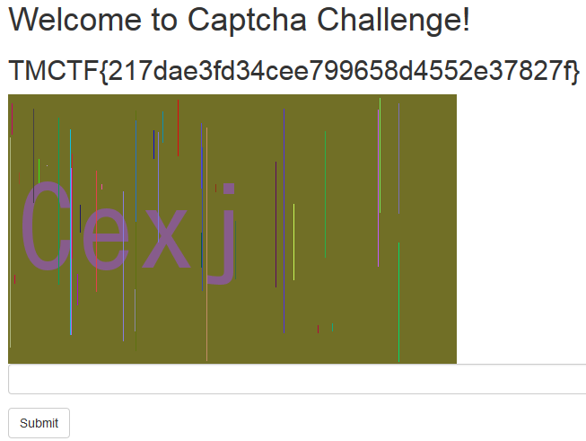

## Captcha (ppc/Misc, 300p)

### PL Version
`for ENG version scroll down`

Zadanie polegało na rozwiązaniu 500 kodów captcha poprawnie pod rząd, przy czym można było pomijać których nie chcieliśmy rozwiązywać captche. Serwowane kody miały postać:

W celu rozwiązania zadania napisaliśmy skrypt w pythonie korzystając z Python Images Library, pytesseract oraz Tesseracta. Niemniej wymóg 500 bezbłędnych rozwiązań pod rząd wymagał zastosowania pewnych heurystyk aby ocenić czy zdekodowane przez nas słowo jest aby na pewno poprawne.

Cały skrypt dostępy jest [tutaj](captcha.py).

Działanie skryptu:
Na początek usuwane są różnokolorowe pionowe kreski. W tym celu:

* Pobieramy rozkład kolorów dla pikseli i odszukujemy dwa dominujące kolory - wypełnienie oraz tekst captchy (pomijamy kolor biały)
* Skanujemy obraz i każdy piksel innego koloru niż 2 dominujące jest zamieniany na dominujący. Jeśli piksel sąsiaduje z pikselami o kolorze tekstu wybieramy ten kolor, jeśli nie używamy koloru wypełnienia.

	def get_filling(pixels, i, j, best_colors, x_range):
		left = pixels[(i - 1) % x_range, j]
		right = pixels[(i + 1) % x_range, j]
		if left in best_colors and left != best_colors[0]:
			return left
		elif right in best_colors and right != best_colors[0]:
			return right
		else:
			return best_colors[0]

	def fix_colors(im):
		colors_distribution = im.getcolors()
		ordered = sorted(colors_distribution, key=lambda x: x[0], reverse=True)
		best_colors = [color[1] for color in ordered]
		if (255, 255, 255) in best_colors:
			best_colors.remove((255, 255, 255))
		best_colors = best_colors[:2]
		pixels = im.load()
		for i in range(im.size[0]):
			for j in range(im.size[1]):
				color = pixels[i, j]
				if color not in best_colors:
					pixels[i, j] = get_filling(pixels, i, j, best_colors, im.size[0])
		return best_colors[0]

W efekcie z powyższego obrazu uzyskujemy:

Następnym krokiem jest zamiana kolorów obrazu w celu zwiększenia kontrastu i ułatwienia pracy OCRa. Skanujemy obraz i każdy piksel o kolorze wypełnienia zamieniamy na biały a piksel i kolorze tekstu na czarny. 

	def black_and_white(im, filling):
		black = (0, 0, 0)
		white = (255, 255, 255)
		pixels = im.load()
		for i in range(im.size[0]):
			for j in range(im.size[1]):
				color = pixels[i, j]
				if color == filling:
					pixels[i, j] = white
				else:
					pixels[i, j] = black

W efekcie uzyskujemy:

Tak przygotowany obraz skanujemy za pomocą Tesseracta a potem wynik oceniamy za pomocą heurystyki:

	def on_blacklist(text):
		if len(text) != 4:
			return True
		blacklisted = ["I", "0", "O", "Z", "Q", "2", "S", "3", "G", "9", "1", "l", "C", "X", "V", "B", "8", "U"]
		for character in blacklisted:
			if character in text:
				return True
		matcher = re.match("[a-zA-Z0-9]+", text)
		if matcher is None or len(matcher.group()) != 4:
			return True
		return False

Odrzucamy wszystkie rozwiązania które nie mają 4 symboli z zakresu `[a-zA-Z0-9]` bo wiemy że wszystkie captche powinny mieć 4 symbole alfanumeryczne. Dodatkowo odrzucamy wszystkie rozwiązania zawierające ryzykowne symbole:

* Tesseract często myli ze sobą: `O0Q`, `2Z`, `B8S`, `Il1`, `6G`, `9g`
* Tesseract często niepopranie rozpoznaje wielkość liter - jeśli podaje małą literę to jest ok, ale jeśli podaje dużą literę nie możemy mieć pewności. Odrzucamy więc wszystkie symbole których mała i duża wersja jest zbyt podobna: `XVUCSZO`

W ten sposób uzyskujemy solver ze 100% skutecznością, chociaż działa on bardzo wolno, bo odrzuca 90% testowanych kodów captcha.
Po rozwiązaniu wszystkich 500 przykładów dostajemy:

### ENG Version

The challenge was to correctly solve 500 consecutive captcha codes, with the ability to skip codes we didn't want to solve. Codes looked like this:

In order to solve this we prepared a python script using Python Images Library, pytesseract and Tesseracta. However the 500 consecutive correct answers required some special processing and heuristics to score the solution and decide if it's correct or not.

Whole script is available [here](captcha.py).

The script works as follows:
First we remove the colorful vertical lines. For this we:

* Get the color distribution of image pixels and we get the two dominant colors - filling and text (skipping white)
* We scan the picture and if a pixel has different color than the 2 dominants, we change it to dominant. If it is next to text-color pixel we choose text-color, otherwise we use filling color.

	def get_filling(pixels, i, j, best_colors, x_range):
		left = pixels[(i - 1) % x_range, j]
		right = pixels[(i + 1) % x_range, j]
		if left in best_colors and left != best_colors[0]:
			return left
		elif right in best_colors and right != best_colors[0]:
			return right
		else:
			return best_colors[0]

	def fix_colors(im):
		colors_distribution = im.getcolors()
		ordered = sorted(colors_distribution, key=lambda x: x[0], reverse=True)
		best_colors = [color[1] for color in ordered]
		if (255, 255, 255) in best_colors:
			best_colors.remove((255, 255, 255))
		best_colors = best_colors[:2]
		pixels = im.load()
		for i in range(im.size[0]):
			for j in range(im.size[1]):
				color = pixels[i, j]
				if color not in best_colors:
					pixels[i, j] = get_filling(pixels, i, j, best_colors, im.size[0])
		return best_colors[0]

With this code, from the catpcha above we get:

Next step is changing the colors to raise contrast and make life easier for OCR engine. We scan the picture and the color of all filling-color pixels change to white and text-color to black.

	def black_and_white(im, filling):
		black = (0, 0, 0)
		white = (255, 255, 255)
		pixels = im.load()
		for i in range(im.size[0]):
			for j in range(im.size[1]):
				color = pixels[i, j]
				if color == filling:
					pixels[i, j] = white
				else:
					pixels[i, j] = black

As a result we get:

Picture prepared like that we pass to Tesseract and then score the result with heuristic:

	def on_blacklist(text):
		if len(text) != 4:
			return True
		blacklisted = ["I", "0", "O", "Z", "Q", "2", "S", "3", "G", "9", "1", "l", "C", "X", "V", "B", "8", "U"]
		for character in blacklisted:
			if character in text:
				return True
		matcher = re.match("[a-zA-Z0-9]+", text)
		if matcher is None or len(matcher.group()) != 4:
			return True
		return False

We reject all solutions that doesn't have 4 symbols from `[a-zA-Z0-9]` range, since we know that all captchas should have 4 alphanumeric symbols. Additionally we reject all solutions with risky symbols:

* Tesseract mistakes sometimes: `O0Q`, `2Z`, `B8S`, `Il1`, `6G`, `9g`
* Tesseract often recognizes the letter case incorrectly - if it says there is a small letter it's fine, but if it ways it's a capital letter then we can't be sure. We reject all symbols where small and capital versions are similar: `XVUCSZO`

This way we get a 100% accuracy solver, however it works rather slowly since it rejects ~90% of tested codes.
After solving all 500 captchas we get:

