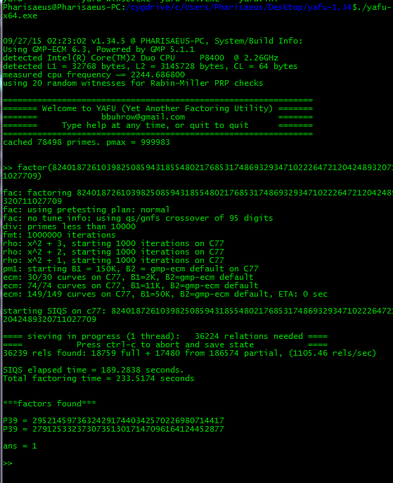

## RSA (crypto, 100p)

### PL Version
`for ENG version scroll down`

Zadanie polegało na odszyfrowaniu wiadomości szyfrowanej za pomocą RSA mając dostęp do klucza publicznego. Wiadomość to:

`kPmDFLk5b/torG53sThWwEeNm0AIpEQek0rVG3vCttc=`

A klucz:

	-----BEGIN PUBLIC KEY-----
	MDwwDQYJKoZIhvcNAQEBBQADKwAwKAIhALYtzp8lgWNXI9trGI8S8EacvuDLxdrL
	NsNuDJa26nv8AgMBAAE=
	-----END PUBLIC KEY-----

Zadanie wspomniało też, że klucz publiczny nie jest całkiem poprawny i brakuje mu jakiegoś bitu. 
Dekodujemy klucz publiczny i uzyskujemy:

	n = 82401872610398250859431855480217685317486932934710222647212042489320711027708
	e = 65537

Widzimy od razu że wartość `n` jest niepoprawna bo nie jest iloczynem 2 liczb pierwszych (dzieli się przez 4). Zamieniamy więc ostatni bit z 0 na 1 uzyskując liczbę `82401872610398250859431855480217685317486932934710222647212042489320711027709`

Klucz jest bardzo krótki - ma tylko 256 bitów co oznacza, że jest podatny na faktoryzację. Dokonujemy jej za pomocą narzędzia `yafu`:

Na tej podstawie uzyskujemy liczby `p` oraz `q` potrzebne do odtworzenia klucza prywatnego. Dokonujemy tego za pomocą rozszerzonego algorytmu Euklidesa:

	def egcd(a, b):
		u, u1 = 1, 0
		v, v1 = 0, 1
		while b:
			q = a // b
			u, u1 = u1, u - q * u1
			v, v1 = v1, v - q * v1
			a, b = b, a - q * b
		return a, u, v

    q = 295214597363242917440342570226980714417
    p = 279125332373073513017147096164124452877
    e = 65537
    n = 82401872610398250859431855480217685317486932934710222647212042489320711027709
    phi = (p - 1) * (q - 1)
    gcd, a, b = egcd(e, phi)
    d = a
    if d < 0:
        d += phi
    print("n:  " + str(d))

Mając liczbę `d` możemy teraz dokonać dekodowania wiadomości. Zamieniamy wiadomość na liczbę:

`ct = 65573899802596942877560813284504892432930279657642337826069076977341847221975`

A następnie wykonujemy:

    pt = pow(ct, d, n)
    print("pt: " + long_to_bytes(pt))
	
I uzyskujemy flagę: `TMCTF{$@!zbo4+qt9=5}`

### ENG Version

The task was to crack RSA encoded message based on provided public key. The message was:

`kPmDFLk5b/torG53sThWwEeNm0AIpEQek0rVG3vCttc=`

And the key was:

	-----BEGIN PUBLIC KEY-----
	MDwwDQYJKoZIhvcNAQEBBQADKwAwKAIhALYtzp8lgWNXI9trGI8S8EacvuDLxdrL
	NsNuDJa26nv8AgMBAAE=
	-----END PUBLIC KEY-----

The task description mentioned that there is something wrong with public key and there is a bit missing.
We decode the public key and we get:

	n = 82401872610398250859431855480217685317486932934710222647212042489320711027708
	e = 65537

We can clearly see that the `n` is incorrect since it's not a product of 2 prime numbers (it is divisible by 4). We swtich last bit from 0 to 1 and we get `82401872610398250859431855480217685317486932934710222647212042489320711027709`

The key is very short - only 256 bits so we can factor it. We do it using `yafu`:

Based on this we get `p` and `q` numbers required for private key recovery. We do this with extended euclidean algorithm:

	def egcd(a, b):
		u, u1 = 1, 0
		v, v1 = 0, 1
		while b:
			q = a // b
			u, u1 = u1, u - q * u1
			v, v1 = v1, v - q * v1
			a, b = b, a - q * b
		return a, u, v

    q = 295214597363242917440342570226980714417
    p = 279125332373073513017147096164124452877
    e = 65537
    n = 82401872610398250859431855480217685317486932934710222647212042489320711027709
    phi = (p - 1) * (q - 1)
    gcd, a, b = egcd(e, phi)
    d = a
    if d < 0:
        d += phi
    print("n:  " + str(d))

With the `d` number we can now decode the message. We change the message into a number:

`ct = 65573899802596942877560813284504892432930279657642337826069076977341847221975`

Execute:

    pt = pow(ct, d, n)
    print("pt: " + long_to_bytes(pt))
	
And get the flag: `TMCTF{$@!zbo4+qt9=5}`