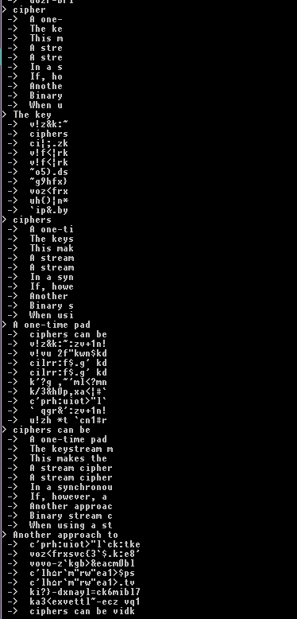

## Crypto 50 (crypto, 50p)

Bardzo przyjemne (dla autora tego writeupa) zadanie. Dostajemy 10 tekstów zaszyfrowanych tym samym stream cipher (z tym samym IV/kluczem), i mamy za zadanie rozszyfrować 11.

Teksty w pliku [input.txt](input.txt)

Orientujemy się od razu, że to sytuacja podobna do tego gdy wszystkie teksty zostały zaszyfrowane tym samym one time padem. A na to są sposoby.

Oczywiście jeden sposób to napisanie masę skomplikowanego kodu bruteforcującego różne możliwości i wybierający najlepszy plaintext (np. taki który mieści sie w wymaganym charsecie). To rozwiązanie dobre do specjalistycznych zastosowań/mechanicznego łamania, ale my mamy znacznie _zabawniejszy_ sposób, do zapisania w kilkunastu linijkach pythona:

    dat = open('input.txt').readlines()
    dat = [x.strip().decode('hex') for x in dat]

    def xor(a, b):
        return ''.join(chr(ord(ac) ^ ord(bc)) for ac, bc in zip(a, b))

    def interactive_hack(xored):
        while True:
            print ">", 
            i = raw_input()
            for x in xored:
                print " -> ", xor(i, x)

    xored = [xor(dat[0], d) for d in dat[1:]]
    interactive_hack(xored)

I tyle. Co nam to daje? Otóż możemy zgadywać w ten sposób hasło "interaktywnie" - Na przykład jest spore prawdopodobieństwo że któryś z plaintextów zaczyna się od "You" - spróbujmy więc:

    > You
     ->  {&j&
     ->  nn`h
     ->  nnl;
     ->  {&v<
     ->  {&v<
     ->  sh%)
     ->  s`)h
     ->  {hj<
     ->  xok)
     ->  mn`&

Meh. To może "The "?

    > The
     ->  v!z&
     ->  ciph
     ->  ci|;
     ->  v!f<
     ->  v!f<
     ->  ~o5)
     ->  ~g9h
     ->  voz<
     ->  uh{)
     ->  `ip&

Strzał w dziesiątkę. Widać początek słowa "cipher", więc próbujemy:

    > cipher
     ->  A one-'
     ->  The ke*
     ->  This m2
     ->  A stre2
     ->  A stre2
     ->  In a s*
     ->  If, ho$
     ->  Anothe!
     ->  Binarys
     ->  When u

Ostatni znak nie ma sensu nigdzie, więc podejrzewamy że to jednak miało być inne słowo (np. ciphers). Ale idziemy dalej, i tak aż do końca:

Flaga: `When using a stream cipher, never use the key more than once!`
