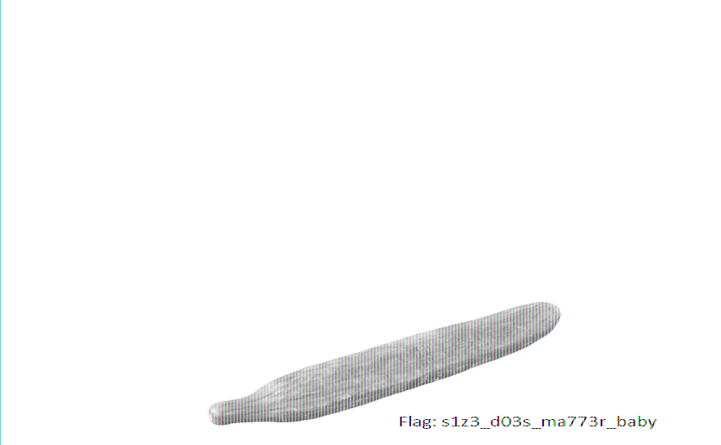

## She said it doesn't matter (misc/stego, 100p)

### PL Version
[ENG](#eng-version)

W zadaniu dostajemy obrazek [png](./m100.png) z zepsutym nagłówkiem. Rozpakowujemy zawartość pliku i za pomocą pozyskanych pikseli tworzymy obrazek, w którym ukryta jest flaga. Musimy ustawić dobre wymiary obrazka, które różnią sie od odczytanych z nagłówka. Po paru próbach odnajdujemy właściwe wartości.

```python
from PIL import Image
with open('zlibdec.bin','rb') as f:
	data=f.read()
im = Image.frombytes('RGB',(891,550),data)
im.show()
```
i w wyniku otrzymujemy:


### ENG Version
We get png picture with broken header checksum. With pixels extracted from file we make picture using them. We have to set good size of picture and mode, since data from broken header are misleading. After some trials we can easly find right values.
```python
from PIL import Image
with open('zlibdec.bin','rb') as f:
	data=f.read()
im = Image.frombytes('RGB',(891,550),data)
im.show()
```
as a result we get:


