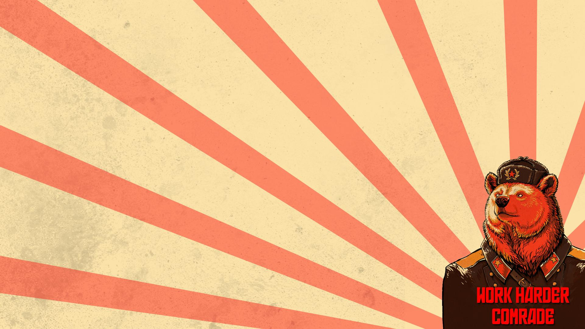
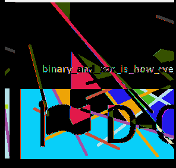

## Try harder! (misc/stego, 200p)

### PL Version
[ENG](#eng-version)

W zadaniu dostajemy dwa archiwa:
* gzip o nazwie part0
* zip o nazwie part3, wymagające hasła do dekodowania

Rozpoczęliśmy od analizy archiwum part0 i pierwsze co rzuciło sie w oczy to fakt, że 4MB archiwum dekompresowało sie do 4GB pliku jpg. Analiza archiwum za pomocą hexedytora pozwoliła zauważyć, że w rzeczywistości archiwum jest wypełnione dużą ilością dziwngo paddingu. Okazało się, że był to plik jpg tylko z rozszerzenia - tak naprawdę był to DOS/MBR bootsector. Jego zamontowanie daje dostęp do obazka:

Analiza bootsectora za pomocą hexedytora pozwala znaleźć jeszcze linki do serwisu imgur, ale nadal nic przydatnego. Analiza archiwum part0 pomocą binwalka pozwala znaleźć wewnatrz ukryty [plik mp3](./3pm.redrah-yrt.mp3), który jest odwróconym nagraniem słów `try harder`. Niemniej analiza tego pliku pozwala znaleźć ciekawy string zapisany w tagach ID3:

`aHR0cDovL2RjdGYuZGVmLmNhbXAvX19kbmxkX18yMDE1X18vcGFydDEuaHRtbATXXX`

Który po dekodowaniu jako base-64 daje nam: `http://dctf.def.camp/__dnld__2015__/part1.html`

Pod znalezionym urlem znajdujemy [plik html](./source.txt). Analiza źródła pozwala zauważyć że znajdują się tam białe znaki ułożone w sposób nieprzypadkowy.

Ekstrakcja białych znaków i przetworzenie ich za pomocą skryptu:

	x = open('wut.txt', 'rb').read()
	for i in range(256):
		if i == ord(' ') or i == ord('\t'):
			continue
		x = x.replace(chr(i), '')
	x = x.replace(' ', '0')
	x = x.replace('\t', '1')
	open('wut2.txt', 'wb').write(x)
	
Dała jako wynik:

	['01010011', '01100101', '01100011', '01101111', '01101110', '01100100', '00100000', '01110000', '01100001', '01110010', '01110100', '00100000', '01101001', '01101110', '00100000', '01101101', '01101001', '01110011', '01100011', '00110010', '00110000', '00110000', '01110000', '01100001', '01110010', '01110100', '00110010', '00101110', '01111010', '01101001', '01110000']
	Second part in misc200part2.zip
	
Kolejne archiwum zawiera pliki [file1.bmp](./file1.bmp) oraz [file2](./file2). Analiza drugiego pliku pozwala zauważyć, że bajty w nim można także intepretować jako obraz bmp i że zawiera on tekst:

`binary_and_xor_is_how_we`

Oba pliki mają identyczne rozmiary i wewnętrznie przypominają bitmapy. Ale tam gdzie powinien być nagłówek bmp w drugim pliku, znajdowały się zera. Więc przekeiliśmy nagłówek z pierwszego pliku i jako efekt uzyskaliśmy obraz z całym tekstem: `binary_and_xor_is_how_we_all_start`

Testujemy tą wiadomość jako hasło dla pliku part3.zip i bingo! Rozpakowujemy archiwum i znajdujemy tam [zdjecie](./part3.jpg) które zawiera szukaną flagę:

`DCTF{711389441a47c19a244c8473ee5aceff}`

### ENG Version

We get two archives:
* gzip named part0
* zip named part3, encrypted with a password

We start with analysis of the part0 archive and first thing we notice is that 4MB archive decompresses into a 4GB jpg file. In reality it turned out that is isn't a jpg file at all, it's a DOS/MBR bootsector. Mounting it gives the picture:

Further analysis of bootsector file with hexeditor gives us also some links to imgur but nothing useful. Further analysis of the part0 archive with binwalk give us a hidden [mp3 file](./3pm.redrah-yrt.mp3), containing a reversed recording of `try harder`. Analysis of this file allows us to find an interesting string inside ID3 tags:

`aHR0cDovL2RjdGYuZGVmLmNhbXAvX19kbmxkX18yMDE1X18vcGFydDEuaHRtbATXXX`

Decoding it as base64 gives: `http://dctf.def.camp/__dnld__2015__/part1.html`

The URL holds a single [html file](./source.txt). Source code analysis shwows that there is a very particular layuot of whitespaces.
Extraction of whitespace characters and processing with:

	x = open('wut.txt', 'rb').read()
	for i in range(256):
		if i == ord(' ') or i == ord('\t'):
			continue
		x = x.replace(chr(i), '')
	x = x.replace(' ', '0')
	x = x.replace('\t', '1')
	open('wut2.txt', 'wb').write(x)
	
Gives us:

	['01010011', '01100101', '01100011', '01101111', '01101110', '01100100', '00100000', '01110000', '01100001', '01110010', '01110100', '00100000', '01101001', '01101110', '00100000', '01101101', '01101001', '01110011', '01100011', '00110010', '00110000', '00110000', '01110000', '01100001', '01110010', '01110100', '00110010', '00101110', '01111010', '01101001', '01110000']
	Second part in misc200part2.zip
	
Next archive contains [file1.bmp](./file1.bmp) and [file2](./file2). Second file analysis shows that it can be also interpreted as bmp and contains some text:

`binary_and_xor_is_how_we`

Both files have identical size, and looks like bmp files when looked at in hexeditor - but second file's header was replaced with zeroes. So we copied header from first file to second, and as a result we got a picture with full text: `binary_and_xor_is_how_we_all_start`

We try this message as a password for part3.zip and bingo! We decompress the archive and find a single [picture](./part3.jpg) with the flag:

`DCTF{711389441a47c19a244c8473ee5aceff}`
