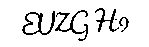
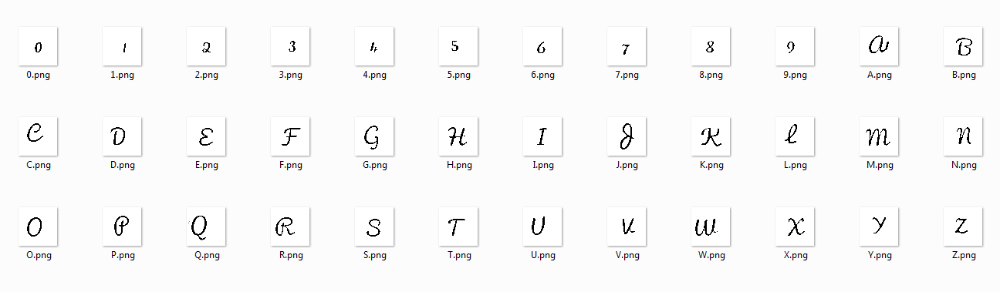
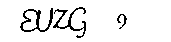
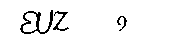
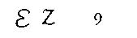
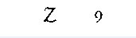
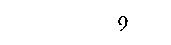
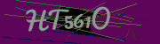

## Can you read Pacifico? (misc/ppc, 400+1p)

### PL Version
[ENG](#eng-version)

Zadanie polegało na napisaniu łamacza captchy. Captche miały następujący format:

Należało rozwiązać 1337 kodów pod rząd bezbłędnie w celu uzyskania flagi.

Jak nie trudno zauważyć konieczne będzie przetworzenie obrazu do wersji bardziej przystępnej do automatycznej analizy. Stosujemy algorytm, który przetworzy podany obraz do postaci czarnego tekstu na białym tle. Wykonujemy to za pomocą zestawu 2 funkcji:

	def fix_colors(im):
		colors_distribution = im.getcolors(1000)
		ordered = sorted(colors_distribution, key=lambda x: x[0], reverse=True)
		best_colors = [color[1] for color in ordered]
		if (255, 255, 255) in best_colors:
			best_colors.remove((255, 255, 255))
		if (0, 0, 0) in best_colors:
			best_colors.remove((0, 0, 0))
		best_colors = best_colors[:2]
		pixels = im.load()
		for i in range(im.size[0]):
			for j in range(im.size[1]):
				color = pixels[i, j]
				if color not in best_colors:
					pixels[i, j] = best_colors[0]
		return best_colors[0]

	def black_and_white(im, filling):
		black = (0, 0, 0)
		white = (255, 255, 255)
		pixels = im.load()
		for i in range(im.size[0]):
			for j in range(im.size[1]):
				color = pixels[i, j]
				if color == filling:
					pixels[i, j] = white
				else:
					pixels[i, j] = black
					
Pierwsza służy do usunięciu z obrazu wszystkich oprócz 2 dominujacych kolorów (którymi jest wypełnienie i tekst), przy czym szukajac dominujących kolorów nie bierzemy pod uwagę białego i czarnego, aby nie wybrać któregoś z nich jako koloru wypełnienia.

Druga funkcja zamienia kolor tekstu na czarny a kolor wypełnienia na biały. W efekcie uzyskujemy:

A następnie:

Niestety jak nie trudno zauważyć nasze captche są bardzo bardzo małe. Za małe żeby OCR był w stanie poprawnie i bezbłędnie je odczytać. Stosujemy więc inną metodę. Jeden z naszych kolegów poświecił się i zmapował stosowaną czcionkę tworząc pliki z każdym potrzebnym symbolem:

Algorytm dekodowania captcha wyglądał następujaco:

1. Pobieramy captche
2. Poprawiamy kolory i zamieniamy na czarno-białe
3. Pobieramy prostokąt obejmujacy captchę
4. Dla każdego symbolu z alfabetu znajdujemy najlepsze dopasowanie go do captchy (takie gdzie najbardziej się z nią pokrywa), zapamiętujemy też pozycje tego dopasowania
5. Wybieramy najlepiej dopasowany symbol
6. Usuwamy z captchy dopasowany symbol poprzez zamalowanie go na biało
7. Kroki 4-6 powtarzamy 6 razy, bo szukamy 6 symboli.
8. Sortujemy uzyskane symbole względem pozycji dopasowania w kolejnosci rosnacej aby odtworzyć poprawną kolejność symboli

Dla prezentowanej wyżej captchy sesja dekodowania wygląda tak (najlepiej dopasowany symbol oraz obraz po jego usunięciu):

`('H', 155)`

`('G', 122)`

`('U', 103)`

`('E', 99)`

`('Z', 86)`

`('9', 46)`

W wyniku czego uzyskujemy kod: `EUZGH9`

Dwie funkcje, o których warto wspomnieć to funkcja licząca jak dobre dopasowanie znaleźliśmy oraz funkcja usuwająca symbole z obrazu.

	def test_configuration(im_pixels, start_x, start_y, symbol_len, symbol_h, symbol_pixels, symbol_x_min, symbol_y_min):
		counter = 0
		black = (0, 0, 0)
		for i in range(symbol_len):
			for j in range(symbol_h):
				if im_pixels[start_x + i, start_y + j] == black:
					if im_pixels[start_x + i, start_y + j] == symbol_pixels[symbol_x_min + i, symbol_y_min + j]:
						counter += 1
					else:
						counter -= 1
				elif symbol_pixels[symbol_x_min + i, symbol_y_min + j] == black:
					counter -= 1
		return counter
	
Dla zadanego offsetu (w poziomie - start_x oraz w pionie - start_y) na obrazie z captchą iterujemy po pikselach i porównujemy je z pikselami testowanego symbolu. Jeśli trafimy na czarne piksele na obrazie to sprawdzamy czy występują także w symbolu i dodajemy lub odejmujemy 1 od licznika pasujących pikseli. Jeśli na obrazie mamy kolor biały a symbol ma czarne piksele to odejmujemy 1 od licznika. Ta druga część jest dość istotna, ponieważ w innym wypadku litery "całkowicie obejmujące inne" mogłyby być wskazane jako poprawne dopasowanie.

	def is_to_remove(symbol_pixels, x, y):
		black = (0, 0, 0)
		result = False
		for i in range(-1, 1):
			for j in range(-1, 1):
				result = result or symbol_pixels[x + i, y + j] == black
		return result

	def remove_used(picture_pixels, symbol, offset_x, offset_y, symbol_len, symbol_h):
		white = (255, 255, 255)
		symbol_x_min, _, symbol_y_min, _ = get_coords(symbol)
		symbol_pixels = symbol.load()
		for i in range(offset_x, offset_x + symbol_len + 1):
			for j in range(offset_y, offset_y + symbol_h + 1):
				if is_to_remove(symbol_pixels, symbol_x_min + i - offset_x, symbol_y_min + j - offset_y):
					picture_pixels[i, j] = white

Usuwając symbol z obrazu iterujemy po obrazie zgodnie ze znalezionym offsetem i kolorujemy na biało te piksele, które są czarne także w symbolu. Nie kolorujemy całego boxa na biało! Jest to dość istotne, bo captche czasem były takie:

Jak widać symbol `5` znajduje sie wewnątrz boxa obejmującego literę `T` i zamalowanie całego boxa na biało "zniszczy" symbol `5`.

Kod całego solvera dostępny jest [tutaj](./captcha.py). Tak przygotowany solver + pypy i szybki internet pozwolił po pewnym czasie uzyskać flagę:

`DCTF{6b91e112ee0332616a5fe6cc321e48f1}`
		
### ENG Version

The task was to create a captcha breaker. The captcha codes looked like this:

We had to solve 1337 examples in a row without any mistakes to get the flag.

As can be noticed we had to process the image to make it more useful for automatic analysis. We used an algorithm to get a black & white clean version of the text. We used 2 functions for this:

	def fix_colors(im):
		colors_distribution = im.getcolors(1000)
		ordered = sorted(colors_distribution, key=lambda x: x[0], reverse=True)
		best_colors = [color[1] for color in ordered]
		if (255, 255, 255) in best_colors:
			best_colors.remove((255, 255, 255))
		if (0, 0, 0) in best_colors:
			best_colors.remove((0, 0, 0))
		best_colors = best_colors[:2]
		pixels = im.load()
		for i in range(im.size[0]):
			for j in range(im.size[1]):
				color = pixels[i, j]
				if color not in best_colors:
					pixels[i, j] = best_colors[0]
		return best_colors[0]

	def black_and_white(im, filling):
		black = (0, 0, 0)
		white = (255, 255, 255)
		pixels = im.load()
		for i in range(im.size[0]):
			for j in range(im.size[1]):
				color = pixels[i, j]
				if color == filling:
					pixels[i, j] = white
				else:
					pixels[i, j] = black
					
First one removed all colors except for 2 dominant ones (filling and text), however we skip black and white when looking for dominants, so we don't pick one as filling.

Second function changes the text color to black and filling color to white. This was we get:

And then:

Unfortunately, as you can notice the captchas are really small. Too small for OCR to give good results. Therefore, we proceed with a different method. One of our teammates mapped the whole alphabet of necessary symbols:

Captcha-solving algorithm:

1. Download captcha
2. Fix colors and make black & white
3. Calculate a box with captcha letters
4. For every alphabet character we calculate the best positioning on the captcha (where it overlaps the most), we save also the offset of this positioning 
5. We pick the character with highest score
6. We remove the character from captcha by painting it white.
7. We perform steps 4-6 six times, because we are looking for 6 characters.
8. We sort the characters by the x_offset of the positioning of the character, to reconstruct the inital order of characters

For the captcha presented above the decoding session looks like this (the best matched character and picture after removal):

`('H', 155)`

`('G', 122)`

`('U', 103)`

`('E', 99)`

`('Z', 86)`

`('9', 46)`

As a result we get the code: `EUZGH9`

Two functions that are worth mentioning are the function to calculate matching score and function for removing the characters from picture.

	def test_configuration(im_pixels, start_x, start_y, symbol_len, symbol_h, symbol_pixels, symbol_x_min, symbol_y_min):
		counter = 0
		black = (0, 0, 0)
		for i in range(symbol_len):
			for j in range(symbol_h):
				if im_pixels[start_x + i, start_y + j] == black:
					if im_pixels[start_x + i, start_y + j] == symbol_pixels[symbol_x_min + i, symbol_y_min + j]:
						counter += 1
					else:
						counter -= 1
				elif symbol_pixels[symbol_x_min + i, symbol_y_min + j] == black:
					counter -= 1
		return counter

For given offset (horizontal - start_x and vertical - start_y) on the captcha picture we iterate over pixels and compare with symbol pixels. If we have black pixels on the picture we check if they are black also in symbol and we add or subtract 1 from the matched pixels counter. If on the picture we have white color but black in symbol we subtract 1 from counter. The second part os really important, because otherwise the large letters that "cover other letters entirely" could be selected as best match.

	def is_to_remove(symbol_pixels, x, y):
		black = (0, 0, 0)
		result = False
		for i in range(-1, 1):
			for j in range(-1, 1):
				result = result or symbol_pixels[x + i, y + j] == black
		return result

	def remove_used(picture_pixels, symbol, offset_x, offset_y, symbol_len, symbol_h):
		white = (255, 255, 255)
		symbol_x_min, _, symbol_y_min, _ = get_coords(symbol)
		symbol_pixels = symbol.load()
		for i in range(offset_x, offset_x + symbol_len + 1):
			for j in range(offset_y, offset_y + symbol_h + 1):
				if is_to_remove(symbol_pixels, symbol_x_min + i - offset_x, symbol_y_min + j - offset_y):
					picture_pixels[i, j] = white

In order to remove the symbol from picture we iterate over it starting from appropriate offset and color pixels white if they are black in the symbol. We don't color the whole box white! It is important because some captchas were like this:

As can be seen the character `5` is inside the box surrounding letter `T` and paiting it white would "destroy" the character `5`. 

Code of the solver is available [here](./captcha.py).  This solver + pypy + fast internet connection resulted in:

`DCTF{6b91e112ee0332616a5fe6cc321e48f1}`
