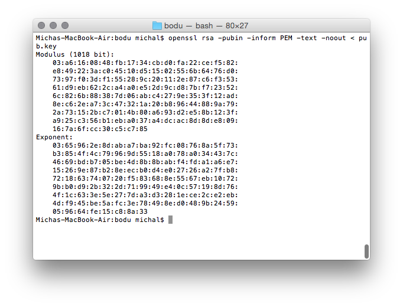
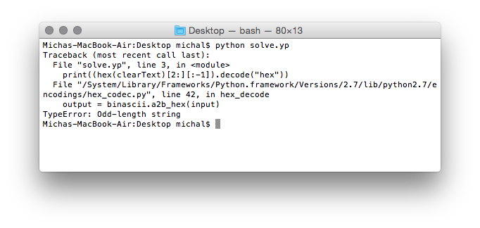

## Bodu (crypto, 175p)

###PL
[ENG](#eng-version)

Zostają nam dane [klucz publiczny](pub.key) i [zaszyfrowana wiadomość](flag.enc), zacznijmy od spojrzenia jak wygląda klucz publiczny:

Od razu rzuca się w oczy dosyć spory exponent (najczęściej widzi się należące do liczb pierwszy Fermata, a więc `3, 5, 17, 256, 65536`)

Czyli szukamy jakiegoś ataku na RSA(możliwe, że exponent), z pomocą przychodzi nam [Boneh Durfee Attack](https://github.com/mimoo/RSA-and-LLL-attacks/blob/master/boneh_durfee.sage)

Użycie sprowadza się do podstawienia naszego n i e, po chwili dostajemy:

`=== solutions found ===
x: 166655144474518261230652989223296290941028672984834812738633465334956148666716172

y: -1620506135779940147224760304039194820968390775056928694397695557680267582618799089782283100396517871978055320094445221632538028739201519514071704255517645

d: 89508186630638564513494386415865407147609702392949250864642625401059935751367507

=== 0.260915994644 seconds ===`

[Podstawiamy](solve.py) do `pow(ciphertext, d, n)` iiiii....

To nie dobrze, może spróbujemy dodać `0` na początku?

`—)ò~ÐãüéÛaû¨0JÀîr|¹Â|Ú÷ûš5Ù° r'Ž{§¯†0âËúJ4Þ¤<úô!›EþX}êïî³Ë?g’/óF>gá}þ‘74|ú(¾¶HšASIS{b472266d4dd916a23a7b0deb5bc5e63f}`

### ENG version

In this task, we're given a [public key](pub.key) and a [encrypted message](flag.enc), let's start by looking inside the public key:

The exponent seems quite high(you usually see exponents from the set of Fermat primes, `3, 5, 17, 256, 65536`)

So we're looking for an RSA attack(possibly including the high exponent), after some googling we come across a [Boneh Durfee Attack](https://github.com/mimoo/RSA-and-LLL-attacks/blob/master/boneh_durfee.sage)

Using it comes down to just entering our n and e, after a while of computing the program outputs:

`=== solutions found ===
x: 166655144474518261230652989223296290941028672984834812738633465334956148666716172

y: -1620506135779940147224760304039194820968390775056928694397695557680267582618799089782283100396517871978055320094445221632538028739201519514071704255517645

d: 89508186630638564513494386415865407147609702392949250864642625401059935751367507

=== 0.260915994644 seconds ===`

Great, let's try to decipher the message using that d by [calculating](solve.py) the value of pow(ciphertext, d, n)

That's weird, maybe a 0 at the beginning will help?

`—)ò~ÐãüéÛaû¨0JÀîr|¹Â|Ú÷ûš5Ù° r'Ž{§¯†0âËúJ4Þ¤<úô!›EþX}êïî³Ë?g’/óF>gá}þ‘74|ú(¾¶HšASIS{b472266d4dd916a23a7b0deb5bc5e63f}`
