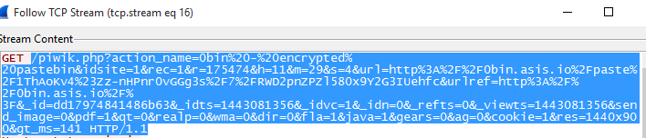
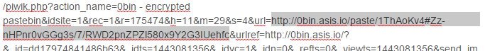
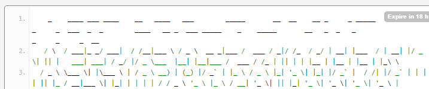
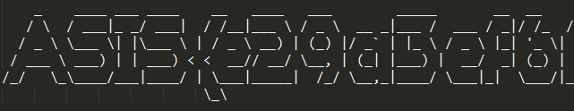

## Big Lie (forensic, 100p, 101 solves)

> Find the [flag](biglie.pcap).

### PL
[ENG](#eng-version)

Otrzymany plik pcap ładujemy do Wiresharka i na podstawie wyeksportowanych obiektach z sesji HTTP dochodzimy do wniosku, że użytkownik skorzystał z usługi pastebin, która przed wysłaniem danych szyfruje je lokalnie, a klucz przesyłany jest za pomocą części "fragment" (to, co za krzyżykiem) URLa. Jest to część, która nie jest częścią requestu HTTP i nie jest przesyłana serwerowi (i tym samym nie znalazło się w zrzucie danych sieciowych).

Ale po dalszej analizie sesji HTTP znajdujemy pełnego URLa (razem z kluczem) w requestach do wewnętrznej usługi monitorującej ruch.

Po urldecode:

Zawartość "pasty":

Po przeklejeniu do edytora z wyłączonym word-wrap:

`ASIS{e29a3ef6f1d71d04c5f107eb3c64bbbb}`
