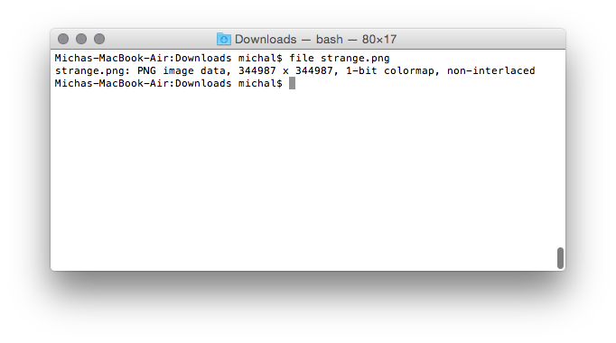
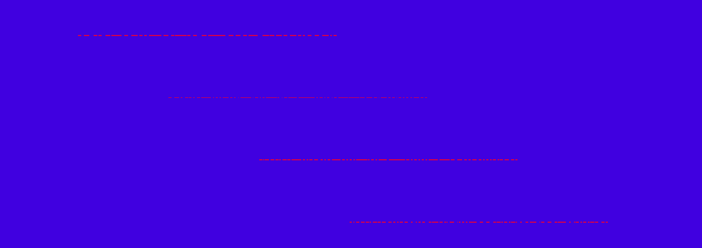

##Strange 150 (forensics, 150p)

### PL
[ENG](#eng-version)

W tym zadaniu zostanie przetestowana nasza umiejętność otwierania dużych obrazków, dostajemy plik [strange.png](strange.png) ważący 16MB ale pojawia się jeden problem:

Tak, zgadza się, obrazek ma `344987x344987` pikseli, nawet z 1 bitową mapą daje nam dużo za dużo wymaganej pamięci.

(Tutaj spędziliśmy trochę czasu na próbowanie gotowych programów obsługujących duże pliki, lecz nie przyniosło to żadnego efektu więc tą część pomijamy :) )

Należałoby zaglądnąć do środka tej binarki, żeby dowiedzieć się co tak na prawdę tam w środku siedzi. 

Okazuje się, że znaczną większość pliku stanowią nullbyte-y. Więc w sumie spróbujmy wyciąć linijki z samymi nullami, zmniejszmy rozmiar obrazka w EXIFie i zobaczmy co się stanie...

Teraz tylko spróbujmy je posklejać i...

Flaga jest nasza!

### ENG version

In this task we're given an 16MB [png image](strange.png), there's just one problem:

Yes, that's right, it's `344987x344987` pixels big, even with 1 bit map, it's still too much to even consider trying viewing it.

(Insert 2 hours of trying various programs with little success here)

Why don't we look inside the image, maybe we could find out something interesting.

It turns out that a huge majority of the file is just null bytes. Let's try to cut lines composed of only nulls and edit the image exif data to make it smaller

Some weird binary lines, how about sticking them together?

The flag is ours! (Just be careful with 1's and f's)
