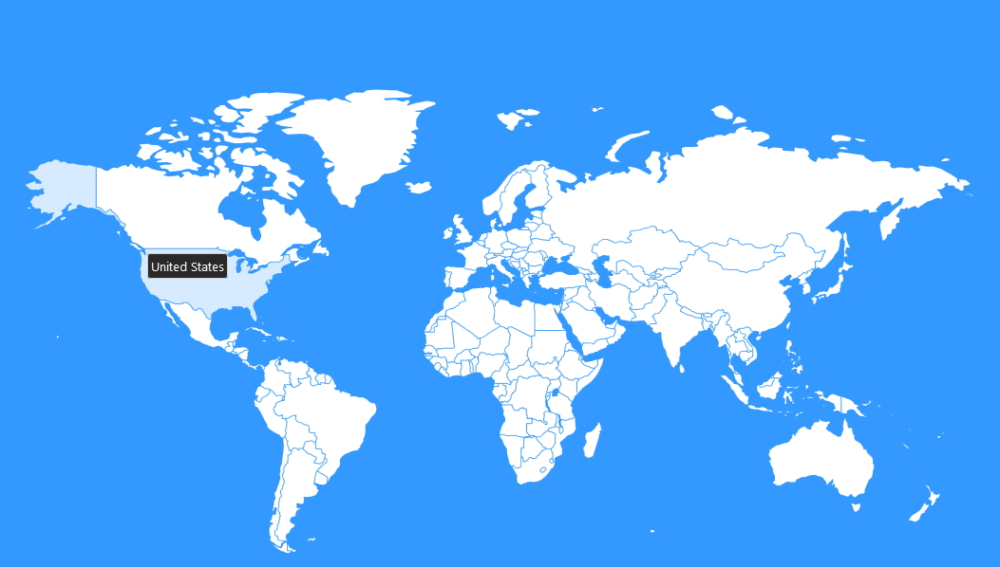
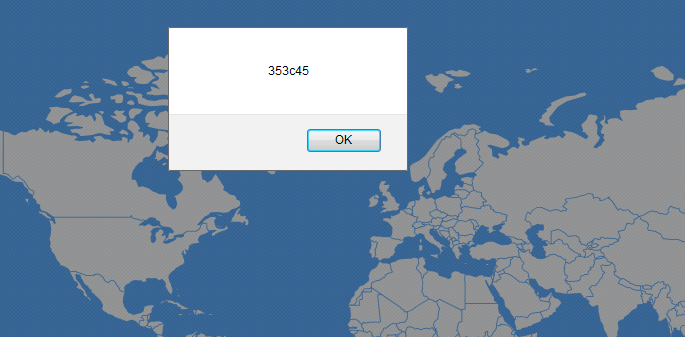

## FlagHunter 75 (re, 75p, 53 solves)

### PL
[ENG](#eng-version)

Wchodzimy pod podany w zadnaniu link i widzimy:



Możemy kliknąć na kraj na mapie w wyniku czemu uzyskujemy jedną z dwóch odpowiedzi. 

Jeśli klinęliśmy w kraj w którym jesteśmy (z którego mamy IP):



Jeśli klinięmy w inny kraj:


Postanawiamy więc spróbować zebrać wszystkie możliwe kody, bo domyślamy się, że są potrzebne do uzyskania flagi. Robimy to za pomocą prostego skryptu:

```python
from Queue import Queue
import codecs
import os
import threading
import urllib
import urllib2
import re
import subprocess

results = {}
url = "http://flaghunt.asis-ctf.ir/a.php"


def test_proxy(proxy):
    try:
        proxy = proxy.strip()
        proxy_host = proxy[:proxy.find(":")]
        ping_response = os.system("ping -n 1 " + proxy_host + " > NUL")
        if ping_response == 0:
            whois = subprocess.check_output("whois " + proxy_host, stderr=subprocess.STDOUT)
            pattern = re.compile("country:\s*(.*)\n")
            country_code = pattern.findall(whois.lower())[0].upper()
            if country_code not in results:
                params = {'code': country_code}
                encoded_params = urllib.urlencode(params)
                urllib2.install_opener(
                    urllib2.build_opener(
                        urllib2.ProxyHandler({'http': proxy})
                    )
                )
                f = urllib2.urlopen(url, encoded_params)
                response = f.read()
                if "long distance calls" not in response:
                    results[country_code] = response
                    print(proxy + " " + country_code + " " + response)
    except:
        pass
        # probably some problem with whois response


def worker():
    while True:
        proxy = q.get()
        test_proxy(proxy)
        q.task_done()
        if q.unfinished_tasks % 100 == 0:
            print("left to process " + str(q.unfinished_tasks))


with codecs.open("proxy.txt") as file:
    q = Queue()
    for i in range(30):
        thread = threading.Thread(target=worker)
        thread.daemon = True
        thread.start()
    for proxy in file.readlines():
        q.put(proxy)
    q.join()
    print(results)
```

- kod uruchamia się w 30 wątkach
- każdy pobiera z listy serwerów proxy (skomponowanej z google w kilka minut) jeden adres
- pinguje go żeby upewnić się, że działa
- pobiera z whois informacje o kraju dla tego proxy
- jeśli nie mamy jeszcze na liście kodu dla tego kraju to wysyłamy zapytanie symulujące klikniecie w ten kraj na mapie, poprzez wybrane proxy
- odebrany kod zapisujemy

Okazuje się, że unikalnych kodów jest tylko kilka. Wszystkie unikalne kody to:

`f55101, 353c45, fc, c99801, bf853b, 926c51`

Jak nie trudno zauważyć mamy tutaj dokładnie 32 znaki z zakresu [0-9a-f], czyli rozłożony na kawałki hash md5. To sugerowałoby, że można z nich skleić flagę. Ale nie mieliśmy pomysłu na to, w jakiej kolejności to zrobić. Jeden z naszych kolegów postanowił zdać sie na intuicje i po prostu wysłał losowo sklejoną flagę. Niemniej późniejsza analiza wykazała, że tylko jedna ze 120 możliwości była poprawna (możliwa do wyliczenia poprzez analizę kodu JS który na stronie walidował flagę). Nasz kolega powinien kupić los na loterii.

`ASIS{926c51bf853b353c45f55101c99801fc}`

### ENG version

We go to the designated webpage to find:


We can click on a country on the map and we can get one of two answers:

If we clicked on a country where we are (where out IP is from):


If we click any other country:


So we start off by trying to collect all the codes, since we suspect that we will need those for the flag. We do this with a simple script:

```python
from Queue import Queue
import codecs
import os
import threading
import urllib
import urllib2
import re
import subprocess

results = {}
url = "http://flaghunt.asis-ctf.ir/a.php"


def test_proxy(proxy):
    try:
        proxy = proxy.strip()
        proxy_host = proxy[:proxy.find(":")]
        ping_response = os.system("ping -n 1 " + proxy_host + " > NUL")
        if ping_response == 0:
            whois = subprocess.check_output("whois " + proxy_host, stderr=subprocess.STDOUT)
            pattern = re.compile("country:\s*(.*)\n")
            country_code = pattern.findall(whois.lower())[0].upper()
            if country_code not in results:
                params = {'code': country_code}
                encoded_params = urllib.urlencode(params)
                urllib2.install_opener(
                    urllib2.build_opener(
                        urllib2.ProxyHandler({'http': proxy})
                    )
                )
                f = urllib2.urlopen(url, encoded_params)
                response = f.read()
                if "long distance calls" not in response:
                    results[country_code] = response
                    print(proxy + " " + country_code + " " + response)
    except:
        pass
        # probably some problem with whois response


def worker():
    while True:
        proxy = q.get()
        test_proxy(proxy)
        q.task_done()
        if q.unfinished_tasks % 100 == 0:
            print("left to process " + str(q.unfinished_tasks))


with codecs.open("proxy.txt") as file:
    q = Queue()
    for i in range(30):
        thread = threading.Thread(target=worker)
        thread.daemon = True
        thread.start()
    for proxy in file.readlines():
        q.put(proxy)
    q.join()
    print(results)
```

- the code is running in 30 threads
- each one takes an address from proxy servers list (compiled from google in a couple of minutes)
- pings the proxy to make sure it's online
- collects country code from whois info for the proxy
- if we don't have the code for the country we send a request simulating clicking on this country on the map, through the selected proxy
- we save the response code

It turns out that there are only a few unique codes. All of them are:

`f55101, 353c45, fc, c99801, bf853b, 926c51`

As can be easily noticed we have exactly 32 characters from [0-9a-f] range, so a split md5 hash value. This suggest that maybe we could assemble a flag from this. But we had no idea what should be the order. One of our friends, lead by intuition, simply tried to send a random permutation as a flag. Interestingly we later realised that in fact only one of potential 120 flags was correct (the right one could be found by analysing JS code on flag validation site). Our friend should start playing some lottery.

`ASIS{926c51bf853b353c45f55101c99801fc}`