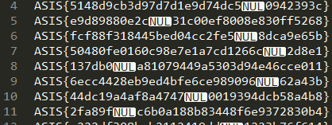

## Which one is flag? (trivia, 75p, 89 solves)

> Which one is [flag](flagBag.zip)?

### PL
[ENG](#eng-version)

Otrzymujemy plik tekstowy z prawie 300 tysiącami flag. Jednak pierwsze co rzuca się w oczy to po jednym null byte na wiersz.

Sprawdzamy ile tych null byte-ów jest: okazuje się, że o jeden mniej niż wszystkich flag. Znajdźmy więc flagę bez niego - najpierw usuwamy wszystkie znaki w każdym z wierszy od nullbyte'a: `\x00.+`, a następnie szukamy znaku `}`. Pozostał tylko jeden - we fladze:

`ASIS{dc99999733dd1f4ebf8c199753c05595}`

### ENG version

We get a text file wiht almost 300,000 flags. However, first thing that we notice is that there is a single null byte per row.

We check the number of null bytes and it turns out it's the number of all flags -1. So we look for the flag without the null byte - first we remove all characters in every row starting from nullyte `\x00.+` and then we search for `}`. There is only one - in the flag:

`ASIS{dc99999733dd1f4ebf8c199753c05595}`