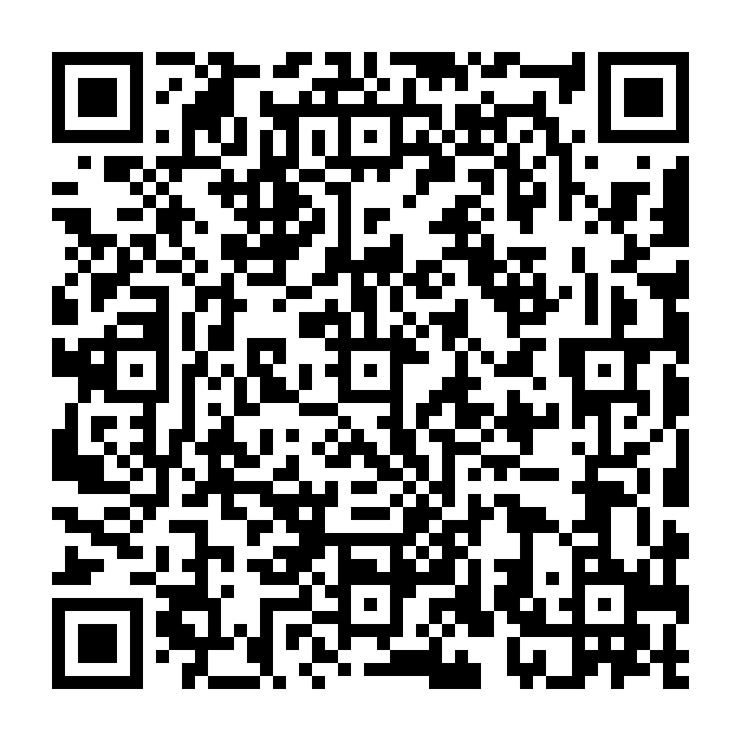

## Puzzleng (forensic, 150p, 24 solves)

> Next Generation of Puzzle!

> [puzzleng-edb16f6134bafb9e8b856b441480c117.tgz](puzzleng.tgz)

### PL
[ENG](#eng-version)

Z dołączonego do zadania pliku tgz wypakowujemy dwa kolejne - [encrypt](encrypt) (to binarka, elf) oraz [flag.puzzle](flag.puzzle) (nieznany typ pliku).
Łatwo domyślić się że jeden to kod którym zostały zaszyfrowane dane, a drugi to same zaszyfrowane dane.

Przepisujemy kod szyfrujący do C żeby móc go dokładniej przeanalizować:

```c
int main(int argc, char *argv[]) {
    char hash[20];
    assert(argc == 3);
    int password_len = strlen(argv[1]);
    SHA1(argv[1], password_len, hash);
    stream = fopen(argv[2], "r");
    assert(stream);
    fseek(stream, 0LL, 2);
    int data_len = ftell(stream);
    rewind(stream);
    for (int i = 0; i <= 19; ++i) {
        for (int j = 0; j < (data_len + 19) / 20; ++j) {
            int chr = fgetc(stream);
            if (chr == -1) break;
            putchar(chr ^ hash[i]);
        }
    }
}
```

Jak widać działanie jest bardzo proste - dzieli plik wejściowy na 20 bloków, i każdy z nich xoruje z innym bajtem.
Bajty z którymi szyfruje są losowe (wynik SHA1) więc ich nie zgadniemy.

Ale wydaje się to być banalne, albo wręcz trywialne zadanie. W końcu xorowanie po bajcie to jedna z najsłabszych
metod szyfrowania jaką można wymyślić. Zakładamy więc że dane które zostały zaszyfrowane to plaintext, i piszemy
na szybko dekryptor (źródło już nie istnieje, ale pomysł był prosty - dla każdego bloku sprawdzenie, z jakim bajtem
go trzeba xorować żeby po xorowaniu wszystkie bajty były plaintekstem). Bardzo się zawiedliśmy - nie ma takich 
bajtów, więc dane które zostały zaszyfrowane nie są plaintextem.

W przypływie natchnienie sprawdzamy co innego - czy da się znaleźć taki bajt, że po xor-owaniu go z pierwszym blokiem
w wyniku będzie gdzieś "IHDR". I nie myliliśmy się - dane które otrzymaliśmy to zaszyfrowany plik .png:

```python
s = open('flag.puzzle', 'rb').read()

chunk_len = (1135+19)/20
chunks = [s[chunk_len*i:chunk_len*(i+1)] for i in range(20)]

def xor(a, b):
    return ''.join(chr(ord(ac) ^ ord(bc)) for ac, bc in zip(a, b))

for i in range(len(chunks)):
    c = chunks[i]
    for b in range(256):
        xx = xor(c, chr(b)*10000)
        if 'IHDR' in xx:
            print i, b, xx, xx.encode('hex')
```

Co teraz? Wiemy już z jakim bajtem był xorowany pierwszy blok, ale mamy 19 do zgadnięcia. Zrobiliśmy to samo dla 'IDAT' i 'IEND',
zgadując kolejne dwa bajty. Niestety to ślepa uliczka - pikseli obrazka w ten sposób nie zgadniemy (a przynajmniej nie mieliśmy pomysłu żadnego).

Dlatego poszliśmy inną drogą - wiemy jak zaczynają się dane chunka IDAT (to stream zlibowy), bo mamy ich fragment:  

```python
start = '789CEDCF418AE4300C05D0DCFFD2358BC6485F76'.decode('hex')
```

Stream zlibowy prawdopodobnie nie zadziała dla wszystkich danych - możemy próbować deszyfrować drugi blok, i patrzeć kiedy będzie leciał wyjątek podczas dekompresji:

```python
known = {
    0: 101,
    1: 48
}

curr = start
for ndx in range(2, 20):
    c = chunks[ndx]
    if not known.has_key(ndx):
        for i in range(256):
            xx = xor(c, chr(i)*10000)
            try:
                zl = zlib.decompressobj().decompress(curr+xx)
            except:
                continue
            known[ndx] = i
    print known[ndx]
    xxok = xor(c, chr(known[ndx])*10000)
    curr = curr + xxok
```

Był to bardzo obiecujący sposób, ale niestety skończył się niepowodzeniem - o ile zawartość trzeciego bloku 
odzyskaliśmy (był tylko jeden bajt który nie powodował wyjątku), przy czwartym i dalej bloku za wiele danych dekompresowało się poprawnie.

Więc wykorzystaliśmy to co wiedzieliśmy o obrazku - miał szerokość 912 pikseli oraz miał jednobitową paletę (czyli prawdopodobnie czarno-biały).
I teraz cechą plików png, jest to że na początku każdego wiersza danych znajduje się filtr którym są one traktowane. Mniejsza o technikalia,
wynika z tego że co 115 bajt w zdekompresowanych danych powinien być równy '\x00' (tzn. nie musiał jeśli byłyby użyte inne filtry, ale po analizie 
fragmentów danych które mieliśmy zauważyliśmy że tutaj używany wszędize jest filtr 0, jak zazwyczaj w png).


```python
def testraw(raw):
    for i in range(len(raw) / 115):
        if raw[i*115] != '\0':
            return False
    return True
```

Nowa wersja:

```python
curr = start
for ndx in range(2, 20):
    c = chunks[ndx]
    if not known.has_key(ndx):
        for i in range(256):
            xx = xor(c, chr(i)*10000)
            try:
                zl = zlib.decompressobj().decompress(curr+xx)
            except:
                continue
            if testraw(zl):
                known[ndx] = i
    print known[ndx]
    xxok = xor(c, chr(known[ndx])*10000)
    curr = curr + xxok
```

Niestety, było to dalej niewystarczające - ciągle więcej niż jeden bajt spełniał nasze warunki, więc musieliśmy je jakoś oceniać.
Jako że zauważyliśmy że w błędnie zdekompresowanych plikach na końcu znajdywały się głównie zera (czarne piksele), wartościowaliśmy po ilości
nieczarnych pikseli w wyniku po dekompresji. Ostateczna wersja:

```python
curr = start
for ndx in range(2, 20):
    clean()
    c = chunks[ndx]
    if not known.has_key(ndx):
        mingap = 0
        for i in range(256):
            xx = xor(c, chr(i)*10000)
            try:
                zl = zlib.decompressobj().decompress(curr+xx)
            except:
                continue
            if testraw(zl):
                gap = len([True for x in zl[-500:] if x != '\x00'])
                if gap > mingap:
                    known[ndx] = i
                    mingap = gap
    print known[ndx]
    xxok = xor(c, chr(known[ndx])*10000)
    curr = curr + xxok
```

Udało się, dostaliśmy jakieś dane. Po zapisaniu ich do pliku otrzymaliśmy piękny QR code:



Po dekodowaniu:

`hitcon{qrencode -s 16 -o flag.png -l H --foreground 8F77B5 --background 8F77B4}`

### ENG version

