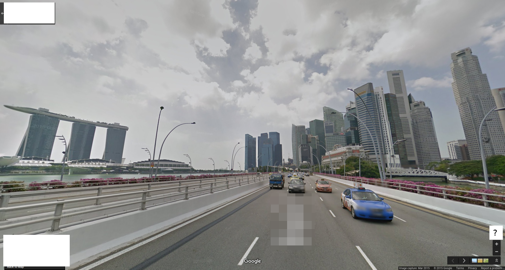
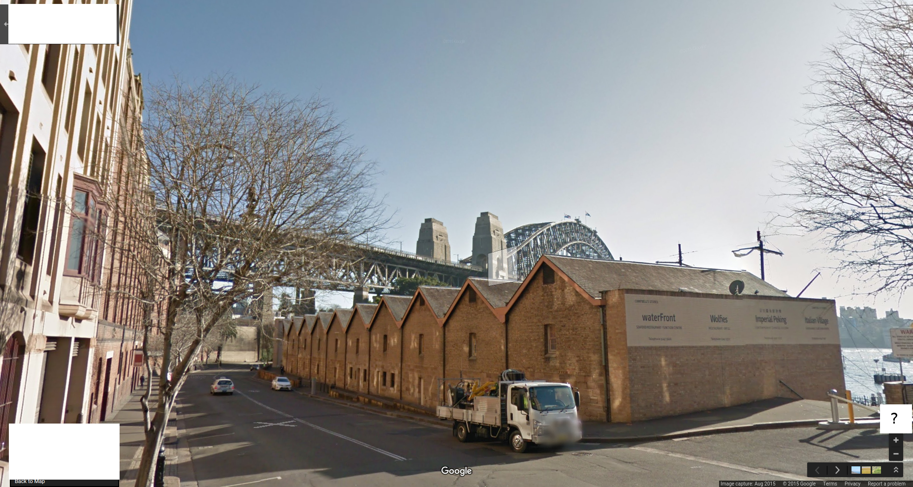
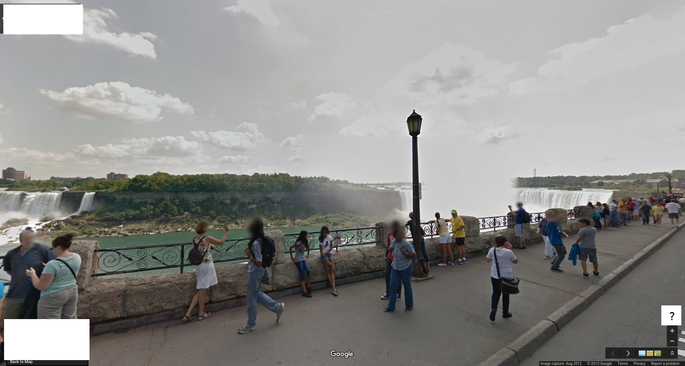
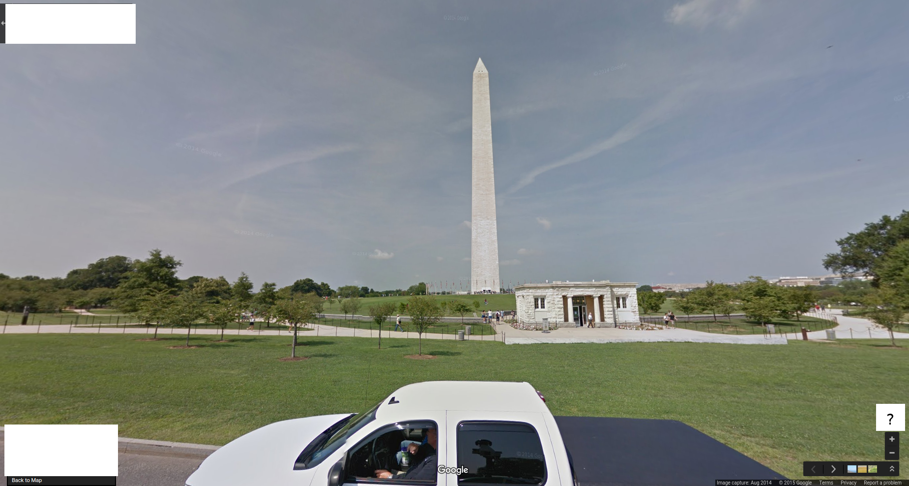
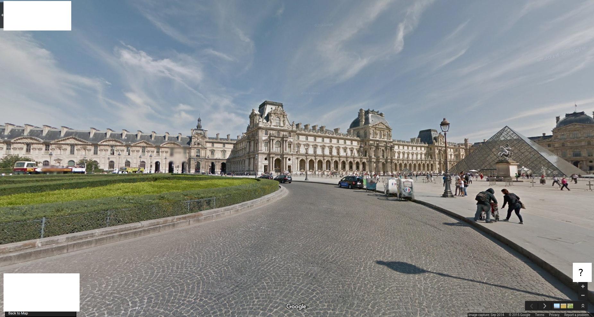
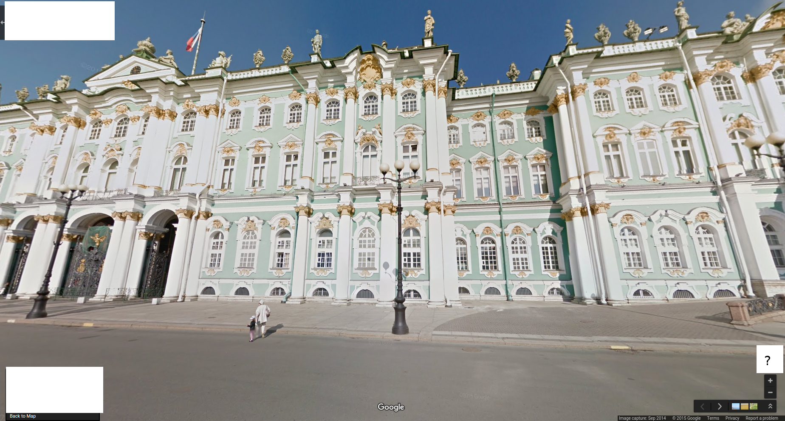
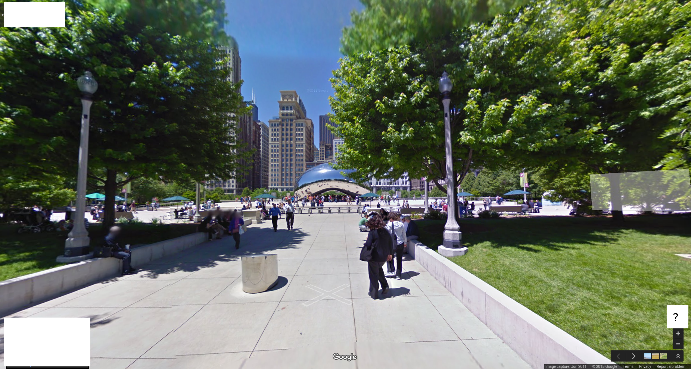

##4w1h (misc, 100p)

`Hint! The flag is made up of the direction each image is looking in, like 9447{NWSE}`

###PL
[ENG](#eng-version)

Dostajemy w zadaniu 10 obrazów i zgodnie z podpowiedzią mamy sprawdzić w jakim kierunku patrzy kamera która robiła dane zdjęcie.

https://www.google.pl/maps/@-22.9578184,-43.2061834,3a,75y,320.83h,104.41t/data=!3m6!1e1!3m4!1sTb-FwFIg4x6lhjWEBHbLbQ!2e0!7i13312!8i6656

NW

https://www.google.pl/maps/@1.2890586,103.8542089,3a,75y,171.52h,90.31t/data=!3m6!1e1!3m4!1sabxkNWrPgqE6p_8s8QZLnQ!2e0!7i13312!8i6656 

S

https://www.google.pl/maps/@-33.8576596,151.209252,3a,44.5y,8.57h,91.35t/data=!3m6!1e1!3m4!1sM6Art2b882XlIU7EEphbmw!2e0!7i13312!8i6656

N

https://www.google.pl/maps/@43.0836224,-79.077298,3a,75y,141.49h,73.97t/data=!3m6!1e1!3m4!1siL1i6KTNVw0j8BXMH_CnlA!2e0!7i13312!8i6656!6m1!1e1 

SE

https://www.google.pl/maps/@38.8893105,-77.0328766,3a,75y,277.92h,89.09t/data=!3m6!1e1!3m4!1sGXxnHvvXIh9ZIcV1gfjbxA!2e0!7i13312!8i6656!6m1!1e1

W

https://www.google.pl/maps/@48.8611422,2.3341197,3a,75y,48.8h,85.07t/data=!3m6!1e1!3m4!1spi8i58rsnwwXFC_3_3Ko6w!2e0!7i13312!8i6656!6m1!1e1

NE

https://www.google.pl/maps/@59.9398238,30.3155033,3a,75y,313.41h,100.58t/data=!3m6!1e1!3m4!1smTEhn-Y1rbv3orgeV5DbNw!2e0!7i13312!8i6656

NW

https://www.google.pl/maps/@41.882726,-87.6225599,3a,75y,273.93h,89.85t/data=!3m6!1e1!3m4!1sQZFXb5I7gYZegqvmi7kYOQ!2e0!7i13312!8i6656

W

https://www.google.pl/maps/@37.5750684,126.9768249,3a,75y,0.59h,85.8t/data=!3m6!1e1!3m4!1snQzQJfkLNSVcHQizsrBV2g!2e0!7i13312!8i6656!6m1!1e1

N

Zdjęcie bieguna południowego więc S

`9447{NWSNSEWNENWWNS}`

### ENG version

We get 10 pictures and according to hint we need to check the direction in which the camera is pointing.

https://www.google.pl/maps/@-22.9578184,-43.2061834,3a,75y,320.83h,104.41t/data=!3m6!1e1!3m4!1sTb-FwFIg4x6lhjWEBHbLbQ!2e0!7i13312!8i6656

NW

https://www.google.pl/maps/@1.2890586,103.8542089,3a,75y,171.52h,90.31t/data=!3m6!1e1!3m4!1sabxkNWrPgqE6p_8s8QZLnQ!2e0!7i13312!8i6656 

S

https://www.google.pl/maps/@-33.8576596,151.209252,3a,44.5y,8.57h,91.35t/data=!3m6!1e1!3m4!1sM6Art2b882XlIU7EEphbmw!2e0!7i13312!8i6656

N

https://www.google.pl/maps/@43.0836224,-79.077298,3a,75y,141.49h,73.97t/data=!3m6!1e1!3m4!1siL1i6KTNVw0j8BXMH_CnlA!2e0!7i13312!8i6656!6m1!1e1 

SE

https://www.google.pl/maps/@38.8893105,-77.0328766,3a,75y,277.92h,89.09t/data=!3m6!1e1!3m4!1sGXxnHvvXIh9ZIcV1gfjbxA!2e0!7i13312!8i6656!6m1!1e1

W

https://www.google.pl/maps/@48.8611422,2.3341197,3a,75y,48.8h,85.07t/data=!3m6!1e1!3m4!1spi8i58rsnwwXFC_3_3Ko6w!2e0!7i13312!8i6656!6m1!1e1

NE

https://www.google.pl/maps/@59.9398238,30.3155033,3a,75y,313.41h,100.58t/data=!3m6!1e1!3m4!1smTEhn-Y1rbv3orgeV5DbNw!2e0!7i13312!8i6656

NW

https://www.google.pl/maps/@41.882726,-87.6225599,3a,75y,273.93h,89.85t/data=!3m6!1e1!3m4!1sQZFXb5I7gYZegqvmi7kYOQ!2e0!7i13312!8i6656

W

https://www.google.pl/maps/@37.5750684,126.9768249,3a,75y,0.59h,85.8t/data=!3m6!1e1!3m4!1snQzQJfkLNSVcHQizsrBV2g!2e0!7i13312!8i6656!6m1!1e1

N

Picture of South Pole so S

`9447{NWSNSEWNENWWNS}`
