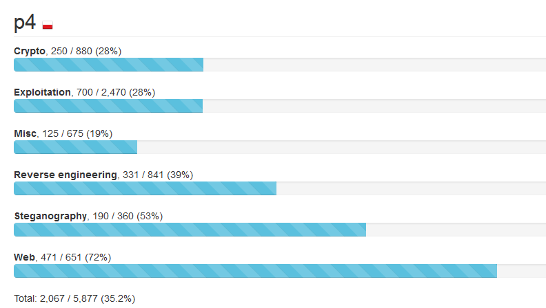

# Writeup 9447 CTF 2015

Uczestniczyliśmy (cr019283, c7f.m0d3, msm, Rev, other019, nazywam i Shalom) w 9447 CTF, i znowu spróbujemy opisać zadania z którymi walczyliśmy (a przynajmniej te, które pokonaliśmy).

### Spis treści:
* [binned (Steganography) 100]
* [Give feedback (Misc) 15]
* [dub-key (Crypto) 130]
* [imaged (Steganography) 90]
* [Hello, Joe (Reverse engineering) 160]
* [cards (Exploitation) 140]
* [BWS (Exploitation) 190]
* [danklang (Reverse engineering) 100]
* [4w1h (Misc) 100]
* [randBox (Crypto) 120]
* [RedOs (Exploitation) 160]
* [calpop reloaded (Exploitation) 130]
* [nicklesndimes (Web) 200]
* [premonition (Web) 140]
* [YWS (Web) 130]
* [The *real* flag finder (Reverse engineering) 70]
* [flag finder (Reverse engineering) 1]
* [calcpop (Exploitation) 80]
* [Get help (Misc) 10]
* [sanutf8y_check (Web) 1]

## ENG version
### Table of contents:
* [binned (Steganography) 100]
* [Give feedback (Misc) 15]
* [dub-key (Crypto) 130]
* [imaged (Steganography) 90]
* [Hello, Joe (Reverse engineering) 160]
* [cards (Exploitation) 140]
* [BWS (Exploitation) 190]
* [danklang (Reverse engineering) 100]
* [4w1h (Misc) 100]
* [randBox (Crypto) 120]
* [RedOs (Exploitation) 160]
* [calpop reloaded (Exploitation) 130]
* [nicklesndimes (Web) 200]
* [premonition (Web) 140]
* [YWS (Web) 130]
* [The *real* flag finder (Reverse engineering) 70]
* [flag finder (Reverse engineering) 1]
* [calcpop (Exploitation) 80]
* [Get help (Misc) 10]
* [sanutf8y_check (Web) 1]

