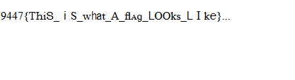

##sanutf8y_check (web, 1p)

###PL
[ENG](#eng-version)

Po wejściu na stronę ukazuje nam się:

Nie możemy skopiować tego tekstu ze strony ponieważ są to jedynie dziwne unicodowe znaki wyglądające jak litery. Musimy więc przepisać flagę:

9447{ThiS_iS_what_A_flAg_Looks_LIke}

### ENG version

When we enter given website we see:

We can't simply copy this text from webpage since those are strange unicode symbols resembling ascii characters. We need to type down the flag:

9447{ThiS_iS_what_A_flAg_Looks_LIke}
