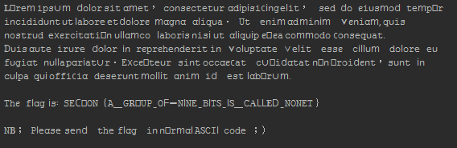

##4042 (Misc/Crypto, 100p)

```
Unknown document is found in ancient ruins, in 2005.
Could you figure out what is written in the document?
```

###PL
[ENG](#eng-version)

Dostajemy [plik](no-network.txt) który mamy zdekodować. Podpowiedź stanowi `4042` oraz rok `2005`. Pozwala nam to dotrzeć do RFC4042: https://www.ietf.org/rfc/rfc4042.txt które w ramach żartu opisuje kodowanie UTF-9.
Domyślamy się, że właśnie z takim kodowaniem mamy do czynienia i w celu odczytania flagi musimy napisać dekoder.
Każdy znak jest kodowany na 9 bitach, gdzie najstarszy bit oznacza że znak jest kontynuowany na kolejnym bajcie. Pozostałe bity określają znak.
Piszemy więc prosty kod:

```python
def convert_single_char(start_pos, bits):
    end_pos = 9
    continuation = int(bits[start_pos])
    character = bits[start_pos + 1:start_pos + 9]
    c = int(character, 2)
    if continuation:
        character = bits[start_pos + 9:start_pos + 18]
        c <<= 8
        c += int(character, 2)
        end_pos += 9
    return unichr(c), end_pos
```
Który dla ciągu bitów oraz pozycji startowej zwraca zdekodowany znak oraz ostanią użytą pozycję.
Dane wejściowe traktujemy jako liczbę w systemie ósemkowym a następnie dekodujemy za pomocą przygotowanego [skryptu](4042.py).
W efekcie dostajemy flagę:



czyli:

`SECCON{A_GROUP_OF_NINE_BITS_IS_CALLED_NONET}`

### ENG version

We get [a file](no-network.txt) which we are supposed to decode. 
A starting point is `4042` and year `2005`. This leads us to RFC4042: https://www.ietf.org/rfc/rfc4042.txt which is a joke describing UTF-9 encoding.
We assume we will have to decode input file using this strange encoding so we need a decoder.
Each character is encoded on 9 bits, where the most significant bit signals that the character is continued on another byte. Rest of the bits are left for the data itself.

We make a simple decoder:

```python
def convert_single_char(start_pos, bits):
    end_pos = 9
    continuation = int(bits[start_pos])
    character = bits[start_pos + 1:start_pos + 9]
    c = int(character, 2)
    if continuation:
        character = bits[start_pos + 9:start_pos + 18]
        c <<= 8
        c += int(character, 2)
        end_pos += 9
    return unichr(c), end_pos
```
Which takes a list of bits and start position and returns a chracter and index of last used position.
We treat input data as a large oct number and decode with prepared [script](4042.py).
As a result we get:


which is:

`SECCON{A_GROUP_OF_NINE_BITS_IS_CALLED_NONET}`