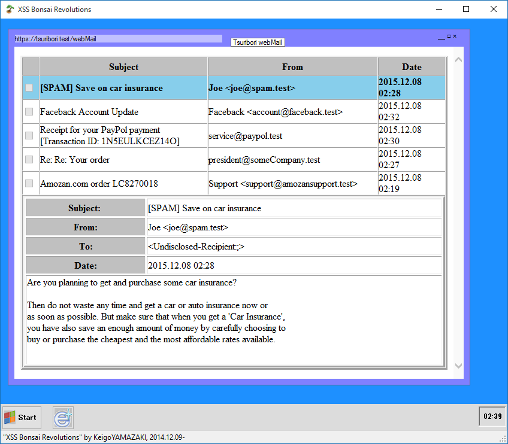
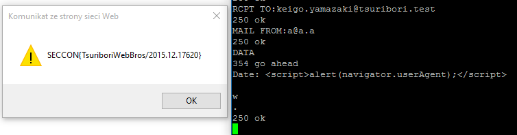

##Bonsai XSS Revolutions (Web/Network, 200p)

>What is your browser(User-Agent)?  
>[hakoniwaWebMail_20151124.zip](hakoniwaWebMail_20151124.zip)  
>Requirement:.NET Framework 4.5

###PL
[ENG](#eng-version)

Załączona do zadania była mocno zobfuskowana aplikacja .NETowa. Była to symulacja przeglądarki, w której użytkownik logował się do swojej poczty.



Z początku postanowiliśmy powalczyć z samą aplikacją. Częściowo udało nam sie zdeobfuskować plik wykonywalny narzędziem `de4dot`. Następnie utworzyliśmy nową aplikację .NETową i załadowaliśmy oryginalny program za pomocą refleksji:

```csharp
var assembly = Assembly.LoadFile("hakoniwaWebMail.exe");
```

To pozwoliło nam ręcznie tworzyć instancje klas i wywoływać metody. W głównej przestrzeni nazw były dwie formy: `FLAGgenerator` i `frmMain`. Pierwsza dała nam flagę, ale była fejkowa. Druga była faktycznie główną formą aplikacji i stworzenie jej instancji oraz pokazanie jej równało się wywołaniu całej naszej symulacji - z tą różnicą, że teraz mogliśmy się z nią pobawić:

```csharp
var form = (hakoniwaWebMail.frmMain)Activator.CreateInstance(assembly.GetTypes()[7]);
var browser = (WebBrowser)GetControls(form)[7];
```

Dzięki temu mogliśmy zrzucić zawartość wyświetlonej strony w zintegrowanej/symulowanej przeglądarce:

```csharp
Console.WriteLine(browser.DocumentText);
```

Ale jedyne co dostaliśmy to:

```html
<html><style>.b{font-weight:bold;}(...)</style><body>
<script>var navigator=new Object;navigator.userAgent='This is NOT a flag. Use XSS to obtain it.';</script>
<table border=3 cellspacing=0 cellpadding=0 width=100% height=100%>(...)
```

Jedną możliwością na tym etapie było zagłębienie się w zaobfuskowaną aplikację i zreverseengineerowanie jej, a drugą było przeczytanie jeszcze raz nazwy zadania, jej kategorii oraz punktów: XSS, web, 200p. No więc, jeżeli aplikacja faktycznie była symulowanym webmailem to może da się wysłać tam maila. I faktycznie tak było: był to również serwer pocztowy działający na standardowym porcie 25:

```
TCP    127.0.0.1:25           0.0.0.0:0              LISTENING       6512
[hakoniwaWebMail.exe]
```

Próbowaliśmy XSS na kilku z nagłówków w wiadomości aż w końcu zadziałał z polem `Date`.



`SECCON{TsuriboriWebBros/2015.12.17620}


### ENG version

Attached was a heavily obfuscated .NET application. It was a simulated webbrowser in which a user logged in to his webmail.


At first we tried to tacke the application itself. We partly managed to deobfuscate the binary with a `de4dot` tool. Then we created another .NET application and loaded the original program by reflection:

```csharp
var assembly = Assembly.LoadFile("hakoniwaWebMail.exe");
```

That allows us to manually instantiate classes and invoke methods. There were two form classes in the main namespace: `FLAGgenerator` and `frmMain`. The former gave us a flag, but it was a fake. The former was indeed the main form of the app and instantiating the class and showing the form basically run the whole simulation but now we could interact with it:

```csharp
var form = (hakoniwaWebMail.frmMain)Activator.CreateInstance(assembly.GetTypes()[7]);
var browser = (WebBrowser)GetControls(form)[7];
```

That way we could simply dump the contents of displayed page in the integrated/simulated webbrowser:

```csharp
Console.WriteLine(browser.DocumentText);
```

But all we got was:

```html
<html><style>.b{font-weight:bold;}(...)</style><body>
<script>var navigator=new Object;navigator.userAgent='This is NOT a flag. Use XSS to obtain it.';</script>
<table border=3 cellspacing=0 cellpadding=0 width=100% height=100%>(...)
```

One possibility at this point was to dig deep in the obfuscated application and reverse engineer it and another to read the task name, category and points again: XSS, web, 200p. Well then, if the application is a simulated webmail, maybe we can send an actual email. And there it was: it was also a mail server running on standard port 25:

```
TCP    127.0.0.1:25           0.0.0.0:0              LISTENING       6512
[hakoniwaWebMail.exe]
```

We tried several mail headers for the XSS and it finally worked with the `Date` header.


`SECCON{TsuriboriWebBros/2015.12.17620}
