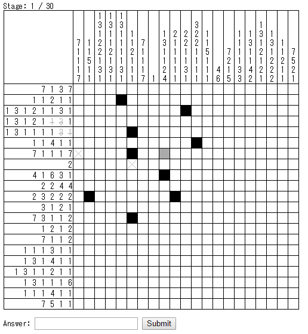
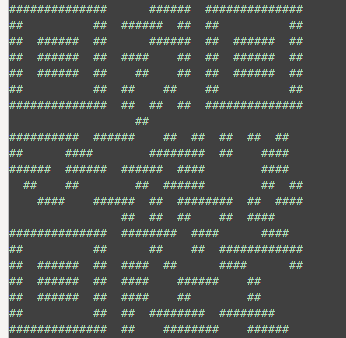

##QR puzzle (Nonogram) (Misc, 300p)

>Solve a puzzle 30 times  
>http://qrlogic.pwn.seccon.jp:10080/game/

###PL
[ENG](#eng-version)

Zadanie było proste: dostajemy losowo wygenerowany nonogram, rozwiązujemy go otrzymując qrcode, dekodujemy go i przechodzimy do następnej rundy. Jeżeli uda nam się dotrzeć do końca to otrzymujemy flagę.



Sama gra nie jest tutaj bardzo ważna: miało dla nas znaczenie tylko to, że było dostępnych kilka gotowych solverów. Losowo użyliśmy tego: http://jwilk.net/software/nonogram.

Jako że było sporo rund zdecydowaliśmy się napisać w pełni automatyczny solver. Pierwszym zadaniem było sparsowanie strony i pobranie liczb nonogramu.

```python
import requests
from bs4 import BeautifulSoup
import re

session = requests.Session()

source = session.post('http://qrlogic.pwn.seccon.jp:10080/game/').content
soup = BeautifulSoup(source)

print re.findall('Stage: (\d+) / 30', source)

def parse(cls):
	return [[span.contents[0] for span in th.find_all('span')] for th in soup.find_all('th', class_=cls)]

rows = parse('rows')
cols = parse('cols')
```

Następna część to przekazanie tych danych do faktycznego solvera:

```python
from pwn import *

solver = process('nonogram-0.9/nonogram')
solver.sendline("%d %d" % (len(cols), len(rows)))

for row in rows:
	solver.sendline(' '.join(row))

for col in cols:
	solver.sendline(' '.join(col))

solver.shutdown()
```

I otrzymanie wyniku:

```python
qr_text = []
for i in range(0, len(rows)):
	solver.recvuntil('|')
	qr_text.append(solver.recvuntil('|')[:-1])
```

Który na tym etapie wyglądał tak:



To tekst, a my musimy skonwertować go na faktyczny obrazek z qrcode:

```python
from PIL import Image, ImageDraw

size = 20
image = Image.new('RGB', ((len(qr_text) * size), (len(qr_text[0]) * size) / 2))
draw = ImageDraw.Draw(image)

for i in range(0, len(qr_text)):
	for j in range(0, len(qr_text[0]) / 2):
		pos = ((j * size, i * size), (j * size + size, i * size + size))
		draw.rectangle(pos, 'black' if qr_text[i][j * 2] == '#' else 'white')

image.save('qrcode.png')
```

Możemy go teraz przeczytać:

```python
import qrtools

qr = qrtools.QR()
qr.decode('qrcode.png')
return qr.data
```

Wysłać i powtórzyć cały proces.
```python
answer = ''
for i in range(0, 100):
    get_image(answer)
    answer = get_qrcode()
    print answer
```

Solver nie był idealny - musieliśmy go uruchomić kilka razy, ale po kilku minutach otrzymaliśmy flagę.

`SECCON{YES_WE_REALLY_LOVE_QR_CODE_BECAUSE_OF_ITS_CLEVER_DESIGN}`

### ENG version

Task details are simple: we get a randomly generated nonogram, we solve it and with that get a qr code, we decode it and get to the next round. If we manage to get to the end we're given the flag.


The game itself isn't very important here: all that mattered to us was that there were several solvers available. We randomly chose this one: http://jwilk.net/software/nonogram.

As there were many stages we opted in for a fully automated solver. First task was to parse the webpage and get the nonogram numbers.

```python
import requests
from bs4 import BeautifulSoup
import re

session = requests.Session()

source = session.post('http://qrlogic.pwn.seccon.jp:10080/game/').content
soup = BeautifulSoup(source)

print re.findall('Stage: (\d+) / 30', source)

def parse(cls):
	return [[span.contents[0] for span in th.find_all('span')] for th in soup.find_all('th', class_=cls)]

rows = parse('rows')
cols = parse('cols')
```

Next part was to pass these to the actual solver:

```python
from pwn import *

solver = process('nonogram-0.9/nonogram')
solver.sendline("%d %d" % (len(cols), len(rows)))

for row in rows:
	solver.sendline(' '.join(row))

for col in cols:
	solver.sendline(' '.join(col))

solver.shutdown()
```

And get the result:

```python
qr_text = []
for i in range(0, len(rows)):
	solver.recvuntil('|')
	qr_text.append(solver.recvuntil('|')[:-1])
```

Which at this point looked like this:


That's text and we need to convert it to a proper qrcode image:

```python
from PIL import Image, ImageDraw

size = 20
image = Image.new('RGB', ((len(qr_text) * size), (len(qr_text[0]) * size) / 2))
draw = ImageDraw.Draw(image)

for i in range(0, len(qr_text)):
	for j in range(0, len(qr_text[0]) / 2):
		pos = ((j * size, i * size), (j * size + size, i * size + size))
		draw.rectangle(pos, 'black' if qr_text[i][j * 2] == '#' else 'white')

image.save('qrcode.png')
```

We can now read it:

```python
import qrtools

qr = qrtools.QR()
qr.decode('qrcode.png')
return qr.data
```

Send it and repeat the whole process:
```python
answer = ''
for i in range(0, 100):
    get_image(answer)
    answer = get_qrcode()
    print answer
```

The solver wasn't perfect: we had to rerun it several times, but after few minutes we got the flag.

`SECCON{YES_WE_REALLY_LOVE_QR_CODE_BECAUSE_OF_ITS_CLEVER_DESIGN}`
