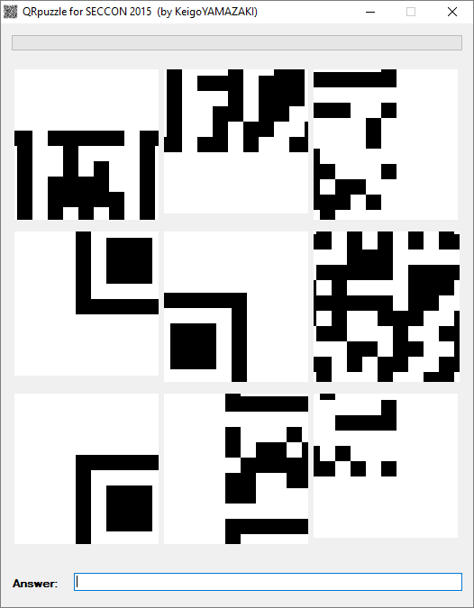

## QR Puzzle (Unknown, 200p)

    Please solve a puzzle 300 times
    QRpuzzle.zip

###PL
[ENG](#eng-version)

Dostajemy program, który wyświetla poszatkowane QR cody po uruchomieniu:



Dość oczywisty jest cel zadania - należy napisać program który złoży taki QR code, rozwiąże go, oraz wyśle do programu.
Moglibyśmy próbować go reversować, ale to wyraźnie co innego niż autorzy zadania zaplanowali dla nas, więc nie poszliśmy tą drogą.

Napisaliśmy w tym celu pewien bardzo duży solver, który:
 - robił screena programu
 - wyciągał z niego poszczególne fragmenty
 - składał części w jedną (najtrudniejsza część oczywiśćie)
 - dekodował wynikowy QR code
 - wysyłał zdekodowany tekst do aplikacji
 - czekał 500 ms i powtarzał ten cykl.

Kodu jest za dużo by omawiać go funkcja po funkcji, wklejona zostanie jedynie główna funkcja pokazująca te kroki ([pełen kod](Form1.cs)]:

```csharp
while (true)
{
    using (var bmp = CaptureApplication("QRpuzzle"))
    {
        var chunks = Split(
            18, 77,
            160, 167,
            6, 13,
            3,
            bmp);
        var result = Bundle.Reconstruct(chunks, 3);

        var reader = new BarcodeReader { PossibleFormats = new[] { BarcodeFormat.QR_CODE }, TryHarder = true };

        result.Save("Test2.png");
        var code = reader.Decode(result);

        SendKeys.Send(code.Text);
        Thread.Sleep(500);
    }
}
```

Flaga:

    SECCON{402B00F89DC8}


### ENG version

We get a program that displays scrambled QR codes when run:


It's obvious what task authors want from us - we have to write program that unscrambles given QR code and sends it to program.
Of course we could try to reverse engineer given program, but clearly task authors wanted us to solve challenge different way.

We have written large solver, that:
 - captured program window to bitmap
 - cut all 9 qr code fragments to different bitmaps
 - put fragments in correct order (hardest part, by far)
 - decoded resulting QR code
 - sent decoded text to program
 - slept 500 ms and repeated that cycle

Solver code is too large to be described function by function, so we will just paste main function here ([full code](Form1.cs)):

```csharp
while (true)
{
    using (var bmp = CaptureApplication("QRpuzzle"))
    {
        var chunks = Split(
            18, 77,
            160, 167,
            6, 13,
            3,
            bmp);
        var result = Bundle.Reconstruct(chunks, 3);

        var reader = new BarcodeReader { PossibleFormats = new[] { BarcodeFormat.QR_CODE }, TryHarder = true };

        result.Save("Test2.png");
        var code = reader.Decode(result);

        SendKeys.Send(code.Text);
        Thread.Sleep(500);
    }
}
```

Flag:

    SECCON{402B00F89DC8}
