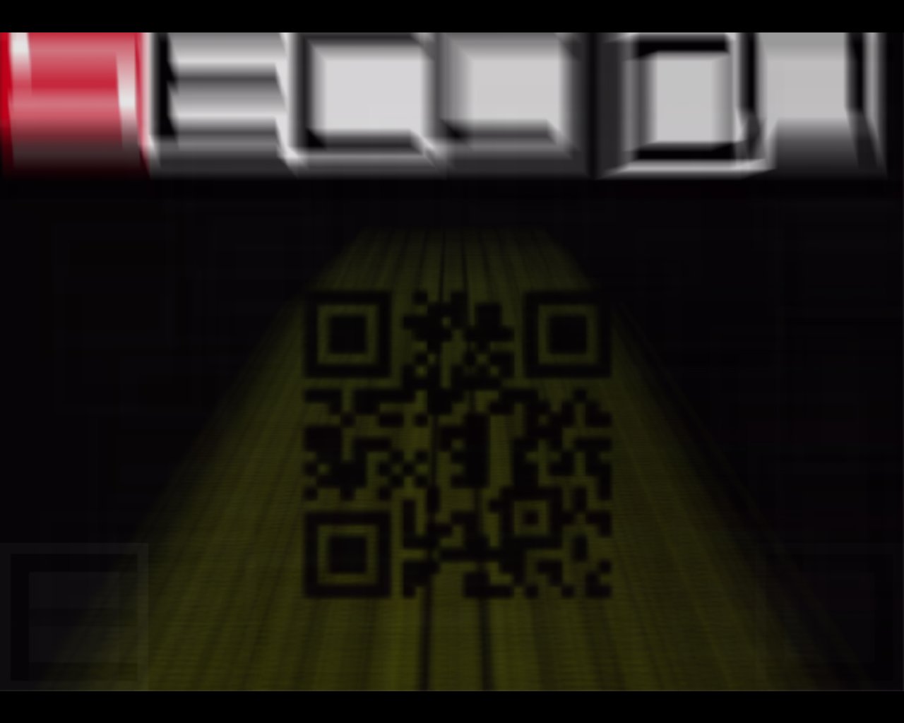

## Seccon Wars (Stegano, 100p)

    https://youtu.be/8SFsln4VyEk

###PL
[ENG](#eng-version)

Na filmie wideo zalinkowanym w zadaniu wyraźnie widać zarysy QR CODE, ale jest on zbyt rozmazany by odczytać go bezpośrednio.

Po chwili zastanowienia (jednym z pomysłów było ręczne naprawianie QR kodu "w paincie") wpadliśmy na pomysł uśrednienia wartości piksela dla wielu screenów i odczytania qr codu z takiego uśrednionego obrazu (powinien być czytelniejszy wtedy)

Najpierw napisaliśmy program w C# robiący screeny przeglądarki, żeby mieć co uśredniać:

```csharp
private class User32 {
    [StructLayout(LayoutKind.Sequential)]
    public struct Rect {
        public int left;
        public int top;
        public int right;
        public int bottom;
    }

    [DllImport("user32.dll")]
    public static extern IntPtr GetWindowRect(IntPtr hWnd, ref Rect rect);
}

public void CaptureApplication(string procName, int i) {
    var proc = Process.GetProcessesByName(procName)[0];
    var rect = new User32.Rect();
    User32.GetWindowRect(proc.MainWindowHandle, ref rect);

    int width = rect.right - rect.left;
    int height = rect.bottom - rect.top;

    var bmp = new Bitmap(width, height, PixelFormat.Format32bppArgb);
    Graphics graphics = Graphics.FromImage(bmp);
    graphics.CopyFromScreen(rect.left, rect.top, 0, 0, new Size(width, height), CopyPixelOperation.SourceCopy);

    bmp.Save("frame" + i + ".png", ImageFormat.Png);
}

protected override void OnLoad(EventArgs e) {
    int i = 0;
    while (true) {
        i++;
        CaptureApplication("firefox", i);
        Thread.Sleep(100);
    }
    base.OnLoad(e);
}
```

A następnie niewielki skrypt uśredniający obrazy z folderu (szczerze mówiąc, to tak naprawdę to skopiowaliśmy go z SO):

```python
import os, numpy, PIL
from PIL import Image

# Access all PNG files in directory
allfiles=os.listdir(os.getcwd())
imlist=[filename for filename in allfiles if  filename[-4:] in [".png",".PNG"]]

# Assuming all images are the same size, get dimensions of first image
w,h=Image.open(imlist[0]).size
N=len(imlist)

# Create a numpy array of floats to store the average (assume RGB images)
arr=numpy.zeros((h,w,3),numpy.float)

# Build up average pixel intensities, casting each image as an array of floats
for im in imlist:
    imarr=numpy.array(Image.open(im).convert("RGB"),dtype=numpy.float)
    arr=arr+imarr/N

# Round values in array and cast as 8-bit integer
arr=numpy.array(numpy.round(arr),dtype=numpy.uint8)

# Generate, save and preview final image
out=Image.fromarray(arr,mode="RGB")
out.save("Average.png")
out.show()
```

Wynik działania:



Po poprawieniu kontrastu, odczytujemy wynik:

    SECCON{TH3F0RC3AVVAK3N53P7}

### ENG version

In video linked in the description we can clearly see outline of QR CODE, but it's too dark to be read directly

After a while (one of our first ideas was to draw qr code by hand in mspaint), we decided to capture a lot of video frames and average all pixels.

First, we have written C# script to take browser screenshot every 0.1s:

```csharp
private class User32 {
    [StructLayout(LayoutKind.Sequential)]
    public struct Rect {
        public int left;
        public int top;
        public int right;
        public int bottom;
    }

    [DllImport("user32.dll")]
    public static extern IntPtr GetWindowRect(IntPtr hWnd, ref Rect rect);
}

public void CaptureApplication(string procName, int i) {
    var proc = Process.GetProcessesByName(procName)[0];
    var rect = new User32.Rect();
    User32.GetWindowRect(proc.MainWindowHandle, ref rect);

    int width = rect.right - rect.left;
    int height = rect.bottom - rect.top;

    var bmp = new Bitmap(width, height, PixelFormat.Format32bppArgb);
    Graphics graphics = Graphics.FromImage(bmp);
    graphics.CopyFromScreen(rect.left, rect.top, 0, 0, new Size(width, height), CopyPixelOperation.SourceCopy);

    bmp.Save("frame" + i + ".png", ImageFormat.Png);
}

protected override void OnLoad(EventArgs e) {
    int i = 0;
    while (true) {
        i++;
        CaptureApplication("firefox", i);
        Thread.Sleep(100);
    }
    base.OnLoad(e);
}
```

And then tiny script to average every pixel and save result (to be honest, we just stole it from SO):

```python
import os, numpy, PIL
from PIL import Image

# Access all PNG files in directory
allfiles=os.listdir(os.getcwd())
imlist=[filename for filename in allfiles if  filename[-4:] in [".png",".PNG"]]

# Assuming all images are the same size, get dimensions of first image
w,h=Image.open(imlist[0]).size
N=len(imlist)

# Create a numpy array of floats to store the average (assume RGB images)
arr=numpy.zeros((h,w,3),numpy.float)

# Build up average pixel intensities, casting each image as an array of floats
for im in imlist:
    imarr=numpy.array(Image.open(im).convert("RGB"),dtype=numpy.float)
    arr=arr+imarr/N

# Round values in array and cast as 8-bit integer
arr=numpy.array(numpy.round(arr),dtype=numpy.uint8)

# Generate, save and preview final image
out=Image.fromarray(arr,mode="RGB")
out.save("Average.png")
out.show()
```

And the result is:


After improving contrast and decoding QR CODE:

    SECCON{TH3F0RC3AVVAK3N53P7}
