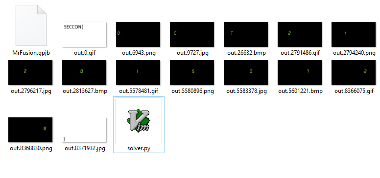

## Steganography 1 (Stegano, 100p)

    Find image files in the file
    
    Please input flag like this format-->SECCON{*** ** **** ****}

###PL
[ENG](#eng-version)

Dostajemy plik o rozszerzeniu .gpjb. Polecenie `file` rozpoznaje go jako gif:


Ale po otworzeniu tego pliku w hexedytorze okazuje się że plik ten składa się w rzeczywistości z dużej liczby obrazów sklejonych w jeden.
Domyślamy się że "gpjb" pochodzi od rozszerzeń .gif, .png, .jpg oraz .bmp.

Piszemy na szybko skrypt w pythonie który dzieli te pliki na fragmenty (szukając odpowiednich headerów formatów):

```python
import re

data = open('MrFusion.gpjb', 'rb').read()

def findndx(str, data):
    return [m.start() for m in re.finditer(str, data)]

ext = {
    '.gif': 'GIF89a',
    '.png': '\x89PNG',
    '.bmp': 'BM',
    '.jpg': '\xFF\xD8\xFF\xE0'
}

for ext, pat in ext.iteritems():
    for n in findndx(pat, data):
        open('out.' + str(n) + ext, 'wb').write(data[n:])
```

Następnie uruchamiamy go i otrzymujemy sporo obrazów, z których każdy odpowiada jednemu znakowi:



Po przepisaniu:

    SECCON{OCT2120150728}

Z powodu błedu w zadaniu flaga nie przechodziła sprawdzenia, więc do opisu zadania doszła informacja o wymaganym formacie flagi, więc ostateczna flaga:

    SECCON{OCT 21 2015 0728}


### ENG version

We are given a file with .gpjb extension. `File` command recognises it as a gif:


But after checking the file in hexeditor it turns out that the file is composed of large number of concantenated images.
We guess that "gpjb" extension stands for gif, png, jpg and bmp file formats.

We have written quick and dirty script to split file into fragments (according to format headers):

```python
import re

data = open('MrFusion.gpjb', 'rb').read()

def findndx(str, data):
    return [m.start() for m in re.finditer(str, data)]

ext = {
    '.gif': 'GIF89a',
    '.png': '\x89PNG',
    '.bmp': 'BM',
    '.jpg': '\xFF\xD8\xFF\xE0'
}

for ext, pat in ext.iteritems():
    for n in findndx(pat, data):
        open('out.' + str(n) + ext, 'wb').write(data[n:])
```

After execution, script generated a lot of images, each of which represented single flag character:


After rewrite:

    SECCON{OCT2120150728}

But because of bug in challenge checker, flag was not accepted by server. After that, description of challenge was changed, and final, accepted flag is:

    SECCON{OCT 21 2015 0728}
