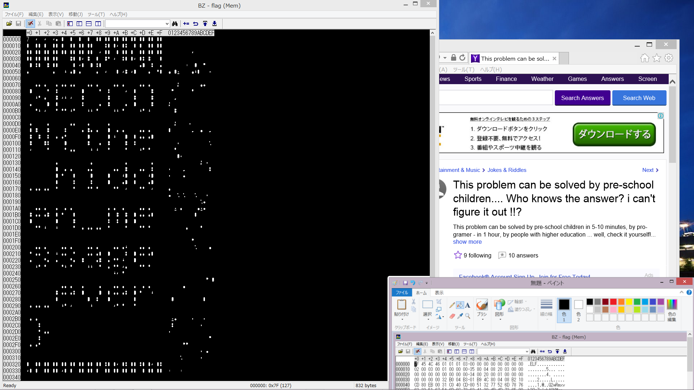

##Steganography 3 (Stegano, 100p)

```
We can get desktop capture!
Read the secret message.
```

###PL
[ENG](#eng-version)

Dostajemy obraz:


Na podstawie którego chcemy uzyskaæ flagê. Pierwszym krokiem jest odtworzenie binarki otwartej w hexedytorze. Zrobiliœmy to za pomoc¹ OCRa a nastêpnie rêcznego poprawiania b³êdów. Wynikiem jest program [elf](elf.bin).
Uruchomienie go daje w wyniku wiadomoœæ `Flood fill` zakodowan¹ jako base64. Po pewnym czasie wpadliœmy wreszcie na rozwi¹zanie, które polega³o na u¿yciu "wyp³eniania kolorem" na pocz¹tkowym obrazie:



co daje nam flage:

`SECCON{the_hidden_message_ever}`

### ENG version

We get a picture:


And we want to get a flag based on this. First step is to recreate the binary open in hexeditor. We used OCR and then fixed defects by hand. This way we got [elf binary](elf.bin).
Running it give a message `Flood fill` encoded as base64. After a while we finally figured the solution, which was to use "flood fill" on the initial picture:


which gives us a flag:

`SECCON{the_hidden_message_ever}`