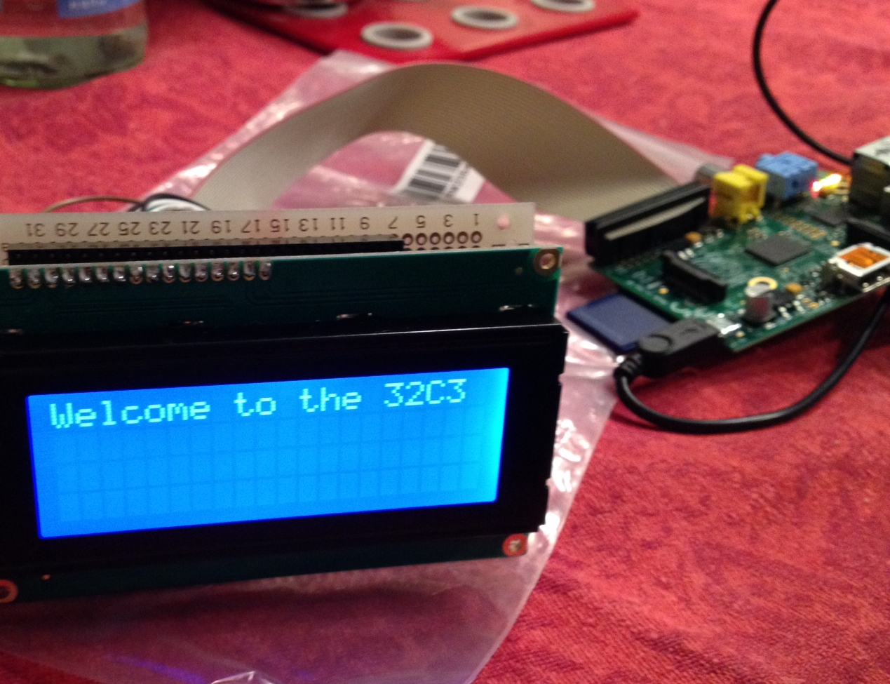

## HD44780 (embedded, 150p, 40 solves)

> The logic states of the GPIOs have been recorded Figure out the displayed message. You're gonna need this [here](./hd44780.tgz)



### PL
[ENG](#eng-version)
Dostajemy paczkę z sześcioma zdjęciami i sześcioma plikami, które zostały nazwane RSPI_GPIO_23.txt. Na zdjęciach widzimy 4 wierszowy
wyświetlacz podłączony do raspberry pi. Po nazwie zadania możemy wywnioskować, że jest to wyświetlacz oparty o sterownik Hitachi HD44780.
Pliki tekstowe zawierają dwie linijki danych pierwsza to czas, druga stan lini.

Ze zdjęć widać, że wyświetlacz i raspberry podłaczone są w następujący sposób:

```
GPIO07 -> RS
GPIO08 -> CLK
GPIO25 -> BIT4
GPIO24 -> BIT5
GPIO23 -> BIT6
GPIO18 -> BIT7
```

Haczykiem w tym zadaniu okazuje się to że wyświetlacz jest czterowierszowy co zmienia mapowanie pamieci na piksele na wyświetlaczu.
Poprawne mapowanie wygląda w ten sposób.


Potem wczytujemy dane plikiem [read.py](./read.py) i sortujemy je pod względem czasu. W wikipedii czytamy, że sygnał zegarowy
"łapie" na opadającym zboczu. Emulujemy stany lini i zapisujemy je jeśli stan lini CLK zmienia się z 1 na 0.
Następnie na [wyjściu](./read.out) wygenerowanym przez [read.py](./read.py) odpalamy [decode.py](./decode.py). Wyświetlacz podłączony jest czterobitowym
interfejsem, dlatego musimy poskładać dwa stany na pojedynczą komendę. [Otrzymujemy](./decode.out) pięknie rozpisane to co dzieje się z wyświetlaczem.
Możemy to zaemulować plikiem [emulate.py](./emulate.py). Na [wyjściu](./emulate.out) dostajemy ciąg ekranów.


Ostatecznie flaga ukazana jest na ekranie:
```
######################
#EOM                 #
#The flag 32C3_Never_#
#_let_you_down_Never_#
#_gonna_give_you_up_ #
######################
```

a flaga to:

`32C3_Never__let_you_down_Never__gonna_give_you_up_`

Oprócz tego organizatorzy dają linka do YT jako bonus. [bit.ly/1fKy1tC](bit.ly/1fKy1tC).


### ENG version
We got the archive with six picture and six text files named like RSPI_GPIO_23.txt. At the pictures we can see the four row
LCD display interfaced with raspberry pi. Acording to the task name we can assume it is based on Hitachi HD44780 controller.
Evry text file contains two lines with plenty of floating point values each.

According to the pictures we know that the diplay and raspberry are connected as follows:
```
GPIO07 -> RS
GPIO08 -> CLK
GPIO25 -> BIT4
GPIO24 -> BIT5
GPIO23 -> BIT6
GPIO18 -> BIT7
```

A catch in this task is that the display has four rows, while the controler orginaly was meant to handle only two rows.
That implicts fancy maaping DRAM to chars on the display.


When we know all that let's get down to work. We read data with [read.py](./read.py) file and sort them in term of their occurence.
Wikipedia inform us that clock signal is trigerred by falling edge. So we have to emulate state of every line and save when
clock line go form state 1 to 0. Next on the [output](./read.out) of [read.py](./read.py) we execute [decode.py](./decode.py).
The display is connected via 4bit interface so we have to join two state to get one data or comand in result. At the end of
this phase we get [decode.out](./decode.out) containing data and commands with comments. Now we can emulate that with
[emulate.py](./emulate.py). Finaly we get a lot of screens from every phase of display in file [emulate.out](./emulate.out).

The whole flag contains this one:

```
######################
#EOM                 #
#The flag 32C3_Never_#
#_let_you_down_Never_#
#_gonna_give_you_up_ #
######################
```

and a flag is:

`32C3_Never__let_you_down_Never__gonna_give_you_up_`

As a bonus we get link [bit.ly/1fKy1tC](bit.ly/1fKy1tC).
