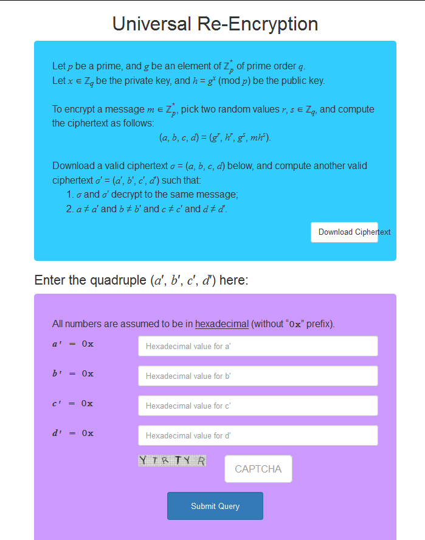

## URE (Crypto, 100p)

    Universal ReEncryption


###PL
[ENG](#eng-version)

Naszym zadaniem jest zmiana ciphertextu tak, aby po zdeszyfrowaniu jego zawartośc (plaintext) się nie zmieniła:



Można się zastanowić czego dokładnie chcą od nas twórcy zadania w "matematycznych" słowach. `r` i `s` są liczbami losowymi, więc jeśli uda nam się je zamienić,
otrzymamy jednocześnie rozwiązanie zadania.

Tzn. jeśli bylibyśmy w stanie zamienić `(g^r, h^r, g^s, mh^s)` na `(g^x, h^x, g^y, mh^y)` (dla jakiegoś x != r, y != s) to mamy rozwiązanie zadania.

Przy rozwiązaniu było trochę kombinowania, ale szybko wpadliśmy na podmianę którą można było łatwo wykonać:

    r -> r+r
    s -> r+s

Nasz solver demonstrujący podmianę (podstawy algebry wystarczą żeby udowodnić poprawność rozwiązania):

```python
def solve(a, b, c, d, p):
    # a = g^r 
    # b = h^r
    # c = g^s
    # d = m*g^xs
    return [x%p for x in [
        a*a, # g^(r+r)
        b*b, # h^(r+r)
        a*c, # g^(r+s)
        d*b  # m*h^(r+s)
    ]]
```

I rozwiązanie:

    a': 3287406693040037454338117703746186185132137914785835752950604845777415758360615360784432898128185782894436154048036406523549199332371675403330587908658389
    b': 3106361558536896198315490627917020257039985078045091925325167930756012775219021778274538316287957153184501076513389822529518252243096913454042609623430979
    c': 2705749471178411581710759303917406711797848509917528975018497036876024862091214580659339932929912633743841281275200381261759865873903109533343463983599973
    d': 5373483039142295785146805049046423326555571326092245347871091138664843112902523040473342171017639501524961161720758693343930112103298610080325764680063048

###ENG version

We have to change ciphertext in such way, that after decrypting plaintext is unchanged:


We need to think about what task authors really want from us - in mathematical terms. `r` and `s` are random numbers, so if we substitute them with another numbers
plaintext will surely be unchanged.

So if we change `(g^r, h^r, g^s, mh^s)` to `(g^x, h^x, g^y, mh^y)` (for any x != r, y != s) then task is solved.

We tried few possibilities, but after not very long time we came to good substitution:

    r -> r+r
    s -> r+s

Our solver demonstrating that substitution (basic algebra is enough to prove it right)

```python
def solve(a, b, c, d, p):
    # a = g^r 
    # b = h^r
    # c = g^s
    # d = m*g^xs
    return [x%p for x in [
        a*a, # g^(r+r)
        b*b, # h^(r+r)
        a*c, # g^(r+s)
        d*b  # m*h^(r+s)
    ]]
```

And our solution

    a': 3287406693040037454338117703746186185132137914785835752950604845777415758360615360784432898128185782894436154048036406523549199332371675403330587908658389
    b': 3106361558536896198315490627917020257039985078045091925325167930756012775219021778274538316287957153184501076513389822529518252243096913454042609623430979
    c': 2705749471178411581710759303917406711797848509917528975018497036876024862091214580659339932929912633743841281275200381261759865873903109533343463983599973
    d': 5373483039142295785146805049046423326555571326092245347871091138664843112902523040473342171017639501524961161720758693343930112103298610080325764680063048
