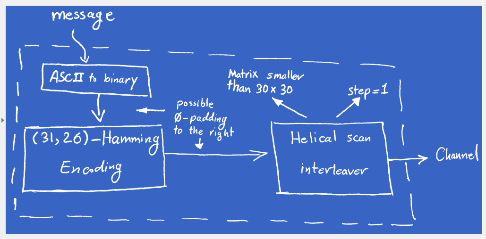

## Hail Zeus (Crypto, 300p)

> Asking Hermes to gath'r intel on the foe, he recover'd the blueprint of their transmitt'r bef're
> getting captur'd. It’s been ov'r a month of radio silence. but wait... all hail Zeus, as they restart'd
> communication when he strok'd them with a lightning: 


###ENG
[PL](#pl-version)

Although this challenge wa worth "only" 300 points, only one team managed to solve it (our team of course,
that's why i can write this writeup right now).

We are given long bit string representing "enemy communication", and we have to decode it:

     11111010101010010101011010100011110101000000000000000000000000000000000000000000
    000000000000000000000000000000000000000000000000000000000000000000000000000000000
    000000000000000000000000000000000000000000000000000000000000000000000000000000000
    000000000000000000000000000000000000000000000000000000000000000000000000000000000
    000000000000000010010110101111111100000111100101010111001010010111011100101111100
    001101000111111000101100110110011001111001001011101011011110110110101010000101101
    100001101010111101000010101000001100010111110000011111100100001000111111011010010
    010010100101011100011000000111001101010000001111111111010000111110001011001010110
    100001001100010111010101010000001111000011010101010101000011110000110101000111101
    000011010010010101111100101011111001111010001001101010000000010011000010110000011
    111000011001100011011001101011001111001001000110111100000101111000100100010100101
    000111101011011110010010011011110010001000001011101010001000000001100011001110011
    011100101100010001001001100100011111000011110000001100111011010000010100001100011
    000101010110010000010001000011100100101100001111100100001010101111010010111010010
    111100110110110111110100100101100011010000001000000000010000111010001010110111100
    100100110000100110011011110000010110001111000001111100100111000111011000101010001
    001111010011110010111000111100100000110000000110101110110001010000011010100001110
    100100111001110110101111011011111110000100010000101100011101000111100001000001001
    001100011001000000000100010111000100101101111100100111010000110101010111000010011
    000100101000101101010110101010010110001100110010110100010010100011011000010010101
    011100100101000001011001101101000011001010011110100110100000110111000010100010110
    010011110010010010100010111001111011000010100100111110001011010111011101010001010
    001101001110100100101001011010010001110110100011100011100000011011001100100100010
    011000110110000010100100011000111010001011110101001001101010000001110101000011100
    010110001000111101010000101011000001011101001101000001101000001100010001100100110
    100100101001010011100000111000011111110000110101101110001011010100001101000011000
    000110100101101000001011000110111001101001001100010011110010011100000110110100110
    100011111110101111000001001000011010010001111001011001100101000101111000001101010
    001100010001100000011000100100101101111110100111011101101101001011000101010010011
    100010010110010100110011111100000000100001010000000111001010010001111010000001100
    000001000101001111011101010001111100111101100010110100111100000111011001110100010
    000010001010110100001100111001001101001001010001011101000011010000011100000001010
    110101100001011010000110010010101000001111010101111101000101011111011000011100001
    110000011110000011110110111100000011100000100100000111011001110010010010001010011
    000011010000010001001001000001001011010011010011101000010111010010111010001100001
    011000011010010010110101011000000010010100010111001011101101111010101111000010101
    000011111000001000110111110101101101011001010011111000101101001011001000110100101
    011001001111101110010000010101000011000000110101000111001000101010001111110011110
    100010010100010011000010110000111010101101000101011101000001000010100000001101010
    110111000100100000100100000011011010111001010110011001110100111110100001001101100
    011001011010111001110110110010110101000100100110100101111110001010110010000011110
    010111010011000110110100001101000000110010011110100110110010011000100111110100001
    001001110010011111000100001000011100010111100001110101000111010001011101001001000
    000000000001101100110010000100101000001100000111010000011000010010000010010100110
    000000001000000000000001101110000000000011100000000001100101000000011111011000000
    001010001000000000110010000000000010011000000010001000000000011010010000000001011
    010000000010000... 

We are also given blueprint describing transmission method:



As you can see, ASCII message is encoded with hamming code, and then interleaved with helical scan matrix.

Before we start reversing this transmission, we have to learn something about hamming codes and helical scan matrices. 

Hamming codes are family of error correcting, linear codes. They have advantage over simple checksums, because they can be used to repair simple single-bit flips,
not only to detect them.

In practice using hamming codes can be reduced to multiplying by appropiate matrices - generato generator matrix G and parity check matrix H.

Every size of hamming code need different matrix, so we have to find (or compute, it's not that hard) appropiate matrix for our needs.
In case of hamming(31, 26) matrix we need looks like this:

```python
mat_g = [
    [1, 0, 0, 0, 0, 0, 0, 0, 0, 0, 0, 0, 0, 0, 0, 0, 0, 0, 0, 0, 0, 0, 0, 0, 0, 0, 1, 0, 1, 0, 0], 
    [0, 1, 0, 0, 0, 0, 0, 0, 0, 0, 0, 0, 0, 0, 0, 0, 0, 0, 0, 0, 0, 0, 0, 0, 0, 0, 0, 1, 0, 1, 0], 
    [0, 0, 1, 0, 0, 0, 0, 0, 0, 0, 0, 0, 0, 0, 0, 0, 0, 0, 0, 0, 0, 0, 0, 0, 0, 0, 0, 0, 1, 0, 1], 
    [0, 0, 0, 1, 0, 0, 0, 0, 0, 0, 0, 0, 0, 0, 0, 0, 0, 0, 0, 0, 0, 0, 0, 0, 0, 0, 1, 0, 1, 1, 0], 
    [0, 0, 0, 0, 1, 0, 0, 0, 0, 0, 0, 0, 0, 0, 0, 0, 0, 0, 0, 0, 0, 0, 0, 0, 0, 0, 0, 1, 0, 1, 1], 
    [0, 0, 0, 0, 0, 1, 0, 0, 0, 0, 0, 0, 0, 0, 0, 0, 0, 0, 0, 0, 0, 0, 0, 0, 0, 0, 1, 0, 0, 0, 1], 
    [0, 0, 0, 0, 0, 0, 1, 0, 0, 0, 0, 0, 0, 0, 0, 0, 0, 0, 0, 0, 0, 0, 0, 0, 0, 0, 1, 1, 1, 0, 0], 
    [0, 0, 0, 0, 0, 0, 0, 1, 0, 0, 0, 0, 0, 0, 0, 0, 0, 0, 0, 0, 0, 0, 0, 0, 0, 0, 0, 1, 1, 1, 0], 
    [0, 0, 0, 0, 0, 0, 0, 0, 1, 0, 0, 0, 0, 0, 0, 0, 0, 0, 0, 0, 0, 0, 0, 0, 0, 0, 0, 0, 1, 1, 1], 
    [0, 0, 0, 0, 0, 0, 0, 0, 0, 1, 0, 0, 0, 0, 0, 0, 0, 0, 0, 0, 0, 0, 0, 0, 0, 0, 1, 0, 1, 1, 1], 
    [0, 0, 0, 0, 0, 0, 0, 0, 0, 0, 1, 0, 0, 0, 0, 0, 0, 0, 0, 0, 0, 0, 0, 0, 0, 0, 1, 1, 1, 1, 1], 
    [0, 0, 0, 0, 0, 0, 0, 0, 0, 0, 0, 1, 0, 0, 0, 0, 0, 0, 0, 0, 0, 0, 0, 0, 0, 0, 1, 1, 0, 1, 1], 
    [0, 0, 0, 0, 0, 0, 0, 0, 0, 0, 0, 0, 1, 0, 0, 0, 0, 0, 0, 0, 0, 0, 0, 0, 0, 0, 1, 1, 0, 0, 1], 
    [0, 0, 0, 0, 0, 0, 0, 0, 0, 0, 0, 0, 0, 1, 0, 0, 0, 0, 0, 0, 0, 0, 0, 0, 0, 0, 1, 1, 0, 0, 0], 
    [0, 0, 0, 0, 0, 0, 0, 0, 0, 0, 0, 0, 0, 0, 1, 0, 0, 0, 0, 0, 0, 0, 0, 0, 0, 0, 0, 1, 1, 0, 0], 
    [0, 0, 0, 0, 0, 0, 0, 0, 0, 0, 0, 0, 0, 0, 0, 1, 0, 0, 0, 0, 0, 0, 0, 0, 0, 0, 0, 0, 1, 1, 0], 
    [0, 0, 0, 0, 0, 0, 0, 0, 0, 0, 0, 0, 0, 0, 0, 0, 1, 0, 0, 0, 0, 0, 0, 0, 0, 0, 0, 0, 0, 1, 1], 
    [0, 0, 0, 0, 0, 0, 0, 0, 0, 0, 0, 0, 0, 0, 0, 0, 0, 1, 0, 0, 0, 0, 0, 0, 0, 0, 1, 0, 1, 0, 1], 
    [0, 0, 0, 0, 0, 0, 0, 0, 0, 0, 0, 0, 0, 0, 0, 0, 0, 0, 1, 0, 0, 0, 0, 0, 0, 0, 1, 1, 1, 1, 0], 
    [0, 0, 0, 0, 0, 0, 0, 0, 0, 0, 0, 0, 0, 0, 0, 0, 0, 0, 0, 1, 0, 0, 0, 0, 0, 0, 0, 1, 1, 1, 1], 
    [0, 0, 0, 0, 0, 0, 0, 0, 0, 0, 0, 0, 0, 0, 0, 0, 0, 0, 0, 0, 1, 0, 0, 0, 0, 0, 1, 0, 0, 1, 1], 
    [0, 0, 0, 0, 0, 0, 0, 0, 0, 0, 0, 0, 0, 0, 0, 0, 0, 0, 0, 0, 0, 1, 0, 0, 0, 0, 1, 1, 1, 0, 1], 
    [0, 0, 0, 0, 0, 0, 0, 0, 0, 0, 0, 0, 0, 0, 0, 0, 0, 0, 0, 0, 0, 0, 1, 0, 0, 0, 1, 1, 0, 1, 0], 
    [0, 0, 0, 0, 0, 0, 0, 0, 0, 0, 0, 0, 0, 0, 0, 0, 0, 0, 0, 0, 0, 0, 0, 1, 0, 0, 0, 1, 1, 0, 1], 
    [0, 0, 0, 0, 0, 0, 0, 0, 0, 0, 0, 0, 0, 0, 0, 0, 0, 0, 0, 0, 0, 0, 0, 0, 1, 0, 1, 0, 0, 1, 0], 
    [0, 0, 0, 0, 0, 0, 0, 0, 0, 0, 0, 0, 0, 0, 0, 0, 0, 0, 0, 0, 0, 0, 0, 0, 0, 1, 0, 1, 0, 0, 1], 
]

mat_h = [
    [1, 0, 0, 1, 0, 1, 1, 0, 0, 1, 1, 1, 1, 1, 0, 0, 0, 1, 1, 0, 1, 1, 1, 0, 1, 0, 1, 0, 0, 0, 0],
    [0, 1, 0, 0, 1, 0, 1, 1, 0, 0, 1, 1, 1, 1, 1, 0, 0, 0, 1, 1, 0, 1, 1, 1, 0, 1, 0, 1, 0, 0, 0],
    [1, 0, 1, 1, 0, 0, 1, 1, 1, 1, 1, 0, 0, 0, 1, 1, 0, 1, 1, 1, 0, 1, 0, 1, 0, 0, 0, 0, 1, 0, 0],
    [0, 1, 0, 1, 1, 0, 0, 1, 1, 1, 1, 1, 0, 0, 0, 1, 1, 0, 1, 1, 1, 0, 1, 0, 1, 0, 0, 0, 0, 1, 0],
    [0, 0, 1, 0, 1, 1, 0, 0, 1, 1, 1, 1, 1, 0, 0, 0, 1, 1, 0, 1, 1, 1, 0, 1, 0, 1, 0, 0, 0, 0, 1],
]
```

We also need some way to multiply matrices:

```python
def mult(a, b):
    rows_a = len(a)
    cols_a = len(a[0])
    rows_b = len(b)
    cols_b = len(b[0])

    if cols_a != rows_b:
        print "cannot multiply the two matrices. Incorrect dimensions:", cols_a, rows_b
        return

    c = [[0 for row in range(cols_b)] for col in range(rows_a)]

    for i in range(rows_a):
        for j in range(cols_b):
            c[i][j] = sum(a[i][k] * b[k][j] for k in range(cols_a)) & 1
    return c


def transpose(mat):
    return [[mat[y][x] for y in range(len(mat))] for x in range(len(mat[0]))]

assert transpose([[1, 2, 3], [4, 5, 6]]) == [[1, 4], [2, 5], [3, 6]]
```

Decoding hamming codes is very easy - it's enough to ignore error correcting/error checking informations (if message is not damaged of course).
We can detect if message is damaged by multiplying it with matrix H - if message is not corrupted we should get zero matrix in result.

Second part of transmission is helical scan interleaving. Data is saved in matrix, and read in different order. For example:

                          1   2  3  4
                          5   6  7  8
 1 2 3 4 ... 14 15 16 ->  9  10 11 12  -> 1 6 11 16 5 10 15 4 9 14 3 8 13 2 7 12
                          13 14 15 16

(We read first element in first row, and proceed diagonally. Then we read first element in second row and proceed diagonally, etc).

We need some helper methods, to convert between matrices from raw data strem (both ways):

```python
def make_matrix(w, h, data):
    return [[data[i*w+j] for j in range(w)] for i in range(h)]

assert make_matrix(2, 3, [1, 2, 3, 4, 5, 6]) == [[1, 2], [3, 4], [5, 6]]


def unmake_matrix(w, h, data):
    return [data[i/w][i%w] for i in range(w*h)]

assert unmake_matrix(2, 3, [[1, 2], [3, 4], [5, 6]]) == [1, 2, 3, 4, 5, 6]
```

And encoding/decoding:

```python
def chunks(data, n, pad_obj=0):
    pad = list(data) + [pad_obj] * (n-1)
    return [pad[i*n:(i+1)*n] for i in range(len(pad)/n)]

assert chunks([1, 2, 3, 4, 5], 3) == [[1, 2, 3], [4, 5, 0]]


def helical_interleave_part(w, h, dat):
    mat = make_matrix(w, h, dat)
    conv = [[mat[(y+x) % h][x] for x in range(w)] for y in range(h)]
    return unmake_matrix(w, h, conv)

assert helical_interleave_part(2, 3, [1, 2, 3, 4, 5, 6]) == [1, 4, 3, 6, 5, 2]


def helical_interleave(w, h, dat):
    return sum((helical_interleave_part(w, h, part) for part in chunks(dat, w*h)), [])

assert helical_interleave(2, 3, [1, 2, 3, 4, 5, 6, 7, 8, 9, 10, 11, 12]) == [1, 4, 3, 6, 5, 2, 7, 10, 9, 12, 11, 8]


def helical_deinterleave_part(w, h, dat):
    mat = make_matrix(w, h, dat)
    conv = [[mat[(y-x) % h][x] for x in range(w)] for y in range(h)]
    return unmake_matrix(w, h, conv)

assert helical_deinterleave_part(2, 3, [1, 4, 3, 6, 5, 2]) == [1, 2, 3, 4, 5, 6]


def helical_deinterleave(w, h, dat):
    return sum((helical_deinterleave_part(w, h, part) for part in chunks(dat, w*h)), [])
```

We have implemented everything we need to solve this challenge. We are given all necessary information to actually decode transmission - except
size of helical scan matrix. Fortunatelly, we know that matrix is smaller than 30x30, so we can just bruteforce width and height.
We will know that we guessed right by checking amount of hamming code errors. Random data will rarely have correct checksum (1/32 chance), and 
correctly deinterleaved data should have most checksums correct.

So moving on to implementation phase:

```python
data = open('data.txt').read().strip()
data = [int(c) for c in data]

result = []

for w in range(1, 30):
    print w, ':',
    for h in range(1, 30):
        print h,
        fail = 0

        helix = helical_deinterleave(w, h, data)
        cs = chunks(helix, 31)
        for c in cs:
            hamming_check = mult(mat_h, transpose([c]))
            hamming_check = transpose(hamming_check)
            if not all(n == 0 for n in hamming_check[0]):
                fail += 1
        
        result.append((fail, w, h))
    print

def safe(s):
    return ''.join(c if 32 <= ord(c) <= 127 else '.' for c in s)

result = sorted(result)

fail, w, h = result[0]
print 'best result:', fail, w, h
```

Our code tells us that matrix is 24 elements wide and 16 elements high. We can just decode data now, right?

```python
helix = helical_deinterleave(w, h, data)
helix = decode_helix_brute(mat_g, mat_h, helix)
dat = chunks(helix, 8)
decr = [int(''.join(str(c) for c in chunk), 2) for chunk in dat]
decr_hex = ''.join(chr(c) for c in decr).encode('hex')
decr_bin = bin(int(decr_hex, 16))[2:]
```

Unfortunately, there is one more thing we have to do - we don't know from which bit we should start decoding (transmission is not byte-aligned).
But that's non-issue, because we can just bruteforce all 8 possiblities:

```python
for i in range(8):
    data = repr(''.join([chr(int(''.join(chunk), 2)) for chunk in chunks(decr_bin[i:], 8, '0')]))
    if 'SharifCTF' in data:
        print data
```

    y weighs you down and torments you with regret. Drawing rooms, gossip, balls, SharifCTF{4412e6635c6eafaad08574d77ab4d301}, vanity,
    and triviality --- these are the enchanted circle I cannot escape from. I am now going to the war, the greatest war there ever was,
    and I know nothing and am fit for nothing. I am very al\x00\x00\x00\x00\x00\x00\x00\x00\x00\x00\x00\x00\x00\x00\x00\x00\x00\x00\x00
    \x00\x00\x00\x00\x00\x00\x00\x00\x00\x00\x00\x00\x00\x00\x00\x00\x00\x00\x00\x00\x00\x00\x00'

Challenge solved, 300 points (+ 100 bonus) well earned.

Working code is inside hamming.py file.

###PL version

Zacznę może od tego, że mimo ze zadanie ma "tylko" 300 punktów, to zostało rozwiązane tylko przez
jedną drużynę na świecie - p4 (naszą drużynę tzn). Jako że nikt poza nami nie opisze tego zadania
(bo nikt inny go nie zrobił), czuję się zobowiązany do opisania naszego rozwiązania.

Ale do rzeczy. Dostajemy bardzo długi ciąg bitów, będący "komunikacją" o której mowa w treści zadania:

     11111010101010010101011010100011110101000000000000000000000000000000000000000000
    000000000000000000000000000000000000000000000000000000000000000000000000000000000
    000000000000000000000000000000000000000000000000000000000000000000000000000000000
    000000000000000000000000000000000000000000000000000000000000000000000000000000000
    000000000000000010010110101111111100000111100101010111001010010111011100101111100
    001101000111111000101100110110011001111001001011101011011110110110101010000101101
    100001101010111101000010101000001100010111110000011111100100001000111111011010010
    010010100101011100011000000111001101010000001111111111010000111110001011001010110
    100001001100010111010101010000001111000011010101010101000011110000110101000111101
    000011010010010101111100101011111001111010001001101010000000010011000010110000011
    111000011001100011011001101011001111001001000110111100000101111000100100010100101
    000111101011011110010010011011110010001000001011101010001000000001100011001110011
    011100101100010001001001100100011111000011110000001100111011010000010100001100011
    000101010110010000010001000011100100101100001111100100001010101111010010111010010
    111100110110110111110100100101100011010000001000000000010000111010001010110111100
    100100110000100110011011110000010110001111000001111100100111000111011000101010001
    001111010011110010111000111100100000110000000110101110110001010000011010100001110
    100100111001110110101111011011111110000100010000101100011101000111100001000001001
    001100011001000000000100010111000100101101111100100111010000110101010111000010011
    000100101000101101010110101010010110001100110010110100010010100011011000010010101
    011100100101000001011001101101000011001010011110100110100000110111000010100010110
    010011110010010010100010111001111011000010100100111110001011010111011101010001010
    001101001110100100101001011010010001110110100011100011100000011011001100100100010
    011000110110000010100100011000111010001011110101001001101010000001110101000011100
    010110001000111101010000101011000001011101001101000001101000001100010001100100110
    100100101001010011100000111000011111110000110101101110001011010100001101000011000
    000110100101101000001011000110111001101001001100010011110010011100000110110100110
    100011111110101111000001001000011010010001111001011001100101000101111000001101010
    001100010001100000011000100100101101111110100111011101101101001011000101010010011
    100010010110010100110011111100000000100001010000000111001010010001111010000001100
    000001000101001111011101010001111100111101100010110100111100000111011001110100010
    000010001010110100001100111001001101001001010001011101000011010000011100000001010
    110101100001011010000110010010101000001111010101111101000101011111011000011100001
    110000011110000011110110111100000011100000100100000111011001110010010010001010011
    000011010000010001001001000001001011010011010011101000010111010010111010001100001
    011000011010010010110101011000000010010100010111001011101101111010101111000010101
    000011111000001000110111110101101101011001010011111000101101001011001000110100101
    011001001111101110010000010101000011000000110101000111001000101010001111110011110
    100010010100010011000010110000111010101101000101011101000001000010100000001101010
    110111000100100000100100000011011010111001010110011001110100111110100001001101100
    011001011010111001110110110010110101000100100110100101111110001010110010000011110
    010111010011000110110100001101000000110010011110100110110010011000100111110100001
    001001110010011111000100001000011100010111100001110101000111010001011101001001000
    000000000001101100110010000100101000001100000111010000011000010010000010010100110
    000000001000000000000001101110000000000011100000000001100101000000011111011000000
    001010001000000000110010000000000010011000000010001000000000011010010000000001011
    010000000010000... 

W zadaniu jest również podany "blueprint" z opisem sposobu transmisji:


Jak widać, wiadomość ASCII jest enkodowana przy pomocy kodu hamminga, a następnie przeplatana przy pomocy helical scan matrix.

Zanim zaczniemy reversować tą transmisję, spróbujmy najpierw zorientować się co ona w ogóle robi. Czym jest kodowanie hamminga i `helical scan matrix`?

Kodowanie hamminga to rodzina liniowych kodów naprawczych (linear error correcting codes). Mają one tą zaletę nad prostymi checksumami (jak np. parity code,
czyli bit parzystości), że mogą nie tylko wykrywać błędy, ale również naprawiać pojedyncze bity błędów.

Pomijając teorię stojącą za kodowaniem hamminga, w praktyce sprowadza się to do mnożenia przez odpowiednie macierze - generator matrix G, oraz parity check matrix H.

Dla każdej odmiany kodów hamminga tablice wyglądają inaczej, więc musimy znaleźć/wygenerować odpowiednią tablicę dla naszych potrzeb. W przypadku kodowania hamminga(31, 26) wygląda ona tak:

```python
mat_g = [
    [1, 0, 0, 0, 0, 0, 0, 0, 0, 0, 0, 0, 0, 0, 0, 0, 0, 0, 0, 0, 0, 0, 0, 0, 0, 0, 1, 0, 1, 0, 0], 
    [0, 1, 0, 0, 0, 0, 0, 0, 0, 0, 0, 0, 0, 0, 0, 0, 0, 0, 0, 0, 0, 0, 0, 0, 0, 0, 0, 1, 0, 1, 0], 
    [0, 0, 1, 0, 0, 0, 0, 0, 0, 0, 0, 0, 0, 0, 0, 0, 0, 0, 0, 0, 0, 0, 0, 0, 0, 0, 0, 0, 1, 0, 1], 
    [0, 0, 0, 1, 0, 0, 0, 0, 0, 0, 0, 0, 0, 0, 0, 0, 0, 0, 0, 0, 0, 0, 0, 0, 0, 0, 1, 0, 1, 1, 0], 
    [0, 0, 0, 0, 1, 0, 0, 0, 0, 0, 0, 0, 0, 0, 0, 0, 0, 0, 0, 0, 0, 0, 0, 0, 0, 0, 0, 1, 0, 1, 1], 
    [0, 0, 0, 0, 0, 1, 0, 0, 0, 0, 0, 0, 0, 0, 0, 0, 0, 0, 0, 0, 0, 0, 0, 0, 0, 0, 1, 0, 0, 0, 1], 
    [0, 0, 0, 0, 0, 0, 1, 0, 0, 0, 0, 0, 0, 0, 0, 0, 0, 0, 0, 0, 0, 0, 0, 0, 0, 0, 1, 1, 1, 0, 0], 
    [0, 0, 0, 0, 0, 0, 0, 1, 0, 0, 0, 0, 0, 0, 0, 0, 0, 0, 0, 0, 0, 0, 0, 0, 0, 0, 0, 1, 1, 1, 0], 
    [0, 0, 0, 0, 0, 0, 0, 0, 1, 0, 0, 0, 0, 0, 0, 0, 0, 0, 0, 0, 0, 0, 0, 0, 0, 0, 0, 0, 1, 1, 1], 
    [0, 0, 0, 0, 0, 0, 0, 0, 0, 1, 0, 0, 0, 0, 0, 0, 0, 0, 0, 0, 0, 0, 0, 0, 0, 0, 1, 0, 1, 1, 1], 
    [0, 0, 0, 0, 0, 0, 0, 0, 0, 0, 1, 0, 0, 0, 0, 0, 0, 0, 0, 0, 0, 0, 0, 0, 0, 0, 1, 1, 1, 1, 1], 
    [0, 0, 0, 0, 0, 0, 0, 0, 0, 0, 0, 1, 0, 0, 0, 0, 0, 0, 0, 0, 0, 0, 0, 0, 0, 0, 1, 1, 0, 1, 1], 
    [0, 0, 0, 0, 0, 0, 0, 0, 0, 0, 0, 0, 1, 0, 0, 0, 0, 0, 0, 0, 0, 0, 0, 0, 0, 0, 1, 1, 0, 0, 1], 
    [0, 0, 0, 0, 0, 0, 0, 0, 0, 0, 0, 0, 0, 1, 0, 0, 0, 0, 0, 0, 0, 0, 0, 0, 0, 0, 1, 1, 0, 0, 0], 
    [0, 0, 0, 0, 0, 0, 0, 0, 0, 0, 0, 0, 0, 0, 1, 0, 0, 0, 0, 0, 0, 0, 0, 0, 0, 0, 0, 1, 1, 0, 0], 
    [0, 0, 0, 0, 0, 0, 0, 0, 0, 0, 0, 0, 0, 0, 0, 1, 0, 0, 0, 0, 0, 0, 0, 0, 0, 0, 0, 0, 1, 1, 0], 
    [0, 0, 0, 0, 0, 0, 0, 0, 0, 0, 0, 0, 0, 0, 0, 0, 1, 0, 0, 0, 0, 0, 0, 0, 0, 0, 0, 0, 0, 1, 1], 
    [0, 0, 0, 0, 0, 0, 0, 0, 0, 0, 0, 0, 0, 0, 0, 0, 0, 1, 0, 0, 0, 0, 0, 0, 0, 0, 1, 0, 1, 0, 1], 
    [0, 0, 0, 0, 0, 0, 0, 0, 0, 0, 0, 0, 0, 0, 0, 0, 0, 0, 1, 0, 0, 0, 0, 0, 0, 0, 1, 1, 1, 1, 0], 
    [0, 0, 0, 0, 0, 0, 0, 0, 0, 0, 0, 0, 0, 0, 0, 0, 0, 0, 0, 1, 0, 0, 0, 0, 0, 0, 0, 1, 1, 1, 1], 
    [0, 0, 0, 0, 0, 0, 0, 0, 0, 0, 0, 0, 0, 0, 0, 0, 0, 0, 0, 0, 1, 0, 0, 0, 0, 0, 1, 0, 0, 1, 1], 
    [0, 0, 0, 0, 0, 0, 0, 0, 0, 0, 0, 0, 0, 0, 0, 0, 0, 0, 0, 0, 0, 1, 0, 0, 0, 0, 1, 1, 1, 0, 1], 
    [0, 0, 0, 0, 0, 0, 0, 0, 0, 0, 0, 0, 0, 0, 0, 0, 0, 0, 0, 0, 0, 0, 1, 0, 0, 0, 1, 1, 0, 1, 0], 
    [0, 0, 0, 0, 0, 0, 0, 0, 0, 0, 0, 0, 0, 0, 0, 0, 0, 0, 0, 0, 0, 0, 0, 1, 0, 0, 0, 1, 1, 0, 1], 
    [0, 0, 0, 0, 0, 0, 0, 0, 0, 0, 0, 0, 0, 0, 0, 0, 0, 0, 0, 0, 0, 0, 0, 0, 1, 0, 1, 0, 0, 1, 0], 
    [0, 0, 0, 0, 0, 0, 0, 0, 0, 0, 0, 0, 0, 0, 0, 0, 0, 0, 0, 0, 0, 0, 0, 0, 0, 1, 0, 1, 0, 0, 1], 
]

mat_h = [
    [1, 0, 0, 1, 0, 1, 1, 0, 0, 1, 1, 1, 1, 1, 0, 0, 0, 1, 1, 0, 1, 1, 1, 0, 1, 0, 1, 0, 0, 0, 0],
    [0, 1, 0, 0, 1, 0, 1, 1, 0, 0, 1, 1, 1, 1, 1, 0, 0, 0, 1, 1, 0, 1, 1, 1, 0, 1, 0, 1, 0, 0, 0],
    [1, 0, 1, 1, 0, 0, 1, 1, 1, 1, 1, 0, 0, 0, 1, 1, 0, 1, 1, 1, 0, 1, 0, 1, 0, 0, 0, 0, 1, 0, 0],
    [0, 1, 0, 1, 1, 0, 0, 1, 1, 1, 1, 1, 0, 0, 0, 1, 1, 0, 1, 1, 1, 0, 1, 0, 1, 0, 0, 0, 0, 1, 0],
    [0, 0, 1, 0, 1, 1, 0, 0, 1, 1, 1, 1, 1, 0, 0, 0, 1, 1, 0, 1, 1, 1, 0, 1, 0, 1, 0, 0, 0, 0, 1],
]
```

Potrzebujemy tez operacji działających na tych macierzach:

```python
def mult(a, b):
    rows_a = len(a)
    cols_a = len(a[0])
    rows_b = len(b)
    cols_b = len(b[0])

    if cols_a != rows_b:
        print "cannot multiply the two matrices. Incorrect dimensions:", cols_a, rows_b
        return

    c = [[0 for row in range(cols_b)] for col in range(rows_a)]

    for i in range(rows_a):
        for j in range(cols_b):
            c[i][j] = sum(a[i][k] * b[k][j] for k in range(cols_a)) & 1
    return c


def transpose(mat):
    return [[mat[y][x] for y in range(len(mat))] for x in range(len(mat[0]))]

assert transpose([[1, 2, 3], [4, 5, 6]]) == [[1, 4], [2, 5], [3, 6]]
```

Dekodowanie kodów jest bardzo proste - wystarczy ignorować dane sprawdzające (o ile nie wykazują one błędu, oczywiście).

Druga część transmisji to helical scan interleaving. Polega to na tym, ze dane są zapisywane w macierzy, i czytane w zmienionej kolejności.

Na przykładzie:

  1   2  3  4
  5   6  7  8
  9  10 11 12  -> 1 6 11 16 5 10 15 4 9 14 3 8 13 2 7 12
  13 14 15 16

(czytamy od pierwszego elementu pierwszego wiersza ukośnie na dół, później pierwszego elementu drugiego wiersza ukośnie na dół, etc)

Przyda się tworzenie macierzy z ciągu danych (do kodowania/dekodowania musimy przedstawiac dane hako macierz:

```python
def make_matrix(w, h, data):
    return [[data[i*w+j] for j in range(w)] for i in range(h)]

assert make_matrix(2, 3, [1, 2, 3, 4, 5, 6]) == [[1, 2], [3, 4], [5, 6]]


def unmake_matrix(w, h, data):
    return [data[i/w][i%w] for i in range(w*h)]

assert unmake_matrix(2, 3, [[1, 2], [3, 4], [5, 6]]) == [1, 2, 3, 4, 5, 6]
```

I samo enkodowanie/dekodowanie:

```python
def chunks(data, n, pad_obj=0):
    pad = list(data) + [pad_obj] * (n-1)
    return [pad[i*n:(i+1)*n] for i in range(len(pad)/n)]

assert chunks([1, 2, 3, 4, 5], 3) == [[1, 2, 3], [4, 5, 0]]


def helical_interleave_part(w, h, dat):
    mat = make_matrix(w, h, dat)
    conv = [[mat[(y+x) % h][x] for x in range(w)] for y in range(h)]
    return unmake_matrix(w, h, conv)

assert helical_interleave_part(2, 3, [1, 2, 3, 4, 5, 6]) == [1, 4, 3, 6, 5, 2]


def helical_interleave(w, h, dat):
    return sum((helical_interleave_part(w, h, part) for part in chunks(dat, w*h)), [])

assert helical_interleave(2, 3, [1, 2, 3, 4, 5, 6, 7, 8, 9, 10, 11, 12]) == [1, 4, 3, 6, 5, 2, 7, 10, 9, 12, 11, 8]


def helical_deinterleave_part(w, h, dat):
    mat = make_matrix(w, h, dat)
    conv = [[mat[(y-x) % h][x] for x in range(w)] for y in range(h)]
    return unmake_matrix(w, h, conv)

assert helical_deinterleave_part(2, 3, [1, 4, 3, 6, 5, 2]) == [1, 2, 3, 4, 5, 6]


def helical_deinterleave(w, h, dat):
    return sum((helical_deinterleave_part(w, h, part) for part in chunks(dat, w*h)), [])
```

Mamy cały mechanizm gotowym teraz do rozwiazania zadania - mamy w sumie wszystkie dane, poza wielkością tablicy użytej do helical scanu. Na szczęście
możliwości jest bardzo mało (tablica mniejsza niż 30x30), więc możemy to łatwo bruteforcować. Wybierzemy taką szerokośc i wysokość która da najmniej błędów
kodów hamminga.

Implementując ten pomysł:

```python
data = open('data.txt').read().strip()
data = [int(c) for c in data]

result = []

for w in range(1, 30):
    print w, ':',
    for h in range(1, 30):
        print h,
        fail = 0

        helix = helical_deinterleave(w, h, data)
        cs = chunks(helix, 31)
        for c in cs:
            hamming_check = mult(mat_h, transpose([c]))
            hamming_check = transpose(hamming_check)
            if not all(n == 0 for n in hamming_check[0]):
                fail += 1
        
        result.append((fail, w, h))
    print

def safe(s):
    return ''.join(c if 32 <= ord(c) <= 127 else '.' for c in s)

result = sorted(result)

fail, w, h = result[0]
print 'best result:', fail, w, h
```

Wyszło nam że macierz jest szeroka na 24 elementy i wysoka na 16. W tym momencie wystarczy zdekodować dane - prawda?

```python
helix = helical_deinterleave(w, h, data)
helix = decode_helix_brute(mat_g, mat_h, helix)
dat = chunks(helix, 8)
decr = [int(''.join(str(c) for c in chunk), 2) for chunk in dat]
decr_hex = ''.join(chr(c) for c in decr).encode('hex')
decr_bin = bin(int(decr_hex, 16))[2:]
```

Niestety, jest jeszcze jedna pułapka - nie wiemy od którego bitu powinniśmy zacząć dekodowanie dokładnie (transmisja nie jest wyrównana do bitu)
Ale możemy to znowu bruteforcoawć, mamy tylko 8 możliwości w końcu:

```python
for i in range(8):
    data = repr(''.join([chr(int(''.join(chunk), 2)) for chunk in chunks(decr_bin[i:], 8, '0')]))
    if 'SharifCTF' in data:
        print data
```

    y weighs you down and torments you with regret. Drawing rooms, gossip, balls, SharifCTF{4412e6635c6eafaad08574d77ab4d301}, vanity,
    and triviality --- these are the enchanted circle I cannot escape from. I am now going to the war, the greatest war there ever was,
    and I know nothing and am fit for nothing. I am very al\x00\x00\x00\x00\x00\x00\x00\x00\x00\x00\x00\x00\x00\x00\x00\x00\x00\x00\x00
    \x00\x00\x00\x00\x00\x00\x00\x00\x00\x00\x00\x00\x00\x00\x00\x00\x00\x00\x00\x00\x00\x00\x00'

Mamy nasze 300 punktów (+ 100 punktów bonus).

Cały działający kod znajduje się w pliku hamming.py
