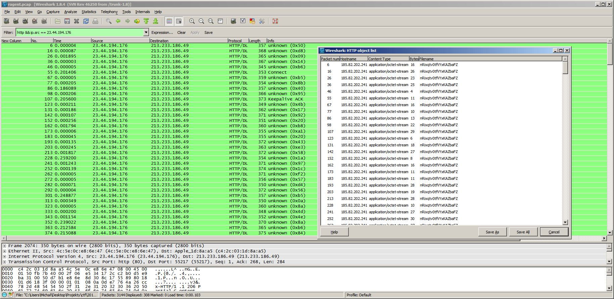
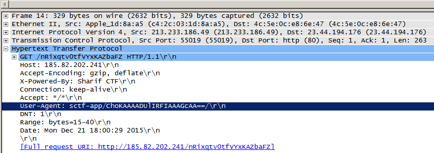
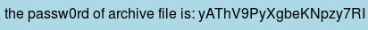
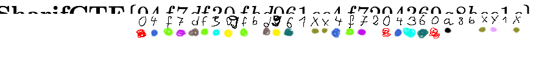

## uagent (Forensics, 100p)

	We think we are really cool, are we?
[Download](ragent.pcap)

###ENG
[PL](#pl-version)

We start off with a pcap file, a file is begin downladed throughout some packets, let's export them by filtering them out and using File->Export Objects->Http



The packets are generally okay, though we need to delete the first byte from every (except first packet), (the content-ranges mesh with each other with 1 byte) and there are some unnecessary packets at the end. 

We solve the first problem with a quick script in bash:

```bash
for file in `ls extractedFiles` done
	tail -c +2 $file > ../output/$file;
done
```

The only thing that's left is merging the files together, we simply do that with `cat * > out`

We're left with a password-protected zip that has out flag.png in it.

Another interesting thing is that requests for the zip are made with an interesting User-Agent:



We extract the packets using the same techinque as in the first step and are left with a file of base64 encoded strings(be careful to ignore retransmissed packets)

Finally, by writing our own script (or just using an online tool like [this one](http://www.motobit.com/util/base64-decoder-encoder.asp)) we convert our strings to an image:



Using it to open the encrypted zip we get:


There you go!

Bonus pic, guessing the flag was not a fun part of the challange:




###PL version

