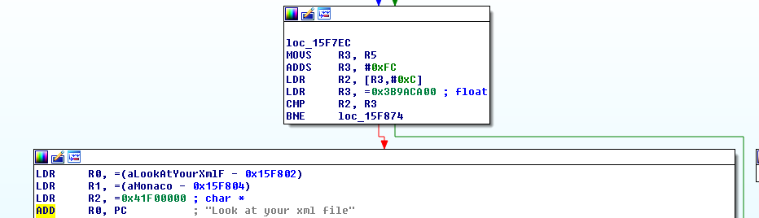
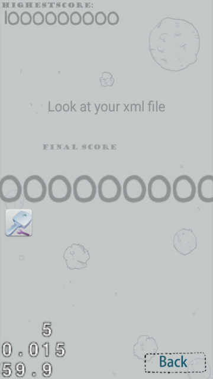

## boomshakalaka (mobile, 3 points)
	play the game, get the highest score

[boomshakalaka](plane.apk)

We're given an android apk, after decompiling it, we learned that our flag is stored in Cocos2dxPrefsFile.xml in shared_prefs folder.
When we looked in the specified file, it turned out that the flag is only partially complete: 

`0ctf{C0coS2d_AnDro1d_G7s÷ضg´36ُ3&EôنG&َ`

After a while of searching, we find out that the rest of our flag mechanics is actually compiled in the `libcocos2dcpp.so` library.
At first, we only noticed one check for score that displayed "Look at your xml file":



So we tried setting the score manually with some game-cheating applications, which gave us some promising results:



But it turned out that it wasn't enough, the flag was still not complete.
Finally, after spending some more time on it, we discovered checks for various numbers of points.

Example:

```c++
case 0xBB8:
	v11 = cocos2d::CCUserDefault::sharedUserDefault(v4, v5, 3000);
	std::operator+<char,std::char_traits<char>,std::allocator<char>>((int)&v26, (int *)&v21, "Bt");
	cocos2d::CCUserDefault::setStringForKey(v11, (int)&v35, (int)&v26);
	v8 = &v26;
	break;
````
Joining all of the strings together, finally gave us the valid flag:

`0ctf{C0coS2d_AnDro1d_G0mE_YoU_Kn0w?}`
