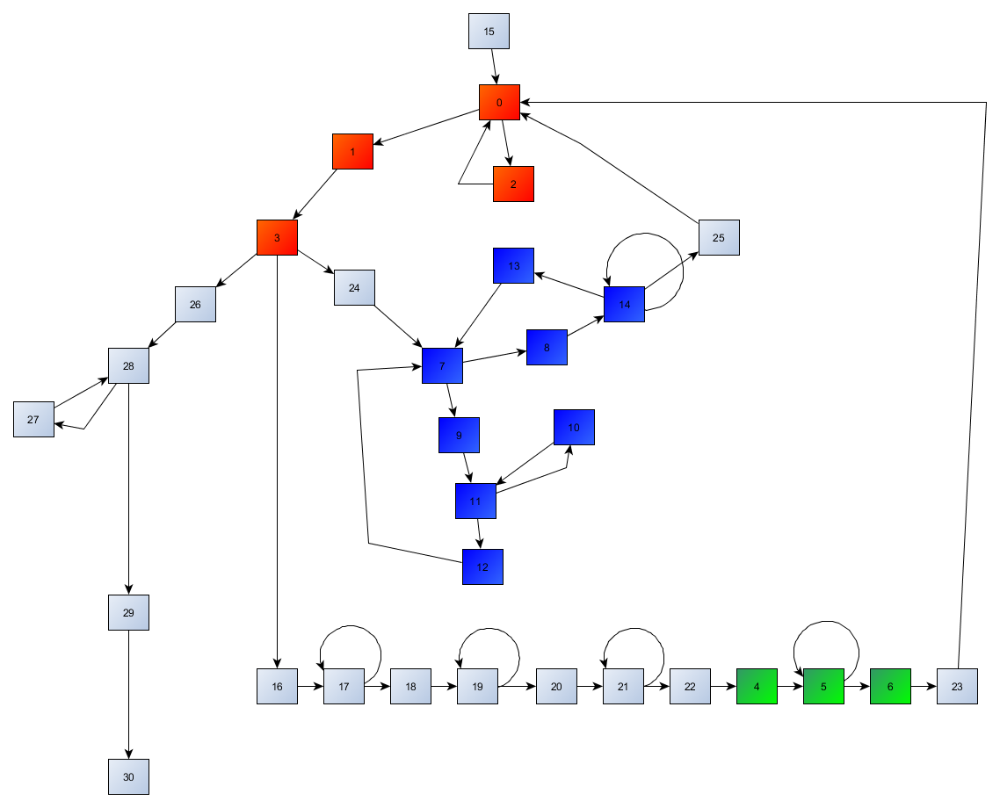

## Trace (RE, 4p)
	
	follow the trace trace.log
	update:
	the flag is at 0x400D80
	*(uint32_t*)0x00410EA0 == 0x400D80 
	
###ENG
[PL](#pl-version)

We are given very long execytiun trace (list of opcodes executed by processor, in order) and want to get flag out of it.

It seems funny, because that was really interesting challenge. At the beginning we didn't even know where tha flag was, because tracelog doesn't contain any data (only opcodes).

We started from processing call log. We wanted to get program code from it, so we just sorted it (we wanted to get real program code that was executed)

    sort trace.log | uniq > prog

Then we hacked quick and dirty script to process that code and split it into basic blocks:

```python
import string

blocks=[[]]
blockno={}

def is_final(ins):
    FINAL="move r1, r1"
    return string.find(ins, FINAL)!=-1

for line in open("prog").read().split("\n")[:-1]:
    blocks[-1].append(line)
    blockno[line]=len(blocks)-1
    if is_final(line):
        blocks.append([])
blocks=blocks[:-1]

f=open("basic_blocks","w")
for cnt, block in enumerate(blocks):
    f.write("Basic block #"+str(cnt)+"\n")
    for line in block:
        f.write(line+"\n")
    f.write("\n========\n\n")
f.close()

bb=[]
next_check=True
for line in open("log").read().split("\n")[:-1]:
    if is_final(line):
        next_check=True
        continue
    if next_check:
        next_check=False
        bb.append(blockno[line])

print bb
```

Result of running that script (with my manual annotations after //, no point in delaying that):

```asm
// function red() - strlen
Basic block #0
[INFO]00400770       addiu r29, r29, 0xffffffe8     // r29 -= 18
[INFO]00400774               sw r30, [r29+0x14]     // r30 = r29[0x14]
[INFO]00400778                    move r30, r29     // r30 = r29
[INFO]0040077c                sw r4, [r30+0x18]     // r4 = r30[0x18]
[INFO]00400780                 sw r0, [r30+0x8]     // r0 = r30[8]

// block 0x400784
[INFO]00400784                 lw r2, [r30+0x8]     // r2 = r30[8]
[INFO]00400788                lw r3, [r30+0x18]     // r3 = r30[0x18]
[INFO]0040078c                  addu r2, r3, r2     // r2 += r3
[INFO]00400790                  lb r2, [r2+0x0]     // r2 = r2[0]
[INFO]00400794                bnez r2, 0x4007a8     // if (r2 != 0) goto BLOCK_2

========

Basic block #1
[INFO]0040079c                 lw r2, [r30+0x8]     // r2 = r30[8]
[INFO]004007a0                       j 0x4007bc     // goto BLOCK_3

========

Basic block #2
[INFO]004007a8                 lw r2, [r30+0x8]     // r2 = r30[8]
[INFO]004007ac                addiu r2, r2, 0x1     // r2 += 1
[INFO]004007b0                 sw r2, [r30+0x8]     // r30[8] = r2
[INFO]004007b4                       j 0x400784     // goto 0x400784

========

Basic block #3
[INFO]004007bc                    move r29, r30     // r29 = r30
[INFO]004007c0               lw r30, [r29+0x14]     // r30 = r29[0x14]
[INFO]004007c4             addiu r29, r29, 0x18     // r29 += 18
[INFO]004007c8                           jr r31     // ret

========

// function green() - strcpy
Basic block #4
[INFO]004007d0       addiu r29, r29, 0xffffffe8     // r29 -= 18
[INFO]004007d4               sw r30, [r29+0x14]     // r29[0x14] = r30
[INFO]004007d8                    move r30, r29     // r30 = r29
[INFO]004007dc                sw r4, [r30+0x18]     // r30[0x18] = r4
[INFO]004007e0                sw r5, [r30+0x1c]     // r30[0x1c] = r5
[INFO]004007e4                 sw r0, [r30+0x8]     // r30[8] = r0
[INFO]004007e8                       j 0x40081c     // goto 0x40081c

========

Basic block #5
[INFO]004007f0                 lw r2, [r30+0x8]     // r2 = r30[8]
[INFO]004007f4                lw r3, [r30+0x18]     // r3 = r30[0x18]
[INFO]004007f8                  addu r2, r3, r2     // r2 += r3
[INFO]004007fc                 lw r3, [r30+0x8]     // r3 = r30[8]
[INFO]00400800                lw r4, [r30+0x1c]     // r4 = r30[0x1c]
[INFO]00400804                  addu r3, r4, r3     // r3 += r4
[INFO]00400808                  lb r3, [r3+0x0]     // r3 = r3[0]
[INFO]0040080c                  sb r3, [r2+0x0]     // r2[0] = r3
[INFO]00400810                 lw r2, [r30+0x8]     // r2 = r30[8]
[INFO]00400814                addiu r2, r2, 0x1     // r2 += 1
[INFO]00400818                 sw r2, [r30+0x8]     // r30[8] = r2

// block 0x40081c
[INFO]0040081c                 lw r2, [r30+0x8]     // r2 = r30[8]
[INFO]00400820                lw r3, [r30+0x1c]     // r3 = r30[0x1c]
[INFO]00400824                  addu r2, r3, r2     // r2 += r3
[INFO]00400828                  lb r2, [r2+0x0]     // r2 = r2[0]
[INFO]0040082c                bnez r2, 0x4007f0     // if r2 != 0: goto BLOCK_5

========

Basic block #6
[INFO]00400834                 lw r2, [r30+0x8]     // r2 = r30[8]
[INFO]00400838                lw r3, [r30+0x18]     // r3 = r30[0x18]
[INFO]0040083c                  addu r2, r3, r2     // r2 += r3
[INFO]00400840                  sb r0, [r2+0x0]     // r2[0] = r0
[INFO]00400844                    move r29, r30     // r29 = r30
[INFO]00400848               lw r30, [r29+0x14]     // r30 = r29[0x14] 
[INFO]0040084c             addiu r29, r29, 0x18     // r29 += 18
[INFO]00400850                           jr r31     // ret

========

// function blue()
Basic block #7
[INFO]00400858       addiu r29, r29, 0xffffffd0 
[INFO]0040085c               sw r31, [r29+0x2c] 
[INFO]00400860               sw r30, [r29+0x28] 
[INFO]00400864                    move r30, r29 
[INFO]00400868                sw r4, [r30+0x30]     // r30[0x30] = r4  # buffer start
[INFO]0040086c                sw r5, [r30+0x34]     // r30[0x34] = r5  # length
[INFO]00400870                lw r2, [r30+0x34]     // r2 = r30[0x34]
[INFO]00400874                 slti r2, r2, 0x2     // r2 = (r2 < 2)
[INFO]00400878                beqz r2, 0x400888     // if (r2 == 0) goto BLOCK_9   # if length >= 2 continue

========

Basic block #8
[INFO]00400880                       j 0x4009bc     // goto exitfunc (BLOCK_14)

========

Basic block #9
[INFO]00400888                lw r2, [r30+0x30]     // r2 = r30[0x30]
[INFO]0040088c                 lbu r2, [r2+0x0]     // r2 = r2[0]   # first byte of buffer
[INFO]00400890                sb r2, [r30+0x20]     // r30[0x20] = r2
[INFO]00400894                addiu r2, r0, 0x1     // r2 = 1
[INFO]00400898                sw r2, [r30+0x18]     // r30[0x18] = r2
[INFO]0040089c                addiu r2, r0, 0x1     // r2 = 1
[INFO]004008a0                sw r2, [r30+0x1c]     // r30[0x1c] = r2
[INFO]004008a4                       j 0x40092c     // goto unnamed block

========

Basic block #10
[INFO]004008ac                lw r2, [r30+0x1c]     // r2 = r30[0x1c] # indeks
[INFO]004008b0                lw r3, [r30+0x30]     // r3 = r30[0x30] # start buffera
[INFO]004008b4                  addu r2, r3, r2     // r2 += r3
[INFO]004008b8                  lb r2, [r2+0x0]     // r2 = r2[0] # next character
[INFO]004008bc                lb r3, [r30+0x20]     // r3 = r30[0x20] # first byte of buffer
[INFO]004008c0                   slt r2, r2, r3     // r2 = (r2 < r3)
[INFO]004008c4                beqz r2, 0x400920     // if r2 != 0 goto unnamed block # if (r2 >= r3) 

========

Basic block #11
[INFO]004008cc                lw r2, [r30+0x18]     // r2 = r30[0x18]  # counter18
[INFO]004008d0                lw r3, [r30+0x30]     // r3 = r30[0x30] # start of buffer
[INFO]004008d4                  addu r2, r3, r2     // r2 += r3
[INFO]004008d8                 lbu r2, [r2+0x0]     // r2 = r2[0] # take byte from buffer[counter18]
[INFO]004008dc                sb r2, [r30+0x21]     // r30[0x21] = r2
[INFO]004008e0                lw r2, [r30+0x18]     // r2 = r30[0x18]
[INFO]004008e4                lw r3, [r30+0x30]     // r3 = r30[0x30] # adress buffer
[INFO]004008e8                  addu r2, r3, r2     // r2 += r3
[INFO]004008ec                lw r3, [r30+0x1c]     // r3 = r30[0x1c] # counter1c
[INFO]004008f0                lw r4, [r30+0x30]     // r4 = r30[0x30] # adress buffer
[INFO]004008f4                  addu r3, r4, r3     // r3 += r4
[INFO]004008f8                  lb r3, [r3+0x0]     // r3 = r3[0] # buffer[counter1c]
[INFO]004008fc                  sb r3, [r2+0x0]     // r2[0] = r3  # buffer[counter18] = buffer[counter1c]
[INFO]00400900                lw r2, [r30+0x1c]     // r2 = r30[0x1c]
[INFO]00400904                lw r3, [r30+0x30]     // r3 = r30[0x30]
[INFO]00400908                  addu r2, r3, r2     // r2 += r3  # adress buffer[counter1c]
[INFO]0040090c               lbu r3, [r30+0x21]     // r3 = r30[0x21]
[INFO]00400910                  sb r3, [r2+0x0]     // r2[0] = r3
[INFO]00400914                lw r2, [r30+0x18]     // \
[INFO]00400918                addiu r2, r2, 0x1     // r30[r18] += 1
[INFO]0040091c                sw r2, [r30+0x18]     // /

// block
[INFO]00400920                lw r2, [r30+0x1c]     // \
[INFO]00400924                addiu r2, r2, 0x1     // r30[r1c] += 1
[INFO]00400928                sw r2, [r30+0x1c]     // /

// block
[INFO]0040092c                lw r3, [r30+0x1c]     // r3 = r30[0x1c]   # some index (indeks1c)
[INFO]00400930                lw r2, [r30+0x34]     // r2 = r30[0x34]   # length
[INFO]00400934                   slt r2, r3, r2     // r2 = (r3 < r2)
[INFO]00400938                bnez r2, 0x4008ac     // if index is not longer than lengrth, jump to BLOCK_10

========

Basic block #12
[INFO]00400940                lw r2, [r30+0x18]     // l2 = r30[0x18]   # indeks2 (indeks18)
[INFO]00400944         addiu r2, r2, 0xffffffff     // r2 -= 1
[INFO]00400948                lw r3, [r30+0x30]     // r3 = r30[0x30]
[INFO]0040094c                  addu r2, r3, r2 
[INFO]00400950                 lbu r2, [r2+0x0]     // r2 = buffer[r18 - 1]
[INFO]00400954                sb r2, [r30+0x21]     // r30[0x21] = r2
[INFO]00400958                lw r2, [r30+0x18] 
[INFO]0040095c         addiu r2, r2, 0xffffffff     // r2 = r30[0x18] - 1
[INFO]00400960                lw r3, [r30+0x30] 
[INFO]00400964                  addu r2, r3, r2     // r2 = &buffer[r2]
[INFO]00400968                lw r3, [r30+0x30]
[INFO]0040096c                  lb r3, [r3+0x0]     // r3 = buffer[0] 
[INFO]00400970                  sb r3, [r2+0x0]     // buffer[r18-1] = buffer[0]
[INFO]00400974                lw r2, [r30+0x30] 
[INFO]00400978               lbu r3, [r30+0x21] 
[INFO]0040097c                  sb r3, [r2+0x0]     // buffer[0] = r30[r21];
[INFO]00400980                lw r2, [r30+0x18]     
[INFO]00400984         addiu r2, r2, 0xffffffff     // r2 -= 1
[INFO]00400988                lw r4, [r30+0x30] 
[INFO]0040098c                      move r5, r2     // r5 = r2
[INFO]00400990                     jal 0x400858     // call blue()

========

Basic block #13
[INFO]00400998                lw r2, [r30+0x18]
[INFO]0040099c                lw r3, [r30+0x30] 
[INFO]004009a0                  addu r4, r3, r2     // r4 = &buffer[r18] 
[INFO]004009a4                lw r3, [r30+0x34] 
[INFO]004009a8                lw r2, [r30+0x18] 
[INFO]004009ac                  subu r2, r3, r2     // r2 = buflen - r18
[INFO]004009b0                      move r5, r2     // r5 = r2
[INFO]004009b4                     jal 0x400858     // call blue()

========

Basic block #14
[INFO]004009bc                    move r29, r30     // exit func
[INFO]004009c0               lw r31, [r29+0x2c]     // r31 = r29[0x2c]
[INFO]004009c4               lw r30, [r29+0x28]     // r39 = r29[0x28]
[INFO]004009c8             addiu r29, r29, 0x30     // r29 += 0x30
[INFO]004009cc                           jr r31     // ret

========

// main()
Basic block #15
[INFO]004009d4       addiu r29, r29, 0xfffffec8 
[INFO]004009d8              sw r31, [r29+0x134] 
[INFO]004009dc              sw r30, [r29+0x130] 
[INFO]004009e0                    move r30, r29 
[INFO]004009e4                    lui r28, 0x42 
[INFO]004009e8       addiu r28, r28, 0xffff8eb0 
[INFO]004009ec               sw r28, [r29+0x10]
[INFO]004009f0                     lui r2, 0x41 
[INFO]004009f4                lw r2, [r2+0xea0] 
[INFO]004009f8                      move r4, r2     // r4 = FLAG 
[INFO]004009fc                     jal 0x400770     // strlen(FLAG)
[INFO]00400a00                      move r1, r1 

========

Basic block #16
[INFO]00400a04               lw r28, [r30+0x10]     // r28 = r30[0x10]
[INFO]00400a08                sw r2, [r30+0x2c]     // r30[0x2c] = r2 (result of strlen)
[INFO]00400a0c                sw r0, [r30+0x18]     // r30[0x18] = 0
[INFO]00400a10                       j 0x400a4c 
[INFO]00400a14                      move r1, r1 

========

Basic block #17 - compute something funny, looks like abcdefghi... array
[INFO]00400a18                lw r2, [r30+0x18]     // r2 = r30[0x18] 
[INFO]00400a1c                andi r2, r2, 0xff     // r2 &= 0xFF
[INFO]00400a20               addiu r2, r2, 0x61     // r2 += 0x61   # += 'a'
[INFO]00400a24                andi r2, r2, 0xff     // r2 &= 0xFF
[INFO]00400a28                 sll r3, r2, 0x18     // r3 = r2 << 0x18
[INFO]00400a2c                 sra r3, r3, 0x18     // r3 = r3 >> 0x18
[INFO]00400a30              addiu r4, r30, 0x30     // r4 = r30 + 0x30
[INFO]00400a34                lw r2, [r30+0x18]     // r2 = r30[0x18]    # indekx
[INFO]00400a38                  addu r2, r4, r2     // r2 += r4          # bufer[index]?
[INFO]00400a3c                  sb r3, [r2+0x0]     // r2[0] = r3
[INFO]00400a40                lw r2, [r30+0x18]     // \
[INFO]00400a44                addiu r2, r2, 0x1     // r30[0x18] += 1
[INFO]00400a48                sw r2, [r30+0x18]     // /

// block
[INFO]00400a4c                lw r2, [r30+0x18]     // r2 = r30[0x18] (starting with 00
[INFO]00400a50                slti r2, r2, 0x1a     // while r2 < 0x1a, so string length
[INFO]00400a54                bnez r2, 0x400a18 

========

Basic block #18
[INFO]00400a5c                sw r0, [r30+0x1c]     // r30[0x1c] = 0
[INFO]00400a60                       j 0x400aa0     // goto ...

========

Basic block #19
[INFO]00400a68                lw r2, [r30+0x1c]     // r2 = r30[0x1c]  # offset in buffer?
[INFO]00400a6c               addiu r2, r2, 0x1a     // r2 += 0x1a
[INFO]00400a70                lw r3, [r30+0x1c]     // r30 = r30[0x1c] # index
[INFO]00400a74                andi r3, r3, 0xff     // r3 &= 0xFF
[INFO]00400a78               addiu r3, r3, 0x41     // r3 += 0x41   # 'A'
[INFO]00400a7c                andi r3, r3, 0xff     // r3 &= 0xFF
[INFO]00400a80                 sll r3, r3, 0x18     // r3 <<= 0x18
[INFO]00400a84                 sra r3, r3, 0x18     // r3 >>= 0x18
[INFO]00400a88              addiu r4, r30, 0x30     // r4 = r30 + 0x30  # another buffer?
[INFO]00400a8c                  addu r2, r4, r2     // r2 += r4         # buffer[index]?
[INFO]00400a90                  sb r3, [r2+0x0]     // r2[0] = r3
[INFO]00400a94                lw r2, [r30+0x1c]     // \
[INFO]00400a98                addiu r2, r2, 0x1     // r30[0x1c] += 1
[INFO]00400a9c                sw r2, [r30+0x1c]     // /
[INFO]00400aa0                lw r2, [r30+0x1c]     // stupid compiler

// block
[INFO]00400aa4                slti r2, r2, 0x1a     // loop 26 times
[INFO]00400aa8                bnez r2, 0x400a68

========

Basic block #20
[INFO]00400ab0                sw r0, [r30+0x20]     // r30[0x20] = 0
[INFO]00400ab4                       j 0x400af4 
[INFO]00400ab8                      move r1, r1 

========

Basic block #21
[INFO]00400abc                lw r2, [r30+0x20]     //
[INFO]00400ac0               addiu r2, r2, 0x34     //  offset in buffer
[INFO]00400ac4                lw r3, [r30+0x20]     //
[INFO]00400ac8                andi r3, r3, 0xff     //
[INFO]00400acc               addiu r3, r3, 0x30     //
[INFO]00400ad0                andi r3, r3, 0xff     //
[INFO]00400ad4                 sll r3, r3, 0x18     //
[INFO]00400ad8                 sra r3, r3, 0x18     //
[INFO]00400adc              addiu r4, r30, 0x30     //  create buffer filled with 012345...
[INFO]00400ae0                  addu r2, r4, r2     //
[INFO]00400ae4                  sb r3, [r2+0x0]     //
[INFO]00400ae8                lw r2, [r30+0x20]     //
[INFO]00400aec                addiu r2, r2, 0x1     //
[INFO]00400af0                sw r2, [r30+0x20]     //
[INFO]00400af4                lw r2, [r30+0x20]     //
[INFO]00400af8                 slti r2, r2, 0xa     //
[INFO]00400afc                bnez r2, 0x400abc     //

========

Basic block #22
[INFO]00400b04               addiu r2, r0, 0x7b     // r2 = 0x7b  # {
[INFO]00400b08                sb r2, [r30+0x6e]     // r30[0x6e] = r2
[INFO]00400b0c               addiu r2, r0, 0x7d     // r2 = 0x7d  # }
[INFO]00400b10                sb r2, [r30+0x6f]     // r30[0x6f] = r2
[INFO]00400b14                     lui r2, 0x41     // r2 = 0x41
[INFO]00400b18                lw r3, [r2+0xea0]     // r3 = &FLAG
[INFO]00400b1c              addiu r2, r30, 0x30     // r2 = r30 + 0x30   - start of buffer
[INFO]00400b20               addiu r2, r2, 0x40     // r2 += 0x40        - 40 byte offset
[INFO]00400b24                      move r4, r2     // r4 = r2           - copy there
[INFO]00400b28                      move r5, r3     // r5 = r3           - flag
[INFO]00400b2c                     jal 0x4007d0     // strcpy()

========

Basic block #23
[INFO]00400b34               lw r28, [r30+0x10]     // r28 = r30[0x10]
[INFO]00400b38              addiu r2, r30, 0x30     // r2 = r30 + 0x30
[INFO]00400b3c                      move r4, r2     // r4 = r2
[INFO]00400b40                     jal 0x400770     // strlen()    # wychodzi 90

========

Basic block #24
[INFO]00400b48               lw r28, [r30+0x10]     // r28 = r30[0x10]
[INFO]00400b4c                      move r3, r2     // r3 = r2
[INFO]00400b50              addiu r2, r30, 0x30     // r2 = r30 + 0x30
[INFO]00400b54                      move r4, r2     // r4 = r2  # r2 = buffer start
[INFO]00400b58                      move r5, r3     // r5 = r3  # r5 = 90 (strlen result)
[INFO]00400b5c                     jal 0x400858     // NIEBIESKA()
[INFO]00400b60                      move r1, r1 

========

Basic block #25
[INFO]00400b64               lw r28, [r30+0x10] 
[INFO]00400b68              addiu r2, r30, 0x30 
[INFO]00400b6c                      move r4, r2 
[INFO]00400b70                     jal 0x400770 
[INFO]00400b74                      move r1, r1 

========

Basic block #26
[INFO]00400b78               lw r28, [r30+0x10] 
[INFO]00400b7c                sw r2, [r30+0x2c] 
[INFO]00400b80                sw r0, [r30+0x24] 
[INFO]00400b84                sw r0, [r30+0x28] 
[INFO]00400b88                       j 0x400bd4 
[INFO]00400b8c                      move r1, r1 

========

Basic block #27
[INFO]00400b90              addiu r3, r30, 0x30 
[INFO]00400b94                lw r2, [r30+0x28] 
[INFO]00400b98                  addu r2, r3, r2 
[INFO]00400b9c                  lb r3, [r2+0x0] 
[INFO]00400ba0                lw r2, [r30+0x28] 
[INFO]00400ba4                addiu r2, r2, 0x1 
[INFO]00400ba8              addiu r4, r30, 0x30 
[INFO]00400bac                  addu r2, r4, r2 
[INFO]00400bb0                  lb r2, [r2+0x0] 
[INFO]00400bb4             beq r3, r2, 0x400bc8 
[INFO]00400bb8                      move r1, r1 

========

Basic block #28
[INFO]00400bbc                lw r2, [r30+0x24] 
[INFO]00400bc0                addiu r2, r2, 0x1 
[INFO]00400bc4                sw r2, [r30+0x24] 
[INFO]00400bc8                lw r2, [r30+0x28] 
[INFO]00400bcc                addiu r2, r2, 0x1 
[INFO]00400bd0                sw r2, [r30+0x28] 
[INFO]00400bd4                lw r2, [r30+0x2c] 
[INFO]00400bd8         addiu r3, r2, 0xffffffff 
[INFO]00400bdc                lw r2, [r30+0x28] 
[INFO]00400be0                   slt r2, r2, r3 
[INFO]00400be4                bnez r2, 0x400b90 
[INFO]00400be8                      move r1, r1 

========

Basic block #29
[INFO]00400bec                lw r3, [r30+0x24] 
[INFO]00400bf0               addiu r2, r0, 0x3f 
[INFO]00400bf4             beq r3, r2, 0x400c10 
[INFO]00400bf8                      move r1, r1 

========

Basic block #30
[INFO]00400c10              addiu r2, r30, 0x30 
[INFO]00400c14                      move r4, r2 
[INFO]00400c18          lw r2, [r28+0xffff8034] 
[INFO]00400c1c                     move r25, r2 
[INFO]00400c20                         jalr r25 
[INFO]00400c24                      move r1, r1 
```

This code also prints order in which blocks were executed. That allowed us to draw this pretty graph (I allowed myself to color functions):



As you might have noticed, I recognised red and green function immediately (that's only because they were rather obvious) - they were strlen and strcpy respectively.
I also analysed what the code is doing at the beginnign (EP is in block 15) - it is creating one big buffer in memory, and appending flag to it.
So in the end, we are stuck with following blob in memory:

abcdefghijklmnopqrstuvwxyzABCDEFGHIJKLMNOPQRSTUVWXYZ0123456789{}[FLAGFLAGFLAGFLAGFLAGFLAG]

And then, blue function is called. Blue function was really complex, so I took liberty to implement it in C:

```cpp
void blue(char *buffer, int buflen) 
{
    if (buflen > 1) {
        int r18 = 1;
        int r20 = buffer[0];
        int r21;
        for (int r1c = 1; r1c < buflen; r1c++) {
            if (buffer[r1c] >= r20) {
                continue;
            }
            r21 = buffer[r18];
            buffer[r18] = buffer[r1c];
            buffer[r1c] = r21;
            r18 += 1;
        }
        r21 = buffer[r18-1];
        buffer[r18-1] = buffer[0];
        buffer[0] = r21;

        blue(buffer, r18-1);
        blue(buffer+r18, buflen-r18);
    }
}
```

If I were not mistaken (and I were not), this function should behave exactly like function that our trace executed.
This is some variant of quicksort (I'm not theory-savy enough to know exact variant name, but that couldn't be less relevant in solving this challenge).

So the problem arised - what now? We knew *what* was executed, we knew *how* it executed, how can we get possibly recover flag from that?

The path we went were probably not the easiest, but it worked. So, first we choose important "checkpoints" inside function:

```cpp
void blue(char *buffer, int buflen) 
{
    // STARTFX
    if (buflen > 1) {
        // STARTMAIN
        int r18 = 1;
        int r20 = buffer[0];
        int r21;
        for (int r1c = 1; r1c < buflen /*FOR_CHECK*/; r1c++ /*FOR_INC*/)) {
            // STARTFOR
            if (buffer[r1c] >= r20) {
                // SKIP
                continue;
            }
            // SWAP_18_1C
            r21 = buffer[r18];
            buffer[r18] = buffer[r1c];
            buffer[r1c] = r21;
            r18 += 1;
            // ENDFOR
        }
        // AFTERFOR
        r21 = buffer[r18-1];
        buffer[r18-1] = buffer[0];
        buffer[0] = r21;

        blue(buffer, r18-1);
        blue(buffer+r18, buflen-r18);
        // ENDMAIN
    }
    // ENDFX
}
```

Than we processed trace.log once again, but looking only at "checkpoints"

```python
data = open('log').read().split('\n')

for line in data:
    if '[INFO]00400858' in line:
        print 'STARTFX'
    if '[INFO]00400888' in line:
        print 'STARTMAIN'
    if '[INFO]004008ac' in line:
        print 'STARTFOR'
    if '[INFO]004008cc' in line:
        print 'SWAP_18_1C'
    if '[INFO]00400920' in line:
        print 'FOR_INC'
    if '[INFO]0040092c' in line:
        print 'FOR_CHECK'
    if '[INFO]00400940' in line:
        print 'AFTERFOR'
    if '[INFO]004009bc' in line:
        print 'ENDMAIN'
```

And finally, we hacked (ugly!) script to "follow" log, and do exactly as it told us:

```python
log = [x.strip() for x in open('calllog').read().split('\n')]

known = []  # known "facts" about characters in flag

def process(log, il, state):
    if log[il] != 'STARTFX':
        raise 'error'
    il += 1
    if len(state) > 1:
        if log[il] != 'STARTMAIN':
            raise 'error'
        il += 1
        r18 = 1
        for r1c in range(1, len(state)+1):
            if log[il] != 'FOR_CHECK':
                raise 'error'
            il += 1
            if r1c == len(state):
                break
            if log[il] == 'AFTERFOR':
                break
            if log[il] != 'STARTFOR':
                raise 'error'
            il += 1
            if log[il] == 'SWAP_18_1C':
                # we are in 'swap' branch, so buffer[r1c] < state[0]
                known.append([state[r1c], '<', state[0]])
                il += 1
                state[r1c], state[r18] = state[r18], state[r1c]
                r18 += 1
            else:
                # we are /not/ in 'swap' branch, so buffer[1rc] >= state[0]
                known.append([state[0], '<=', state[r1c]])
            if log[il] != 'FOR_INC':
                print il
                raise 'error'
            il += 1
        if log[il] != 'AFTERFOR':
            print il, log[il]
            raise 'error'
        il += 1
        state[r18-1], state[0] = state[0], state[r18-1]

        il, state[:r18-1] = process(log, il, state[:r18-1])
        il, state[r18:] = process(log, il, state[r18:])
    if log[il] != 'ENDMAIN':
        raise 'error'
    il += 1
    return il, state


# stars (*) are placeholders for unknown characters
state = list('abcdefghijklmnopqrstuvwxyzABCDEFGHIJKLMNOPQRSTUVWXYZ0123456789{}0ctf{********************}')

# replace stars with integers (0 - first unknown, 1 - second unknown, etc)
j = 0
for i in range(len(state)):
    if state[i] == '*':
        state[i] = j
        j += 1
vars = j
process(log, 0, state)  # process
print state
```

Miraculously, that worked. After running that code we were presented with:

    ['0', '0', 14, 6, '1', 2, '2', '3', 3, '4', 18, 13, '5', 12, 4, 8, '6',
    11, '7', '8', 16, '9', 10, 'A', 'B', 'C', 'D', 'E', 'F', 'G', 'H', 'I',
    'J', 'K', 'L', 'M', 'N', 'O', 'P', 'Q', 'R', 'S', 'T', 'U', 'V', 'W',
    'X', 'Y', 'Z', 'a', 'b', 'c', 'c', 'd', 'e', 'f', 'f', 'g', 'h', 'i',
    'j', 7, 'k', 17, 9, 'l', 'm', 5, 'n', 'o', 'p', 'q', 19, 1, 'r', 15,
    's', 't', 0, 't', 'u', 'v', 'w', 'x', 'y', 'z', '{', '{', '}', '}']

If everything worked fine, that should be array after being sorted by algorithm - and everything looked fine.
That meant that, for example, judging by their position in sorted array, 14-th and 6-th variable were between
'0' and '1' (characters) - so they could be either '0' character or '1' character.

Unfortunately, that was not enough (almost every character had 2 possible values).

But wait, that's more - we know results of comparing variables to other characters - can we use that knowledge to improve our
guesses? It turns out that we can (with even uglier script):

```python
res = {}
for i in range(len(state)):
    if not isinstance(state[i], basestring):
        j = i
        while not isinstance(state[j], basestring):
            j -= 1
        k = i
        while not isinstance(state[k], basestring):
            k += 1
        res[state[i]] = [state[j], state[k]]

print res

for iteration in range(10):
    possible = []
    for i in range(vars):
        mn, mx = res[i]
        for less, op, gtr in known:
            if not isinstance(gtr, basestring) and not isinstance(less, basestring):
                continue
            if op == '<':
                if less == i:   # 1 < 'z'
                    if mx >= gtr:
                        mx = chr(ord(gtr)-1)
                if gtr == i:    # 'z' < 1
                    if mn <= less:
                        mn = chr(ord(less)+1)
            if op == '<=':
                if less == i:   # 1 <= 'z'
                    if mx >= gtr:
                        mx = gtr
                if gtr == i:    # 'z' <= 1
                    if mn <= less:
                        mn = less
        res[i] = [mn, mx]
        if mn == mx:
            for xxx in known:
                if xxx[0] == i:
                    xxx[0] = mn
                if xxx[2] == i:
                    xxx[2] = mn
        else:
            pass
            #possible.append([mn, mx])

for i in range(vars):
    print res[i]
```

And result of running that hellish script is (each line represents minimal and maximal possible value for character):

    ['t', 't']
    ['r', 'r']
    ['1', '1']
    ['3', '3']
    ['5', '5']
    ['m', 'm']
    ['1', '1']
    ['k', 'k']
    ['5', '5']
    ['l', 'l']
    ['9', 'A']
    ['6', '6']
    ['5', '5']
    ['5', '5']
    ['1', '1']
    ['r', 's']
    ['9', '9']
    ['l', 'l']
    ['5', '5']
    ['r', 'r']

That left us with only 4 possibilities (2 characters had 2 possible values each, rest was uniquely determined):

We just bruteforced that 4 possible flags, and finally got our well-deserved 4 points.
We really did a lot of hard work when solving this challenge, it's probable that this was NOT the easiest way.

If I remember correctly, correct flag from 4 possible values were `0ctf{tr135m1k5lA6551r9l5r}`.

###PL version

Dostajemy długi trace wykonania (lista opkodów wykonywanych po kolei przez procesor) i chcemy z niego wyciagnąć flagę.

Brzmi zabawnie, bo i było to ciekawe zadanie. Na początku nie wiadomo w ogóle skąd mielibyśmy wziąć tą flagę, skoro w tracelogu nie ma żadnych danych (tylko opcody).

Zaczeliśmy od doprowadzenia call loga do sensownego stanu. Na dobry początek, posortowaliśmy go (żeby uzyskać faktyczny kod programu który był wykonywany):

    sort trace.log | uniq > prog

Następnie napisaliśmy na szybko skrypt do przetworzenia tego kodu i podzielenia go na bloki:

```python
import string

blocks=[[]]
blockno={}

def is_final(ins):
    FINAL="move r1, r1"
    return string.find(ins, FINAL)!=-1

for line in open("prog").read().split("\n")[:-1]:
    blocks[-1].append(line)
    blockno[line]=len(blocks)-1
    if is_final(line):
        blocks.append([])
blocks=blocks[:-1]

f=open("basic_blocks","w")
for cnt, block in enumerate(blocks):
    f.write("Basic block #"+str(cnt)+"\n")
    for line in block:
        f.write(line+"\n")
    f.write("\n========\n\n")
f.close()

bb=[]
next_check=True
for line in open("log").read().split("\n")[:-1]:
    if is_final(line):
        next_check=True
        continue
    if next_check:
        next_check=False
        bb.append(blockno[line])

print bb
```

Wynik wykonania tego kodu (razem z moimi ręcznymi anotacjami dodanymi później, nie ma sensu odkładać ich na później)

```asm
// function red() - strlen
Basic block #0
[INFO]00400770       addiu r29, r29, 0xffffffe8     // r29 -= 18
[INFO]00400774               sw r30, [r29+0x14]     // r30 = r29[0x14]
[INFO]00400778                    move r30, r29     // r30 = r29
[INFO]0040077c                sw r4, [r30+0x18]     // r4 = r30[0x18]
[INFO]00400780                 sw r0, [r30+0x8]     // r0 = r30[8]

// block 0x400784
[INFO]00400784                 lw r2, [r30+0x8]     // r2 = r30[8]
[INFO]00400788                lw r3, [r30+0x18]     // r3 = r30[0x18]
[INFO]0040078c                  addu r2, r3, r2     // r2 += r3
[INFO]00400790                  lb r2, [r2+0x0]     // r2 = r2[0]
[INFO]00400794                bnez r2, 0x4007a8     // if (r2 != 0) goto BLOCK_2

========

Basic block #1
[INFO]0040079c                 lw r2, [r30+0x8]     // r2 = r30[8]
[INFO]004007a0                       j 0x4007bc     // goto BLOCK_3

========

Basic block #2
[INFO]004007a8                 lw r2, [r30+0x8]     // r2 = r30[8]
[INFO]004007ac                addiu r2, r2, 0x1     // r2 += 1
[INFO]004007b0                 sw r2, [r30+0x8]     // r30[8] = r2
[INFO]004007b4                       j 0x400784     // goto 0x400784

========

Basic block #3
[INFO]004007bc                    move r29, r30     // r29 = r30
[INFO]004007c0               lw r30, [r29+0x14]     // r30 = r29[0x14]
[INFO]004007c4             addiu r29, r29, 0x18     // r29 += 18
[INFO]004007c8                           jr r31     // ret

========

// function green() - strcpy
Basic block #4
[INFO]004007d0       addiu r29, r29, 0xffffffe8     // r29 -= 18
[INFO]004007d4               sw r30, [r29+0x14]     // r29[0x14] = r30
[INFO]004007d8                    move r30, r29     // r30 = r29
[INFO]004007dc                sw r4, [r30+0x18]     // r30[0x18] = r4
[INFO]004007e0                sw r5, [r30+0x1c]     // r30[0x1c] = r5
[INFO]004007e4                 sw r0, [r30+0x8]     // r30[8] = r0
[INFO]004007e8                       j 0x40081c     // goto 0x40081c

========

Basic block #5
[INFO]004007f0                 lw r2, [r30+0x8]     // r2 = r30[8]
[INFO]004007f4                lw r3, [r30+0x18]     // r3 = r30[0x18]
[INFO]004007f8                  addu r2, r3, r2     // r2 += r3
[INFO]004007fc                 lw r3, [r30+0x8]     // r3 = r30[8]
[INFO]00400800                lw r4, [r30+0x1c]     // r4 = r30[0x1c]
[INFO]00400804                  addu r3, r4, r3     // r3 += r4
[INFO]00400808                  lb r3, [r3+0x0]     // r3 = r3[0]
[INFO]0040080c                  sb r3, [r2+0x0]     // r2[0] = r3
[INFO]00400810                 lw r2, [r30+0x8]     // r2 = r30[8]
[INFO]00400814                addiu r2, r2, 0x1     // r2 += 1
[INFO]00400818                 sw r2, [r30+0x8]     // r30[8] = r2

// block 0x40081c
[INFO]0040081c                 lw r2, [r30+0x8]     // r2 = r30[8]
[INFO]00400820                lw r3, [r30+0x1c]     // r3 = r30[0x1c]
[INFO]00400824                  addu r2, r3, r2     // r2 += r3
[INFO]00400828                  lb r2, [r2+0x0]     // r2 = r2[0]
[INFO]0040082c                bnez r2, 0x4007f0     // if r2 != 0: goto BLOCK_5

========

Basic block #6
[INFO]00400834                 lw r2, [r30+0x8]     // r2 = r30[8]
[INFO]00400838                lw r3, [r30+0x18]     // r3 = r30[0x18]
[INFO]0040083c                  addu r2, r3, r2     // r2 += r3
[INFO]00400840                  sb r0, [r2+0x0]     // r2[0] = r0
[INFO]00400844                    move r29, r30     // r29 = r30
[INFO]00400848               lw r30, [r29+0x14]     // r30 = r29[0x14] 
[INFO]0040084c             addiu r29, r29, 0x18     // r29 += 18
[INFO]00400850                           jr r31     // ret

========

// function blue()
Basic block #7
[INFO]00400858       addiu r29, r29, 0xffffffd0 
[INFO]0040085c               sw r31, [r29+0x2c] 
[INFO]00400860               sw r30, [r29+0x28] 
[INFO]00400864                    move r30, r29 
[INFO]00400868                sw r4, [r30+0x30]     // r30[0x30] = r4  # buffer start
[INFO]0040086c                sw r5, [r30+0x34]     // r30[0x34] = r5  # length
[INFO]00400870                lw r2, [r30+0x34]     // r2 = r30[0x34]
[INFO]00400874                 slti r2, r2, 0x2     // r2 = (r2 < 2)
[INFO]00400878                beqz r2, 0x400888     // if (r2 == 0) goto BLOCK_9   # if length >= 2 continue

========

Basic block #8
[INFO]00400880                       j 0x4009bc     // goto exitfunc (BLOCK_14)

========

Basic block #9
[INFO]00400888                lw r2, [r30+0x30]     // r2 = r30[0x30]
[INFO]0040088c                 lbu r2, [r2+0x0]     // r2 = r2[0]   # first byte of buffer
[INFO]00400890                sb r2, [r30+0x20]     // r30[0x20] = r2
[INFO]00400894                addiu r2, r0, 0x1     // r2 = 1
[INFO]00400898                sw r2, [r30+0x18]     // r30[0x18] = r2
[INFO]0040089c                addiu r2, r0, 0x1     // r2 = 1
[INFO]004008a0                sw r2, [r30+0x1c]     // r30[0x1c] = r2
[INFO]004008a4                       j 0x40092c     // goto unnamed block

========

Basic block #10
[INFO]004008ac                lw r2, [r30+0x1c]     // r2 = r30[0x1c] # indeks
[INFO]004008b0                lw r3, [r30+0x30]     // r3 = r30[0x30] # start buffera
[INFO]004008b4                  addu r2, r3, r2     // r2 += r3
[INFO]004008b8                  lb r2, [r2+0x0]     // r2 = r2[0] # next character
[INFO]004008bc                lb r3, [r30+0x20]     // r3 = r30[0x20] # first byte of buffer
[INFO]004008c0                   slt r2, r2, r3     // r2 = (r2 < r3)
[INFO]004008c4                beqz r2, 0x400920     // if r2 != 0 goto unnamed block # if (r2 >= r3) 

========

Basic block #11
[INFO]004008cc                lw r2, [r30+0x18]     // r2 = r30[0x18]  # counter18
[INFO]004008d0                lw r3, [r30+0x30]     // r3 = r30[0x30] # start of buffer
[INFO]004008d4                  addu r2, r3, r2     // r2 += r3
[INFO]004008d8                 lbu r2, [r2+0x0]     // r2 = r2[0] # take byte from buffer[counter18]
[INFO]004008dc                sb r2, [r30+0x21]     // r30[0x21] = r2
[INFO]004008e0                lw r2, [r30+0x18]     // r2 = r30[0x18]
[INFO]004008e4                lw r3, [r30+0x30]     // r3 = r30[0x30] # adress buffer
[INFO]004008e8                  addu r2, r3, r2     // r2 += r3
[INFO]004008ec                lw r3, [r30+0x1c]     // r3 = r30[0x1c] # counter1c
[INFO]004008f0                lw r4, [r30+0x30]     // r4 = r30[0x30] # adress buffer
[INFO]004008f4                  addu r3, r4, r3     // r3 += r4
[INFO]004008f8                  lb r3, [r3+0x0]     // r3 = r3[0] # buffer[counter1c]
[INFO]004008fc                  sb r3, [r2+0x0]     // r2[0] = r3  # buffer[counter18] = buffer[counter1c]
[INFO]00400900                lw r2, [r30+0x1c]     // r2 = r30[0x1c]
[INFO]00400904                lw r3, [r30+0x30]     // r3 = r30[0x30]
[INFO]00400908                  addu r2, r3, r2     // r2 += r3  # adress buffer[counter1c]
[INFO]0040090c               lbu r3, [r30+0x21]     // r3 = r30[0x21]
[INFO]00400910                  sb r3, [r2+0x0]     // r2[0] = r3
[INFO]00400914                lw r2, [r30+0x18]     // \
[INFO]00400918                addiu r2, r2, 0x1     // r30[r18] += 1
[INFO]0040091c                sw r2, [r30+0x18]     // /

// block
[INFO]00400920                lw r2, [r30+0x1c]     // \
[INFO]00400924                addiu r2, r2, 0x1     // r30[r1c] += 1
[INFO]00400928                sw r2, [r30+0x1c]     // /

// block
[INFO]0040092c                lw r3, [r30+0x1c]     // r3 = r30[0x1c]   # some index (indeks1c)
[INFO]00400930                lw r2, [r30+0x34]     // r2 = r30[0x34]   # length
[INFO]00400934                   slt r2, r3, r2     // r2 = (r3 < r2)
[INFO]00400938                bnez r2, 0x4008ac     // if index is not longer than lengrth, jump to BLOCK_10

========

Basic block #12
[INFO]00400940                lw r2, [r30+0x18]     // l2 = r30[0x18]   # indeks2 (indeks18)
[INFO]00400944         addiu r2, r2, 0xffffffff     // r2 -= 1
[INFO]00400948                lw r3, [r30+0x30]     // r3 = r30[0x30]
[INFO]0040094c                  addu r2, r3, r2 
[INFO]00400950                 lbu r2, [r2+0x0]     // r2 = buffer[r18 - 1]
[INFO]00400954                sb r2, [r30+0x21]     // r30[0x21] = r2
[INFO]00400958                lw r2, [r30+0x18] 
[INFO]0040095c         addiu r2, r2, 0xffffffff     // r2 = r30[0x18] - 1
[INFO]00400960                lw r3, [r30+0x30] 
[INFO]00400964                  addu r2, r3, r2     // r2 = &buffer[r2]
[INFO]00400968                lw r3, [r30+0x30]
[INFO]0040096c                  lb r3, [r3+0x0]     // r3 = buffer[0] 
[INFO]00400970                  sb r3, [r2+0x0]     // buffer[r18-1] = buffer[0]
[INFO]00400974                lw r2, [r30+0x30] 
[INFO]00400978               lbu r3, [r30+0x21] 
[INFO]0040097c                  sb r3, [r2+0x0]     // buffer[0] = r30[r21];
[INFO]00400980                lw r2, [r30+0x18]     
[INFO]00400984         addiu r2, r2, 0xffffffff     // r2 -= 1
[INFO]00400988                lw r4, [r30+0x30] 
[INFO]0040098c                      move r5, r2     // r5 = r2
[INFO]00400990                     jal 0x400858     // call blue()

========

Basic block #13
[INFO]00400998                lw r2, [r30+0x18]
[INFO]0040099c                lw r3, [r30+0x30] 
[INFO]004009a0                  addu r4, r3, r2     // r4 = &buffer[r18] 
[INFO]004009a4                lw r3, [r30+0x34] 
[INFO]004009a8                lw r2, [r30+0x18] 
[INFO]004009ac                  subu r2, r3, r2     // r2 = buflen - r18
[INFO]004009b0                      move r5, r2     // r5 = r2
[INFO]004009b4                     jal 0x400858     // call blue()

========

Basic block #14
[INFO]004009bc                    move r29, r30     // exit func
[INFO]004009c0               lw r31, [r29+0x2c]     // r31 = r29[0x2c]
[INFO]004009c4               lw r30, [r29+0x28]     // r39 = r29[0x28]
[INFO]004009c8             addiu r29, r29, 0x30     // r29 += 0x30
[INFO]004009cc                           jr r31     // ret

========

// main()
Basic block #15
[INFO]004009d4       addiu r29, r29, 0xfffffec8 
[INFO]004009d8              sw r31, [r29+0x134] 
[INFO]004009dc              sw r30, [r29+0x130] 
[INFO]004009e0                    move r30, r29 
[INFO]004009e4                    lui r28, 0x42 
[INFO]004009e8       addiu r28, r28, 0xffff8eb0 
[INFO]004009ec               sw r28, [r29+0x10]
[INFO]004009f0                     lui r2, 0x41 
[INFO]004009f4                lw r2, [r2+0xea0] 
[INFO]004009f8                      move r4, r2     // r4 = FLAG 
[INFO]004009fc                     jal 0x400770     // strlen(FLAG)
[INFO]00400a00                      move r1, r1 

========

Basic block #16
[INFO]00400a04               lw r28, [r30+0x10]     // r28 = r30[0x10]
[INFO]00400a08                sw r2, [r30+0x2c]     // r30[0x2c] = r2 (result of strlen)
[INFO]00400a0c                sw r0, [r30+0x18]     // r30[0x18] = 0
[INFO]00400a10                       j 0x400a4c 
[INFO]00400a14                      move r1, r1 

========

Basic block #17 - compute something funny, looks like abcdefghi... array
[INFO]00400a18                lw r2, [r30+0x18]     // r2 = r30[0x18] 
[INFO]00400a1c                andi r2, r2, 0xff     // r2 &= 0xFF
[INFO]00400a20               addiu r2, r2, 0x61     // r2 += 0x61   # += 'a'
[INFO]00400a24                andi r2, r2, 0xff     // r2 &= 0xFF
[INFO]00400a28                 sll r3, r2, 0x18     // r3 = r2 << 0x18
[INFO]00400a2c                 sra r3, r3, 0x18     // r3 = r3 >> 0x18
[INFO]00400a30              addiu r4, r30, 0x30     // r4 = r30 + 0x30
[INFO]00400a34                lw r2, [r30+0x18]     // r2 = r30[0x18]    # indekx
[INFO]00400a38                  addu r2, r4, r2     // r2 += r4          # bufer[index]?
[INFO]00400a3c                  sb r3, [r2+0x0]     // r2[0] = r3
[INFO]00400a40                lw r2, [r30+0x18]     // \
[INFO]00400a44                addiu r2, r2, 0x1     // r30[0x18] += 1
[INFO]00400a48                sw r2, [r30+0x18]     // /

// block
[INFO]00400a4c                lw r2, [r30+0x18]     // r2 = r30[0x18] (starting with 00
[INFO]00400a50                slti r2, r2, 0x1a     // while r2 < 0x1a, so string length
[INFO]00400a54                bnez r2, 0x400a18 

========

Basic block #18
[INFO]00400a5c                sw r0, [r30+0x1c]     // r30[0x1c] = 0
[INFO]00400a60                       j 0x400aa0     // goto ...

========

Basic block #19
[INFO]00400a68                lw r2, [r30+0x1c]     // r2 = r30[0x1c]  # offset in buffer?
[INFO]00400a6c               addiu r2, r2, 0x1a     // r2 += 0x1a
[INFO]00400a70                lw r3, [r30+0x1c]     // r30 = r30[0x1c] # index
[INFO]00400a74                andi r3, r3, 0xff     // r3 &= 0xFF
[INFO]00400a78               addiu r3, r3, 0x41     // r3 += 0x41   # 'A'
[INFO]00400a7c                andi r3, r3, 0xff     // r3 &= 0xFF
[INFO]00400a80                 sll r3, r3, 0x18     // r3 <<= 0x18
[INFO]00400a84                 sra r3, r3, 0x18     // r3 >>= 0x18
[INFO]00400a88              addiu r4, r30, 0x30     // r4 = r30 + 0x30  # another buffer?
[INFO]00400a8c                  addu r2, r4, r2     // r2 += r4         # buffer[index]?
[INFO]00400a90                  sb r3, [r2+0x0]     // r2[0] = r3
[INFO]00400a94                lw r2, [r30+0x1c]     // \
[INFO]00400a98                addiu r2, r2, 0x1     // r30[0x1c] += 1
[INFO]00400a9c                sw r2, [r30+0x1c]     // /
[INFO]00400aa0                lw r2, [r30+0x1c]     // stupid compiler

// block
[INFO]00400aa4                slti r2, r2, 0x1a     // loop 26 times
[INFO]00400aa8                bnez r2, 0x400a68

========

Basic block #20
[INFO]00400ab0                sw r0, [r30+0x20]     // r30[0x20] = 0
[INFO]00400ab4                       j 0x400af4 
[INFO]00400ab8                      move r1, r1 

========

Basic block #21
[INFO]00400abc                lw r2, [r30+0x20]     //
[INFO]00400ac0               addiu r2, r2, 0x34     //  offset in buffer
[INFO]00400ac4                lw r3, [r30+0x20]     //
[INFO]00400ac8                andi r3, r3, 0xff     //
[INFO]00400acc               addiu r3, r3, 0x30     //
[INFO]00400ad0                andi r3, r3, 0xff     //
[INFO]00400ad4                 sll r3, r3, 0x18     //
[INFO]00400ad8                 sra r3, r3, 0x18     //
[INFO]00400adc              addiu r4, r30, 0x30     //  create buffer filled with 012345...
[INFO]00400ae0                  addu r2, r4, r2     //
[INFO]00400ae4                  sb r3, [r2+0x0]     //
[INFO]00400ae8                lw r2, [r30+0x20]     //
[INFO]00400aec                addiu r2, r2, 0x1     //
[INFO]00400af0                sw r2, [r30+0x20]     //
[INFO]00400af4                lw r2, [r30+0x20]     //
[INFO]00400af8                 slti r2, r2, 0xa     //
[INFO]00400afc                bnez r2, 0x400abc     //

========

Basic block #22
[INFO]00400b04               addiu r2, r0, 0x7b     // r2 = 0x7b  # {
[INFO]00400b08                sb r2, [r30+0x6e]     // r30[0x6e] = r2
[INFO]00400b0c               addiu r2, r0, 0x7d     // r2 = 0x7d  # }
[INFO]00400b10                sb r2, [r30+0x6f]     // r30[0x6f] = r2
[INFO]00400b14                     lui r2, 0x41     // r2 = 0x41
[INFO]00400b18                lw r3, [r2+0xea0]     // r3 = &FLAG
[INFO]00400b1c              addiu r2, r30, 0x30     // r2 = r30 + 0x30   - start of buffer
[INFO]00400b20               addiu r2, r2, 0x40     // r2 += 0x40        - 40 byte offset
[INFO]00400b24                      move r4, r2     // r4 = r2           - copy there
[INFO]00400b28                      move r5, r3     // r5 = r3           - flag
[INFO]00400b2c                     jal 0x4007d0     // strcpy()

========

Basic block #23
[INFO]00400b34               lw r28, [r30+0x10]     // r28 = r30[0x10]
[INFO]00400b38              addiu r2, r30, 0x30     // r2 = r30 + 0x30
[INFO]00400b3c                      move r4, r2     // r4 = r2
[INFO]00400b40                     jal 0x400770     // strlen()    # wychodzi 90

========

Basic block #24
[INFO]00400b48               lw r28, [r30+0x10]     // r28 = r30[0x10]
[INFO]00400b4c                      move r3, r2     // r3 = r2
[INFO]00400b50              addiu r2, r30, 0x30     // r2 = r30 + 0x30
[INFO]00400b54                      move r4, r2     // r4 = r2  # r2 = buffer start
[INFO]00400b58                      move r5, r3     // r5 = r3  # r5 = 90 (strlen result)
[INFO]00400b5c                     jal 0x400858     // NIEBIESKA()
[INFO]00400b60                      move r1, r1 

========

Basic block #25
[INFO]00400b64               lw r28, [r30+0x10] 
[INFO]00400b68              addiu r2, r30, 0x30 
[INFO]00400b6c                      move r4, r2 
[INFO]00400b70                     jal 0x400770 
[INFO]00400b74                      move r1, r1 

========

Basic block #26
[INFO]00400b78               lw r28, [r30+0x10] 
[INFO]00400b7c                sw r2, [r30+0x2c] 
[INFO]00400b80                sw r0, [r30+0x24] 
[INFO]00400b84                sw r0, [r30+0x28] 
[INFO]00400b88                       j 0x400bd4 
[INFO]00400b8c                      move r1, r1 

========

Basic block #27
[INFO]00400b90              addiu r3, r30, 0x30 
[INFO]00400b94                lw r2, [r30+0x28] 
[INFO]00400b98                  addu r2, r3, r2 
[INFO]00400b9c                  lb r3, [r2+0x0] 
[INFO]00400ba0                lw r2, [r30+0x28] 
[INFO]00400ba4                addiu r2, r2, 0x1 
[INFO]00400ba8              addiu r4, r30, 0x30 
[INFO]00400bac                  addu r2, r4, r2 
[INFO]00400bb0                  lb r2, [r2+0x0] 
[INFO]00400bb4             beq r3, r2, 0x400bc8 
[INFO]00400bb8                      move r1, r1 

========

Basic block #28
[INFO]00400bbc                lw r2, [r30+0x24] 
[INFO]00400bc0                addiu r2, r2, 0x1 
[INFO]00400bc4                sw r2, [r30+0x24] 
[INFO]00400bc8                lw r2, [r30+0x28] 
[INFO]00400bcc                addiu r2, r2, 0x1 
[INFO]00400bd0                sw r2, [r30+0x28] 
[INFO]00400bd4                lw r2, [r30+0x2c] 
[INFO]00400bd8         addiu r3, r2, 0xffffffff 
[INFO]00400bdc                lw r2, [r30+0x28] 
[INFO]00400be0                   slt r2, r2, r3 
[INFO]00400be4                bnez r2, 0x400b90 
[INFO]00400be8                      move r1, r1 

========

Basic block #29
[INFO]00400bec                lw r3, [r30+0x24] 
[INFO]00400bf0               addiu r2, r0, 0x3f 
[INFO]00400bf4             beq r3, r2, 0x400c10 
[INFO]00400bf8                      move r1, r1 

========

Basic block #30
[INFO]00400c10              addiu r2, r30, 0x30 
[INFO]00400c14                      move r4, r2 
[INFO]00400c18          lw r2, [r28+0xffff8034] 
[INFO]00400c1c                     move r25, r2 
[INFO]00400c20                         jalr r25 
[INFO]00400c24                      move r1, r1 
```

Ten skrypt wypisał też kolejność w której bloki zostały wykonane. To pozwoliło nam narysować ten piękny graf (pokolorowałem w nim funkcje):


Zielona i czerwona funkcja były łatwe do rozpoznania - to były odpowiednio strcpy i strlen.
Przeanalizowałem też kod na początku - tworzy on duży bufor w pamięci, i dokleja do niego flagę.
Więc na końcu jesteśmy z takim blobem w pamięci:

abcdefghijklmnopqrstuvwxyzABCDEFGHIJKLMNOPQRSTUVWXYZ0123456789{}[FLAGFLAGFLAGFLAGFLAGFLAG]

A następnie wywoływana na nim jest niebieska funkcja. Jest ona dużo bardziej skomplikonwaa od poprzednich, więc zaimplementowałem ją w C:

```cpp
void blue(char *buffer, int buflen) 
{
    if (buflen > 1) {
        int r18 = 1;
        int r20 = buffer[0];
        int r21;
        for (int r1c = 1; r1c < buflen; r1c++) {
            if (buffer[r1c] >= r20) {
                continue;
            }
            r21 = buffer[r18];
            buffer[r18] = buffer[r1c];
            buffer[r1c] = r21;
            r18 += 1;
        }
        r21 = buffer[r18-1];
        buffer[r18-1] = buffer[0];
        buffer[0] = r21;

        blue(buffer, r18-1);
        blue(buffer+r18, buflen-r18);
    }
}
```

Jeśli się nie myliłem (i nie myliłem się), ta funkcja powinna zachowywać się dokładnie tak jak fukcja z której otrzymaliśmy tracelog.
To jakaś wariacja quicksortu, swoją drogą (nie wiem jaka dokładnie, nie ma to znaczenia przy rozwiązywaniu zadania).

Więc powstał problem - co teraz? Wiedzieliśmy co było wykonane, wiedzieliśmy jak było wykonane, jak możemy z tego odzyskać flagę?

Poszliśmy prawdopodobnie bardzo okrężną drogą, ale ważne że zadziałało ostatecznie. Najpierw postanowiliśmy zaznaczyć 'checkpointy' w funkcji:

```cpp
void blue(char *buffer, int buflen) 
{
    // STARTFX
    if (buflen > 1) {
        // STARTMAIN
        int r18 = 1;
        int r20 = buffer[0];
        int r21;
        for (int r1c = 1; r1c < buflen /*FOR_CHECK*/; r1c++ /*FOR_INC*/)) {
            // STARTFOR
            if (buffer[r1c] >= r20) {
                // SKIP
                continue;
            }
            // SWAP_18_1C
            r21 = buffer[r18];
            buffer[r18] = buffer[r1c];
            buffer[r1c] = r21;
            r18 += 1;
            // ENDFOR
        }
        // AFTERFOR
        r21 = buffer[r18-1];
        buffer[r18-1] = buffer[0];
        buffer[0] = r21;

        blue(buffer, r18-1);
        blue(buffer+r18, buflen-r18);
        // ENDMAIN
    }
    // ENDFX
}
```

Następnie przetworzyliśmy trace.log patrząc tylko na checkpointy:

```python
data = open('log').read().split('\n')

for line in data:
    if '[INFO]00400858' in line:
        print 'STARTFX'
    if '[INFO]00400888' in line:
        print 'STARTMAIN'
    if '[INFO]004008ac' in line:
        print 'STARTFOR'
    if '[INFO]004008cc' in line:
        print 'SWAP_18_1C'
    if '[INFO]00400920' in line:
        print 'FOR_INC'
    if '[INFO]0040092c' in line:
        print 'FOR_CHECK'
    if '[INFO]00400940' in line:
        print 'AFTERFOR'
    if '[INFO]004009bc' in line:
        print 'ENDMAIN'
```

Ostatecznie napisaliśmy (brzydki!) skrypt który podążał logiem i robił dokładnie to samo co było w logu:

```python
log = [x.strip() for x in open('calllog').read().split('\n')]

known = []  # known "facts" about characters in flag

def process(log, il, state):
    if log[il] != 'STARTFX':
        raise 'error'
    il += 1
    if len(state) > 1:
        if log[il] != 'STARTMAIN':
            raise 'error'
        il += 1
        r18 = 1
        for r1c in range(1, len(state)+1):
            if log[il] != 'FOR_CHECK':
                raise 'error'
            il += 1
            if r1c == len(state):
                break
            if log[il] == 'AFTERFOR':
                break
            if log[il] != 'STARTFOR':
                raise 'error'
            il += 1
            if log[il] == 'SWAP_18_1C':
                # we are in 'swap' branch, so buffer[r1c] < state[0]
                known.append([state[r1c], '<', state[0]])
                il += 1
                state[r1c], state[r18] = state[r18], state[r1c]
                r18 += 1
            else:
                # we are /not/ in 'swap' branch, so buffer[1rc] >= state[0]
                known.append([state[0], '<=', state[r1c]])
            if log[il] != 'FOR_INC':
                print il
                raise 'error'
            il += 1
        if log[il] != 'AFTERFOR':
            print il, log[il]
            raise 'error'
        il += 1
        state[r18-1], state[0] = state[0], state[r18-1]

        il, state[:r18-1] = process(log, il, state[:r18-1])
        il, state[r18:] = process(log, il, state[r18:])
    if log[il] != 'ENDMAIN':
        raise 'error'
    il += 1
    return il, state


# stars (*) are placeholders for unknown characters
state = list('abcdefghijklmnopqrstuvwxyzABCDEFGHIJKLMNOPQRSTUVWXYZ0123456789{}0ctf{********************}')

# replace stars with integers (0 - first unknown, 1 - second unknown, etc)
j = 0
for i in range(len(state)):
    if state[i] == '*':
        state[i] = j
        j += 1
vars = j
process(log, 0, state)  # process
print state
```

Nie wiadomo jakim cudem, ale to zadziałąło. Po uruchomieniu tego kodu dostaliśmy coś takiego:

    ['0', '0', 14, 6, '1', 2, '2', '3', 3, '4', 18, 13, '5', 12, 4, 8, '6',
    11, '7', '8', 16, '9', 10, 'A', 'B', 'C', 'D', 'E', 'F', 'G', 'H', 'I',
    'J', 'K', 'L', 'M', 'N', 'O', 'P', 'Q', 'R', 'S', 'T', 'U', 'V', 'W',
    'X', 'Y', 'Z', 'a', 'b', 'c', 'c', 'd', 'e', 'f', 'f', 'g', 'h', 'i',
    'j', 7, 'k', 17, 9, 'l', 'm', 5, 'n', 'o', 'p', 'q', 19, 1, 'r', 15,
    's', 't', 0, 't', 'u', 'v', 'w', 'x', 'y', 'z', '{', '{', '}', '}']

Jeśli wszystko zadziałało, to powinna być tablica po posortowaniu przez algorytm - i wszystko wyglądało ok.
Ten wynik oznacza że np. 14 i 6 zmienna były pomiędzy znakami '0' i '1' - więc mogły być albo znakami '0' albo '1'.

Niestety, to było niewystarczające do odzyskania flagi (prawie każdy znak miał 2 możliwe wartości - za dużo do zgadnięcia).

Ale w sumie, wiemy coś więcej o fladze - a konkretnie wyniki porównywania zmiennych do innych znaków. Czy możemy uzyć tej wiedzy
do poprawienia naszych estymat flagi? Okazuje się że tak (z nawet gorszym skryptem):

```python
res = {}
for i in range(len(state)):
    if not isinstance(state[i], basestring):
        j = i
        while not isinstance(state[j], basestring):
            j -= 1
        k = i
        while not isinstance(state[k], basestring):
            k += 1
        res[state[i]] = [state[j], state[k]]

print res

for iteration in range(10):
    possible = []
    for i in range(vars):
        mn, mx = res[i]
        for less, op, gtr in known:
            if not isinstance(gtr, basestring) and not isinstance(less, basestring):
                continue
            if op == '<':
                if less == i:   # 1 < 'z'
                    if mx >= gtr:
                        mx = chr(ord(gtr)-1)
                if gtr == i:    # 'z' < 1
                    if mn <= less:
                        mn = chr(ord(less)+1)
            if op == '<=':
                if less == i:   # 1 <= 'z'
                    if mx >= gtr:
                        mx = gtr
                if gtr == i:    # 'z' <= 1
                    if mn <= less:
                        mn = less
        res[i] = [mn, mx]
        if mn == mx:
            for xxx in known:
                if xxx[0] == i:
                    xxx[0] = mn
                if xxx[2] == i:
                    xxx[2] = mn
        else:
            pass
            #possible.append([mn, mx])

for i in range(vars):
    print res[i]
```

Wynik wykonania tego piekielnego skryptu (każda linia oznacza minimalną i maksymalną możliwą wartośc dla każdego znaku):

    ['t', 't']
    ['r', 'r']
    ['1', '1']
    ['3', '3']
    ['5', '5']
    ['m', 'm']
    ['1', '1']
    ['k', 'k']
    ['5', '5']
    ['l', 'l']
    ['9', 'A']
    ['6', '6']
    ['5', '5']
    ['5', '5']
    ['1', '1']
    ['r', 's']
    ['9', '9']
    ['l', 'l']
    ['5', '5']
    ['r', 'r']

Więc zostały tylko 4 możliwości (2 znaki miały po 2 możliwości, reszta była unikalna):

Po prostu bruteforcowaliśmy te 4 możłiwości na panelu do zgłaszania flag, i dostaliśmy nasze dobrze zasłużone 4 punkty.

Naprawdę sporo pracy zrobiliśmy podczas rozwiązywania tego zadania - prawdopodpobnie to nie był najprostszy sposób na rozwiązanie tego.

Jeśli dobrze pamiętam, poprawną flagą z 4 możliwych flag było ostatecznie `0ctf{tr135m1k5lA6551r9l5r}`.
