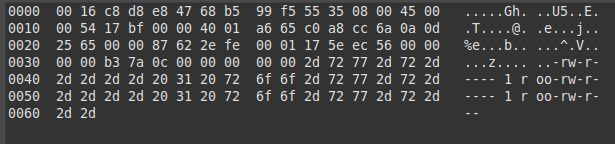

## smartcat3 (web)

This task was another web ping utility, similar to one from the teaser. We were able to submit a text, which would then
be passed to `ping` command, like so: `ping -c 1 OUR_TEXT`. This asks for shell command injection - it was not that easy 
though, since server filtered most metacharacters, such as `$&|` and others. Some special characters were allowed though - in
particular, `<>()`. Using those, and bash's so called "process substitution" (which we found in `man bash`), we were able to
execute commands like `ping -c 1 <(ls)`. Note that this did not give us any output on the web interface - the server returned
only whether the command succeeded or not.

First problem we had to deal with, was filtering of spaces. With `$` disallowed too, we were not able to use `${IFS}` or similar
constructs, but we could still redirect any text to any file, for example:
```
<(python<<<"print'%c%c'%(108,115)">/tmp/p4Rocks)
```
This command, when used in process substitution context, should create file `/tmp/p4Rocks` with `ls` in it (from ASCII codes).
Later, we could simply execute this script using `<(python</tmp/p4Rocks)`. We automatized this workflow in `doit.py`.

Right now, we were able to execute arbitrary command on the server, but we still did not have a way to read their output. 
The description of task, as we read it (as it turned out,
incorrectly, making our work harder), told us that all the ports on the server are closed. One of the ways to bypass this, is 
to use `ping` with payload - builting `ping` command has a nice feature: `-p pattern` makes a `ping` probe with selected
pattern. If we `ping` ourselves with pattern equal to output of the executed command, we are able to sniff it, and receive it.
Sample output, as seen in Wireshark, of `ls -al` (first 16 bytes):



You can clearly see `-rw-r----- 1 roo`, meaning that the first file was owned by root and had `-rw-r-----` permissions.

Trying the usual stuff, such as `ls -al /`, we found that there are two interesting files in the root directory: `flag` and 
`read_flag`. `flag` was not readable by us, but `read_flag` was executable. When ran, it showed output like:
```
Write "Give me a..." on my stdin, wait 2 seconds, and then write "... flag!". This is to make sure you can execute anything.
```
Well, since we had arbitrary code execution, we implemented this (`payload.py` was the final payload). The binary then read
the flag to us.
