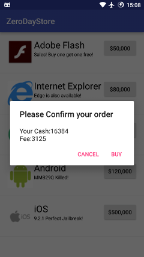
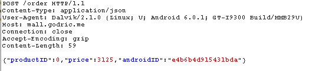

## zerodaystore (misc, 200)
	tldr; Add &price=0 to the end of the /pay request

[server.py](server.py.8c15b34d5e32243f5ed38c1b055bfd6f)
[zerodaystore.apk](zerodaystore.apk.7869c5b00cdf037273e39572fb1affdb)

We start off by decompiling the apk file using [javadecompilers](http://www.javadecompilers.com/apk). The code is pretty straight-forward, we can purchase 0dayexploits with our money. 

There is one problem though, we have no money and 0days are expensive! There are 2 solutions though. 

We can craft the requests ourselfed and send them directly to the recovered url or rebuild the apk with our money upped and exploits' prices lowered. 

After a purchase has been made a JSON request to `http://paygate.godric.me/order` with products price, id and our devices id is sent. 

The request is then corrected(price is set again from productid), signed and returned as a strings contacted by `&`. The response is then sent to `http://paygate.godric.me/order`

The server source tells us that we need to send a pay request with `price=0`, we could try sending a fake request directly at /pay but unfortunatelly the message is verified using rsa and sending edited requests results in error.

It turns out that the signing mechanism is broken, we can smuggle our `&price=0` after the message and sign. This way, we can have correctly-signed message and the price variable set to 0 which should give us the flag.

`BCTF{0DayL0veR1chGuy5}`
Bingo!