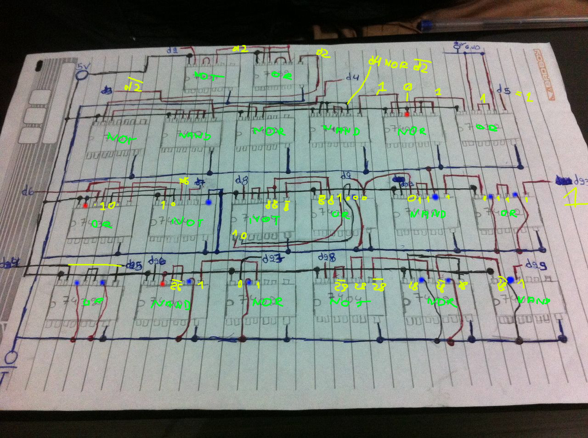

-------------------------------------------
[Eletronics] Eletronic Ballot Box Prototype - 50 points
-------------------------------------------

> A member of Project SKY has infiltrated into a Club recycling facility and got access to one of the first prototypes of what became, afterwards, an electronic ballot box (yes, all of this has been born because of the influence of the Club). We know that the prototype has the potential to unveil the true inner workings behind electronic voting, but we need your help. Add CTF-BR{} around the flag before submitting it.

In this task we were given an image of electronic circuit's hand sketch, and an Arduino code.
It seemed that the code was reading a number from keyboard, setting 8 pins to various states depending on the 
number, waiting for the hardware to respond, reading other 8 pins (and sometimes adjusting them by one), then
finally printing the values to serial port. Example for input=13:
```
      digitalWrite(2, HIGH);
      delay(10);
      digitalWrite(4, HIGH);
      delay(10);
      digitalWrite(6, HIGH);
      delay(10);
      digitalWrite(8, LOW);
      delay(10);
      digitalWrite(22, LOW);
      delay(10);
      digitalWrite(24, HIGH);
      delay(10);
      digitalWrite(26, LOW);
      delay(10);
      digitalWrite(28, HIGH);

      a = digitalRead(3);
      Serial.print(a);
      Serial.print('-');
      b = digitalRead(5);
      Serial.print(b);
      Serial.print('-');
      c = digitalRead(7);
      Serial.print(c);
      Serial.print('-');
      d = digitalRead(9);
      Serial.print(d);
      Serial.print('-');
      e = digitalRead(23) - 1;
      Serial.print(e);
      Serial.print('-');
      f = digitalRead(25);
      Serial.print(f);
      Serial.print('-');
      g = digitalRead(27) + 1;
      Serial.print(g);
      Serial.print('-');
      h = digitalRead(29) - 1;
      Serial.print(h);
      Serial.println(" ");
      delay(100);
```
Well, it seems all we needed to do was to reverse the hardware. Since it was only drawn on paper, we could do it by hand
only. Here's my attempt:



It seemed that each output is a simple function of just one of the inputs. We wrote a simple Python script (`doit.py`) to parse
the Arduino code and simulate the circuitry for every keyboard input. Running it gives us the flag: `FRAUDEToTAL`
