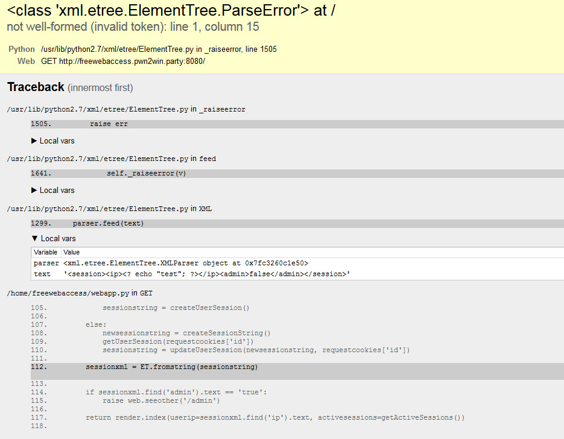
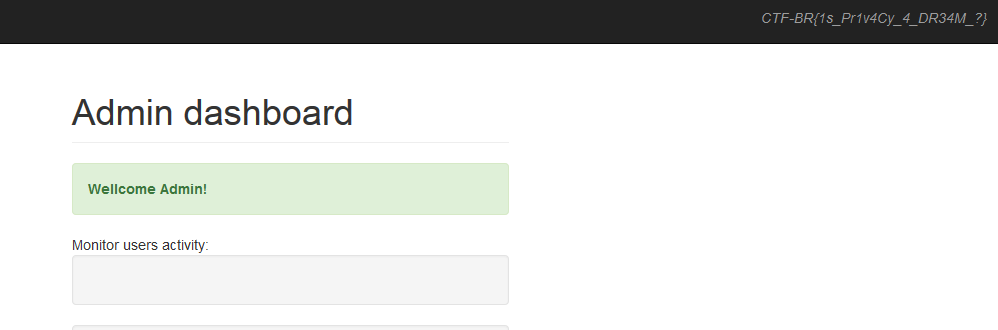

## Free Web Access (Web)

###ENG
[PL](#pl-version)

In the task we get access to a proxy-gate service.
The task description states that this gate is not really anonymous and that it stores some data.
However there is no registration nor accounts.
There is `/admin` subpage but it says that we're not the admin so we can't access it.
This implies that the page somehow checks who is the admin, and we need to fool this mechanism.

The website prints in a visible way our IP address and since it's a proxy service we come up with the idea to check how it will consider `X-Forwarded-For` header.
As we expected, the page prints the specified address as our IP.
We assumed that we just need to use localhost as our IP and this will get us past the admin check, but it didn't.

Then we figured that maybe we can put some code in our spoofed IP address and this way exploit the page.
We started with a standard PHP exploit: `<? echo "test"; ?>` which didn't work, since the page was running on Python.
But it did crash the page, showing us a very verbose error trace:

The interesting part was what crashed the XML parser:

`<session><ip><? echo "test"; ?></ip><admin>false</admin></session>`

It seems that the page creates a session string based on our data and then parses it via XML.

Therefore we can simply pass XML as our IP: `1.2.3.4</ip><admin>true</admin><ip>4.3.2.1`

Which in result will generate session XML:

`<session><ip>1.2.3.4</ip><admin>true</admin><ip>4.3.2.1</ip><admin>false</admin></session>`

And we expect this will be enough to get past the admin check. And it did:

`CTF-BR{1s_Pr1v4Cy_4_DR34M_?}`

###PL version

W zadaniu dostajemy dostęp do bramki-proxy.
W opisie zadania jest informacja że bramka nie jest wcale anonimowa i że agreguje dane.
Nie ma tam jednak żadej rejestracji ani logowania.
Jest coś pod adresem `/admin` ale pojawia sie informacja że nie jesteśmy administratorem.
To oznacza że istnieje mechanizm sprawdzania czy ktoś jest adminem i musimy go jakoś oszukać.

Strona w widocznym miejscu pokazuje nasz adres IP oraz jest to serwis proxy więc przychodzi nam na myśl sprawdzenie co się stanie jeśli podamy nagłówek `X-Forwarded-For`.
Zgodnie z naszymi oczekiwaniami strona pokazuje nasz zmieniony adres w miejscu adresu IP.
Początkowo liczyliśmy na to, że wystarczy udawać że nasze IP to localhost aby przejść test na admina, ale nie powiodło się to.

Następnie pomyśleliśmy, że może jesteśmy w stanie przemycić jakiś kod w naszym spoofowanym IP i w ten sposób exploitować stronę.
Zaczęliśmy od standardowego exploita na PHP: `<? echo "test"; ?>` który nie zadziałał, bo strona była w Pythonie.
Niemniej przypadkiem ten kod wysypał parser XML pokazując nam dość ładny trace:

Interesujące jest to co wysypało parser XML:

`<session><ip><? echo "test"; ?></ip><admin>false</admin></session>`

Wygląda na to, że strona tworzy sobie string sesji na podstawie naszych danych a następnie parsuje go jako XML.

To oznacza że możeym jako IP podać: `1.2.3.4</ip><admin>true</admin><ip>4.3.2.1`

Co utworzy string sesji:

`<session><ip>1.2.3.4</ip><admin>true</admin><ip>4.3.2.1</ip><admin>false</admin></session>`

Oczekiwaliśmy że taki string wystarczy do przejścia sprawdzenia uprawnień admina i się udało:

`CTF-BR{1s_Pr1v4Cy_4_DR34M_?}`
