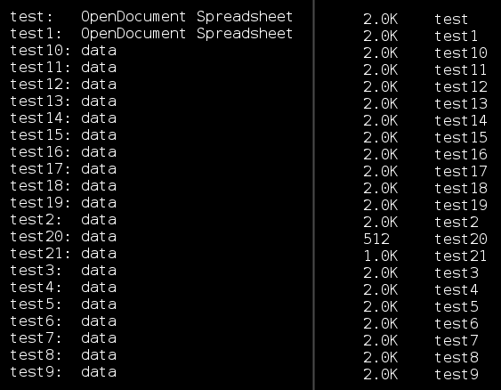
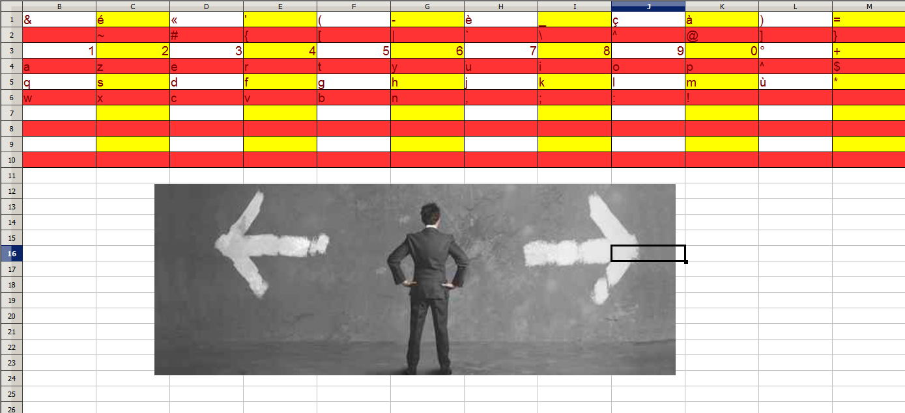

## Catch Me if You Can (Forensics, 100points)
	tl;dr concact even and odd data packets and read the flag from the table

Download [usb.pcap](usb.pcap), load it into wireshark. There is some data being sent(I don't know what is actually going on, you can tell me, I'd love to find out :).

`Leftover Captue Data` hold the raw data we want, filter the packets and the export them in order.

There are 22 files, `file` and `du` commands are extremly helpful here:

2 beginnings and 2 cut-offs, so we are now 99% sure that there are only 2 files being sent and maybe they are in order?

After noticing some intersecting texts and images that connect for example, `1-3-5` we try concacting odd files and even files together.

We're left with [even.ods](even.ods) and [odd.ods](odd.ods)

odd.ods has an interesting table in it:

It looks like a lookup table, so now we have to find the second half of the message.

After unpacking odd.ods we spot an interesting hex string in `content.xml`: `g6d5g5f2b6g5d3e4d4b3c5b6k2j5j5g4l2`

If we now use it with the lookup table we get: `ndh[wh3re1sw@lly]`

Bingo!

 * Fun fact, the hex string is actually in the spreadsheet in the bottom right corner ;)

