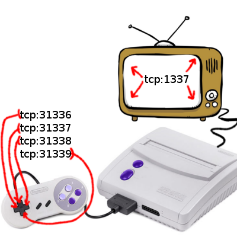

# A...mazeing (Network / PPC, 200) (16 solvers)
	Hi!. let's play old nes game. I just plugged this stuff to tcp ports for ya ...
	IP: amazeing.hackable.software

In this task we were told that there is a service runnning a game
and several TCP ports represent pressing various buttons on SNES
controller.

Connecting to the main server gave us game token and a position.
Connecting to other ports and sending the token made the main server
send us an OK message (or failed one). We quickly thought it may be 
some kind of maze or something, so we wrote a quick python script
(`doit.py`) which discovers whole board using DFS - note that we had 
to increase stack limit.

Drawing the board gives us the following image with the flag hidden on the bottom right corner:

