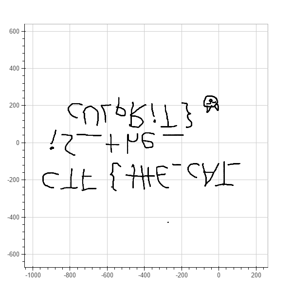

## For2 (Forensics, 200 points)
	tl;dr plot mouse movements from pcap

The given [pcap file](capture.pcap) contains usb mouse traffic, knowing that certain bytes in LeftoverCaptureData contain relative mouse movement, we can easily export the needed data and plot the movements: [plotMouse.py](plotMouse.py)

After running it we get a nice graph that has our upside down flag ;)



If our LeftoverCaptureData is "01234567", then

```
"01" = button pressed (0 = nothing, 1 = rpm, etc...)

"23" = signed x movement

"45" = signed y movement
```

We used python+bokeh for plotting, the unsigned to signed conversion was kinda tricky: `if x >= 1<<7: x -= 1<<8` 
