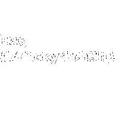

## Television (Misc)
	tl;dr Frames 231 and 463 contain parts of the flag

We're given a gif file, with what looks like static noise. Let's start by splitting it to png of each frame using imagemagick: 
`convert television.gif out.png`

That gave us 463 frames, our first guess was to read the noise as binary and search for the flag in all files but that didn't work out.

While implementing the previous idea, we've noticed that some pixels are not entirely white or black, a quick [script](search.py) told us that this happens only in 2 images. (231 and 463)

After taking a look at them we've noticed some interesting-looking arrangements:

Multiplying pixels of those 2 frames gave us an image, from which we could barely read the flag ;)

