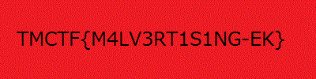

## Offensive 400 (Offensive, 400p)
	
###ENG
[PL](#pl-version)

Challenge starts on webpage which doesn't contain anything (or it looks like this). But after looking at the source code we spot interesting javacript file (named "ads.js"). After deobfuscation it looked like this:


```javascript
var mnt = function() {
	window.host = location.host;
	window.scheme = 'http://';
	window.getLicenseUrl = function() {
		console.log('getting lic url')
		var ax = document.getElementsByTagName('img');
		for (var i = 0; i < ax.length; i++) {
			if (-1 < ax[i].src.indexOf(host)) {
				return "http://" + host + "/images/creature.html?adv=900485&o=7927932&m=844431838&creature=629999&yf=INfzIJzt9bRSOkjD&click=${CLICK_URL_ENC}&type=js&pub=openxnat_1569894390&ord=1450370740864";
			}
		}
	};
	callbackOnLoad = function() {
		console.log('callback');
		var ax = xtr.responseText,
			mn = '/1/',
			cm = '%';
		var data = unescape(ax.substr(3 + ax.indexOf(mn)).replace(/[\S]{3}/g, function(b) {
			return cm + String.fromCharCode(b.charCodeAt(1) ^ ((scheme.length+1) * 6)) + b[2];
		}));
		var sta = document.createElement('sc' + 'rip' + 't');
		sta.innerHTML = data;
		document.body.appendChild(sta);
	};
	licenseRequest = function(command) {
		try {
			console.log('lic request');
			new ActiveXObject(command).GetLicenseFromURL([], getLicenseUrl().replace(scheme, 'http://'))
		} catch (et) {
			return et.number + ''
		}
	};
	suspicious = function() {
		with (xtr = (window.XDomainRequest && (new XDomainRequest) || (new XMLHttpRequest)))
			open('get', scheme + host + '/images/9J2bkcUJHUTTnOmcd56DXVmz.gif' + '?t=' + (new Date).getTime() + '&id=M8XIgp9526a9'), onload = callbackOnLoad, send()
	};
	document.security && 1 && suspicious();
};
mnt();
```

The file was bigger than that, but rest of file wasn't interesting. And I removed licence checking (with function 'licenseRequest'), because it wasn't letting me through. By the way, this code could work only under IE (because of ActiveXObject use).

Either way we can see that finally `<script>` element is created, and some decrypted data is put into it (gif is downloaded from fixed path, and than data is extracted from it).
I tried to decrypt that gif "manually" with python at first, but quickly I decided to do something simpler and I just replaced `sta.innerHTML = data` to `console.log(data)`.
Thanks to this, I reached second stage.

It looked like this:

```javascript
function getA(key) {
	return "3789d132";
}
function getB(key) {
	return "111780a7";
}
function getC(key) {
	return "fbff29";
}
function getD(key) {
	return "b2914faca2";
}

function main(func, idToProcess) {
    func(idToProcess)
}
var LvPmn, BisnmljH, window, JEUMZ;

gWRqmBVp = 'd';

var realMain = 
	(function(idToProcess) {
        TOu8g = kode;
        UA = 'asdfasdfasdf';
        if ((/(MSIE\ [0-7]\.\d+)/).test(UA)) {
            TOu8g = TOu8g.slice(0, -1);
        }
        TOu8g = TOu8g['replace'](/\s/g, '');
        plZla = kfSH(TOu8g, LvPmn);

        delete TOu8g;
        TOu8g = "";
        eval(plZla);
    });
LvPmn = 'oXUX5XqXRXoXGXfX';

function kfSH(YP, sr4ze) {
	var YLvEoLp = "";
	for (var i = 0; i < YP.length / 16; i++) {
		var HQDBqAdIqAP = RZTN(YP.substr((i*16), (i+1)*16), sr4ze);
		YLvEoLp += uyGi(parseInt(HQDBqAdIqAP.substr(8,8),16)) + uyGi(parseInt(HQDBqAdIqAP.substr(0,8),16));

	}
    return unescape(YLvEoLp);
}

function RZTN(SKOx, GHk7) {
	ret = "";
	for (var i = 0; i < SKOx.length; i+=2) {
		ret += (parseInt(SKOx.charAt(i) + SKOx.charAt(i+1), 16) ^ GHk7.charCodeAt(i)).toString(16);
	}
	return ret;
}

function tPC(nojMia) {
    var SKOx = nojMia.charCodeAt(0) + (nojMia.charCodeAt(1) << 8) + (nojMia.charCodeAt(2) << 16) + (nojMia.charCodeAt(3) << 24);
    return isNaN(SKOx) ? 0 : SKOx;
}

function uyGi(SKOx) {
    var nojMia = String.fromCharCode(SKOx & 255, SKOx >> 8 & 255, SKOx >> 16 & 255, SKOx >> 24 & 255);
    return nojMia;
}

main(realMain, 'oU5qRoGfenAszlAOKYBE')
```

This code is after small deobfuscation (I changed few function names, did beautification, etc) and cut few checks. Similary to previous stage, it was enough to cut few checks and add `console.log(plZla)` instead of `eval(plZla)`. Thanks to this I reached another stage.

```javascript
if (document.referrer != "") {
    var iframe = document.createElement("iframe");
    iframe.src = "depress-choose-opportunity-staircase.html";
    iframe.frameBorder = 0;
    iframe.width = "1";
    iframe.height = "1";
    document.body.appendChild(iframe);
};
```

This code is after serious deobfuscation and beautification. As you can see, This code only creates ifrema with `depress-choose-opportunity-staircase.html` injected.

So, what can we find under this address?

Something like this:

```javascript

window['gWRqmBVp'] = '1';

function xWait(xT) {
    var date = new Date();
    var tmpDate = null;
    do {
        tmpDate = new Date();
    } while (tmpDate - date < xT);
}

function xTrueA() {
    if (navigator.userAgent.indexOf('TMCTF') == -1 && navigator.appVersion.indexOf('ctf/') == -1) {
        return;
    }
    if (!!window.__IE_DEVTOOLBAR_CONSOLE_COMMAND_LINE || ('__BROWSERTOOLS_CONSOLE_SAFEFUNC' in window)) {
        return;
    }
    var mirtul = '1',
        ci = 'clsid:';
    var txt = '<object classid="' + ci + 'd27cdb6e-ae6d-11cf-96b8-444553540000" allowScriptAccess="always" width="1" height="1" id="23kjsdf">';
    txt = txt + '<param name="movie" value="swf/YWxUdHVpZm9uaQbmV6dndo.swf" />';
    txt = txt + '<param name="play" value="true"/>';
    txt = txt + '<param name="FlashVars" value="a=' + getA("EkRlsOP") + '&b=' + getB("KslLNbQsY") + '&c=' + getC("MpRuyAZx") + '&d=' + getD("QetIoPZ") + '" />';
    txt = txt + '<!--[if !IE]>-->';
    txt = txt + '<object type="application/x-shockwave-flash" data="swf/YWxUdHVpZm9uaQbmV6dndo.swf" allowScriptAccess=always width="1" height="1">';
    txt = txt + '<param name="movie" value="swf/YWxUdHVpZm9uaQbmV6dndo.swf" />';
    txt = txt + '<param name="play" value="true"/>';
    txt = txt + '<param name="FlashVars" value="a=' + getA("EkRlsOP") + '&b=' + getB("KslLNbQsY") + '&c=' + getC("MpRuyAZx") + '&d=' + getD("QetIoPZ") + '" />';
    txt = txt + '<!--<![endif]-->';
    txt = txt + '<!--[if !IE]>--></object><!--<![endif]-->';
    txt = txt + '</object>';
    try {;
    } catch (e) {}
    document.getElementsByTagName("q")[2].innerHTML = txt;
}
xTrueA();
xWait(1200);
```

Again, this is code after my deobfustation and beautification. So, as you can see, another javascript is being injected. There is some checks (i just removed them) and then some `<object>` is 
pasted into source code. So I downloaded that flash and decompiled. Most interesting fragment of it was:

```actionscript
package tmctf {
    import flash.events.*;
    import flash.utils.*;
    import flash.display.*;

    public class Main extends Sprite {

        private var lIIl11l:Class;

        public function Main(){
            this.lIIl11l = Main_lIIl11l;
            super();
            if (stage){
                this.init();
            } else {
                addEventListener(Event.ADDED_TO_STAGE, this.init);
            };
        }
        private function init(_arg1:Event=null):void{
            var _local2:Object = LoaderInfo(this.root.loaderInfo).parameters.a;
            var _local3:Object = LoaderInfo(this.root.loaderInfo).parameters.b;
            var _local4:Object = LoaderInfo(this.root.loaderInfo).parameters.c;
            var _local5:Object = LoaderInfo(this.root.loaderInfo).parameters.d;
            var _local6:String = (((_local4.toString() + _local3.toString()) + _local5.toString()) + _local2.toString());
            var _local7:ByteArray = (new this.lIIl11l() as ByteArray);
            var _local8:ByteArray = lI11lI.l1l1lI(_local7, _local6);
            this.removeEventListener(Event.ADDED_TO_STAGE, this.init);
            var _local9 = "flash.display.Loader";
            var _local10:Class = (getDefinitionByName(_local9) as Class);
            var _local11:Loader = new (_local10)();
            _local11.loadBytes(_local8);
            addChild(_local11);
        }

    }
}//package tmctf 

package tmctf {
    import mx.core.*;

    public class Main_lIIl11l extends ByteArrayAsset {

    }
}//package tmctf 

package tmctf {
    import flash.utils.*;

    public class lI11lI {

        public static function l1I1lI(_arg1:int):String{
            var _local2 = "";
            if (_arg1 == 1){
                _local2 = "6l.6o3a3d63.B3.y6t263.e5s6";
            };
            if (_arg1 == 2){
                _local2 = "2a.7d6d6.C23h3i.34l6d6";
            };
            if (_arg1 == 3){
                _local2 = "2r4.e6m3.o4v63e3E4v6e3n5t3L6.i3s6t3.4e6n4e3r6";
            };
            if (_arg1 == 4){
                _local2 = "6w3.4r7..i4t6e4.B6y.3t43e5";
            };
            if (_arg1 == 5){
                _local2 = "6p6.3o6s4i6t4i6.o6n";
            };
            if (_arg1 == 8){
                _local2 = "6l2e6n6.g4t4.3h6";
            };
            if (_arg1 == 9){
                _local2 = "3c6h4a..36r34C6o6d34e6A.43t6";
            };
            return (_local2.replace(new RegExp("[(1)\\(2)\\(3)\\(4)\\(5)\\(6)\\(7)\\(8)\\(9)\\(0)\\.]", "g"), ""));
        }
        public static function l1l1lI(_arg1:ByteArray, _arg2:String):ByteArray{
            var _local9:int;
            var _local3:* = 0;
            var _local4:ByteArray = new ByteArray();
            var _local5:String = l1I1lI(4);
            var _local6:String = l1I1lI(5);
            var _local7:String = l1I1lI(8);
            var _local8:String = l1I1lI(9);
            _local3 = 0;
            while (_local3 < _arg1[_local7]) {
                if (_local3 > (_arg2[_local7] - 1)){
                    _arg2 = (_arg2 + _arg2);
                };
                _local9 = (_arg1[_local3] ^ _arg2[_local8](_local3));
                var _local10 = _local4;
                _local10[_local5](_local9);
                _local3++;
            };
            _local4[_local6] = 0;
            return (_local4);
        }

    }
}//package tmctf
```

Obfuscation here was taken to another level - for example, strings are ovbfuscated (quite simply - function l1I1lI removes every digit from string, so for example "6l.6o3a3d63.B3.y6t263.e5s6" changes to "loadBytes"), and function and attribute accesses are obfusacated (for example xxx.length is changed to xxx['length'], and with both techniques combined, to xxx[l1I1lI("6l2e6n6.g4t4.3h6")].

After all, main loop is xoring blob extracted from resources with key (key is equal to getA() + getB() + getC() + getD() from previous stage).

I did it (after rewriting core to python), and I get... another swf. So I decompiled it, again... And that's what I get:

```actionscript
YOLO = function() {
    var vrsntk = "Akstoniskrov";
    
    var aeiVra = "saKrXVoiceda";
    
    var createTi = "wisTtentgaoemric";
    
    var mLtoonq = "qdnpokostELim";
    
    var getDate = "TettnagDotmeig";
    
    var getMonth = "ahsttnnogMotmeig";
    
    var toString = "BgknUimrPtXSloot";
    
    var length = "IhntAgenSeol";
    
    var fromCharCode = "teodSotCrrianhgCFmroormf";
    
    var eval = "Sloarvee";
    
    function Main()
    {
        var currDate = new Date();
        var someConst = 1862628783;
        var mnth = currDate[this.gs(getMonth)]();
        var dayy = currDate[this.gs(getDate)]();
        var modCurrMonth = 2;
        var modCurrDay = 30;
        var cheeeck = someConst[this.gs(toString)](2)[this.gs(length)] - 1;
        if(modCurrMonth * modCurrDay != cheeeck * 2)
        {
            console.log(modCurrMonth);
            console.log(modCurrDay);
            console.log(cheeeck * 2);
            console.log('nope');
            //return;
        }
        var arrWIthData = [122,109,126,44,104,109,120,109,49,46,66,93,98,(..........a lot of numbers.........),60,46,50,43,37,55];
        var resultxx = "";
        var getChrCode = this.gs(fromCharCode);
        var indexl = 0;
        while(indexl < arrWIthData.length)
        {
            resultxx = resultxx + String[getChrCode](arrWIthData[indexl] ^ modCurrMonth + 1 ^ modCurrDay);
            indexl++;
        }
        ej(resultxx,this.gs(eval));
    }
    
    function ej(param1, param2)
    {
        console.log(param2);
        console.log(param1);
        return;
        var _loc3_ = null;
        var _loc4_ = NaN;
        var _loc5_ = null;
        if(ExternalInterface.available)
        {
            _loc3_ = "s";
            _loc5_ = "n" + _loc3_;
            _loc5_ = "n" + _loc3_;
            return ExternalInterface.call(param2,param1);
        }
        return "";
    }
    
    function gs(param1)
    {
        var _loc2_ = "";
        var _loc3_ = param1.length;
        while(_loc3_ > 0 / 2)
        {
        _loc2_ = _loc2_ + param1["charAt"](_loc3_ - 1);
        _loc3_ = _loc3_ - 2;
        }
        return _loc2_;
    }

    Main()
}

YOLO()
```

This is code after *serious* deobfuscation - originally all names was obfuscated and there were no human-readable strings. As you can see, data is encrypted with current data, but luckili there was another check - month * day == 50 - that reduced number of possibilities to check to only few. Thanks to this, I could check every possibility by hand, and I got this:

```javasctipt
var data="NQn5pSETMmg6ysiZ7M7kImT1fb0cNrAV3cutq3Ht17idKv4......"
var key="nky";
var str=window.atob(data);
var s=[], j=0, x, res='';
for (var i=0; i<256; i++) {s[i]=i;};for (i=0; i<256; i++) {j=(j+s[i]+key.charCodeAt(i % key.length)) % 256;
x=s[i];s[i]=s[j];s[j]=x;};
i=0;j=0;for (var y=0; y<str.length; y++) {i=(i+1) % 256;j=(j+s[i]) % 256;x=s[i];s[i]=s[j];s[j]=x;res += String.fromCharCode(str.charCodeAt(y) ^ s[(s[i]+s[j]) % 256]);};
document.write('');
```

This code is after minimal deobfuscation. I had problems with executing this code (it showed me empty page and nothing more), but luckily friend from team executed this code and volia, we get the flag:



###PL version

Wchodzimy na stronę na której na pierwszy rzut oka nic nie ma (pseudo-blog). Rzuca się w oczy jedynie jakiś javascript na dole strony (nazwany "ads.js"). Po deobfuskacji wyglądał mniej więcej tak:


```javascript
var mnt = function() {
	window.host = location.host;
	window.scheme = 'http://';
	window.getLicenseUrl = function() {
		console.log('getting lic url')
		var ax = document.getElementsByTagName('img');
		for (var i = 0; i < ax.length; i++) {
			if (-1 < ax[i].src.indexOf(host)) {
				return "http://" + host + "/images/creature.html?adv=900485&o=7927932&m=844431838&creature=629999&yf=INfzIJzt9bRSOkjD&click=${CLICK_URL_ENC}&type=js&pub=openxnat_1569894390&ord=1450370740864";
			}
		}
	};
	callbackOnLoad = function() {
		console.log('callback');
		var ax = xtr.responseText,
			mn = '/1/',
			cm = '%';
		var data = unescape(ax.substr(3 + ax.indexOf(mn)).replace(/[\S]{3}/g, function(b) {
			return cm + String.fromCharCode(b.charCodeAt(1) ^ ((scheme.length+1) * 6)) + b[2];
		}));
		var sta = document.createElement('sc' + 'rip' + 't');
		sta.innerHTML = data;
		document.body.appendChild(sta);
	};
	licenseRequest = function(command) {
		try {
			console.log('lic request');
			new ActiveXObject(command).GetLicenseFromURL([], getLicenseUrl().replace(scheme, 'http://'))
		} catch (et) {
			return et.number + ''
		}
	};
	suspicious = function() {
		with (xtr = (window.XDomainRequest && (new XDomainRequest) || (new XMLHttpRequest)))
			open('get', scheme + host + '/images/9J2bkcUJHUTTnOmcd56DXVmz.gif' + '?t=' + (new Date).getTime() + '&id=M8XIgp9526a9'), onload = callbackOnLoad, send()
	};
	document.security && 1 && suspicious();
};
mnt();
```

Były jeszcze mniej ciekawe fragmenty, oraz sprawdzanie licencji przy pomocy funkcji `licenseRequest` (które wyciąłem żeby przejść dalej). Swoją drogą, kod miał szanse zadziałać tylko na IE (z uwagi na użycie ActiveXObject).

Tak czy inaczej, widać że ostatecznie tworzony jest element script, do którego są wrzucane jakieś zdeszyfrowane dane (pobierane z jakiegoś gifa), i który jest dorzucany do kodu strony i wykonywany.
Najpierw próbowałem ręcznie przepisać odszyfrowanie tych danych do pythona (co nie było trudne), ale po chwili zdecydowałem się na prostsze rozwiązanie - po prostu podmieniłem linijkę `sta.innerHTML = data` na `console.log(data)`.
Dzięki temu przeszliśmy do drugiego stage.

Wyglądał on mniej-więcej tak:

```javascript
function getA(key) {
	return "3789d132";
}
function getB(key) {
	return "111780a7";
}
function getC(key) {
	return "fbff29";
}
function getD(key) {
	return "b2914faca2";
}

function main(func, idToProcess) {
    func(idToProcess)
}
var LvPmn, BisnmljH, window, JEUMZ;

gWRqmBVp = 'd';

var realMain = 
	(function(idToProcess) {
        TOu8g = kode;
        UA = 'asdfasdfasdf';
        if ((/(MSIE\ [0-7]\.\d+)/).test(UA)) {
            TOu8g = TOu8g.slice(0, -1);
        }
        TOu8g = TOu8g['replace'](/\s/g, '');
        plZla = kfSH(TOu8g, LvPmn);

        delete TOu8g;
        TOu8g = "";
        eval(plZla);
    });
LvPmn = 'oXUX5XqXRXoXGXfX';

function kfSH(YP, sr4ze) {
	var YLvEoLp = "";
	for (var i = 0; i < YP.length / 16; i++) {
		var HQDBqAdIqAP = RZTN(YP.substr((i*16), (i+1)*16), sr4ze);
		YLvEoLp += uyGi(parseInt(HQDBqAdIqAP.substr(8,8),16)) + uyGi(parseInt(HQDBqAdIqAP.substr(0,8),16));

	}
    return unescape(YLvEoLp);
}

function RZTN(SKOx, GHk7) {
	ret = "";
	for (var i = 0; i < SKOx.length; i+=2) {
		ret += (parseInt(SKOx.charAt(i) + SKOx.charAt(i+1), 16) ^ GHk7.charCodeAt(i)).toString(16);
	}
	return ret;
}

function tPC(nojMia) {
    var SKOx = nojMia.charCodeAt(0) + (nojMia.charCodeAt(1) << 8) + (nojMia.charCodeAt(2) << 16) + (nojMia.charCodeAt(3) << 24);
    return isNaN(SKOx) ? 0 : SKOx;
}

function uyGi(SKOx) {
    var nojMia = String.fromCharCode(SKOx & 255, SKOx >> 8 & 255, SKOx >> 16 & 255, SKOx >> 24 & 255);
    return nojMia;
}

main(realMain, 'oU5qRoGfenAszlAOKYBE')
```

To kod już po mojej częściowej deobfuskacji (zmiana nazw kilku funkcji, beautifikacja, etc) i wycięciu checków. Tutaj podobnie jak w poprzednim przypadku, wystarczyło wyciąć kilka checków i dodać `console.log(plZla)` zamiast `eval(plZla)`.
Dzięki temu otrzymałem kolejny stage.

```javascript
if (document.referrer != "") {
    var iframe = document.createElement("iframe");
    iframe.src = "depress-choose-opportunity-staircase.html";
    iframe.frameBorder = 0;
    iframe.width = "1";
    iframe.height = "1";
    document.body.appendChild(iframe);
};
```

(To kod po deobfuskacji). Jak widać, po prostu tworzony jest iframe w który wstrzykiwane jest `depress-choose-opportunity-staircase.html`.

Co znajudje się pod tym adresem?

Mniej więcej taki kod:

```javascript

window['gWRqmBVp'] = '1';

function xWait(xT) {
    var date = new Date();
    var tmpDate = null;
    do {
        tmpDate = new Date();
    } while (tmpDate - date < xT);
}

function xTrueA() {
    if (navigator.userAgent.indexOf('TMCTF') == -1 && navigator.appVersion.indexOf('ctf/') == -1) {
        return;
    }
    if (!!window.__IE_DEVTOOLBAR_CONSOLE_COMMAND_LINE || ('__BROWSERTOOLS_CONSOLE_SAFEFUNC' in window)) {
        return;
    }
    var mirtul = '1',
        ci = 'clsid:';
    var txt = '<object classid="' + ci + 'd27cdb6e-ae6d-11cf-96b8-444553540000" allowScriptAccess="always" width="1" height="1" id="23kjsdf">';
    txt = txt + '<param name="movie" value="swf/YWxUdHVpZm9uaQbmV6dndo.swf" />';
    txt = txt + '<param name="play" value="true"/>';
    txt = txt + '<param name="FlashVars" value="a=' + getA("EkRlsOP") + '&b=' + getB("KslLNbQsY") + '&c=' + getC("MpRuyAZx") + '&d=' + getD("QetIoPZ") + '" />';
    txt = txt + '<!--[if !IE]>-->';
    txt = txt + '<object type="application/x-shockwave-flash" data="swf/YWxUdHVpZm9uaQbmV6dndo.swf" allowScriptAccess=always width="1" height="1">';
    txt = txt + '<param name="movie" value="swf/YWxUdHVpZm9uaQbmV6dndo.swf" />';
    txt = txt + '<param name="play" value="true"/>';
    txt = txt + '<param name="FlashVars" value="a=' + getA("EkRlsOP") + '&b=' + getB("KslLNbQsY") + '&c=' + getC("MpRuyAZx") + '&d=' + getD("QetIoPZ") + '" />';
    txt = txt + '<!--<![endif]-->';
    txt = txt + '<!--[if !IE]>--></object><!--<![endif]-->';
    txt = txt + '</object>';
    try {;
    } catch (e) {}
    document.getElementsByTagName("q")[2].innerHTML = txt;
}
xTrueA();
xWait(1200);
```

(To kod po deobfuskacji.  Jak widać, jest wstrzykiwany *kolejny* javascript. Znowu jakieś checki (które wyciąłem), a ostatecznie tworzony jest jakiś `<object>` zawierający flasha.

Pobrałem więc tego flasha i zdekompilowałem. Najciekawszy fragment poniżej:

```actionscript
package tmctf {
    import flash.events.*;
    import flash.utils.*;
    import flash.display.*;

    public class Main extends Sprite {

        private var lIIl11l:Class;

        public function Main(){
            this.lIIl11l = Main_lIIl11l;
            super();
            if (stage){
                this.init();
            } else {
                addEventListener(Event.ADDED_TO_STAGE, this.init);
            };
        }
        private function init(_arg1:Event=null):void{
            var _local2:Object = LoaderInfo(this.root.loaderInfo).parameters.a;
            var _local3:Object = LoaderInfo(this.root.loaderInfo).parameters.b;
            var _local4:Object = LoaderInfo(this.root.loaderInfo).parameters.c;
            var _local5:Object = LoaderInfo(this.root.loaderInfo).parameters.d;
            var _local6:String = (((_local4.toString() + _local3.toString()) + _local5.toString()) + _local2.toString());
            var _local7:ByteArray = (new this.lIIl11l() as ByteArray);
            var _local8:ByteArray = lI11lI.l1l1lI(_local7, _local6);
            this.removeEventListener(Event.ADDED_TO_STAGE, this.init);
            var _local9 = "flash.display.Loader";
            var _local10:Class = (getDefinitionByName(_local9) as Class);
            var _local11:Loader = new (_local10)();
            _local11.loadBytes(_local8);
            addChild(_local11);
        }

    }
}//package tmctf 

package tmctf {
    import mx.core.*;

    public class Main_lIIl11l extends ByteArrayAsset {

    }
}//package tmctf 

package tmctf {
    import flash.utils.*;

    public class lI11lI {

        public static function l1I1lI(_arg1:int):String{
            var _local2 = "";
            if (_arg1 == 1){
                _local2 = "6l.6o3a3d63.B3.y6t263.e5s6";
            };
            if (_arg1 == 2){
                _local2 = "2a.7d6d6.C23h3i.34l6d6";
            };
            if (_arg1 == 3){
                _local2 = "2r4.e6m3.o4v63e3E4v6e3n5t3L6.i3s6t3.4e6n4e3r6";
            };
            if (_arg1 == 4){
                _local2 = "6w3.4r7..i4t6e4.B6y.3t43e5";
            };
            if (_arg1 == 5){
                _local2 = "6p6.3o6s4i6t4i6.o6n";
            };
            if (_arg1 == 8){
                _local2 = "6l2e6n6.g4t4.3h6";
            };
            if (_arg1 == 9){
                _local2 = "3c6h4a..36r34C6o6d34e6A.43t6";
            };
            return (_local2.replace(new RegExp("[(1)\\(2)\\(3)\\(4)\\(5)\\(6)\\(7)\\(8)\\(9)\\(0)\\.]", "g"), ""));
        }
        public static function l1l1lI(_arg1:ByteArray, _arg2:String):ByteArray{
            var _local9:int;
            var _local3:* = 0;
            var _local4:ByteArray = new ByteArray();
            var _local5:String = l1I1lI(4);
            var _local6:String = l1I1lI(5);
            var _local7:String = l1I1lI(8);
            var _local8:String = l1I1lI(9);
            _local3 = 0;
            while (_local3 < _arg1[_local7]) {
                if (_local3 > (_arg2[_local7] - 1)){
                    _arg2 = (_arg2 + _arg2);
                };
                _local9 = (_arg1[_local3] ^ _arg2[_local8](_local3));
                var _local10 = _local4;
                _local10[_local5](_local9);
                _local3++;
            };
            _local4[_local6] = 0;
            return (_local4);
        }

    }
}//package tmctf
```

Tutaj obfuskacja poziom wyżej - np. stringi są obfuskowane (w prosty sposób - funkcja l1I1lI usuwa po prostu wszystkie cyfry ze stringa, czyli np. "6l.6o3a3d63.B3.y6t263.e5s6" zamienia się w "loadBytes"), oraz wywołania funkcji
i odwołania do atrybutów są obuskowane (np. xxx.length jest zamieniane na xxx['length'], a po połączeniu obu technik na xxx[l1I1lI("6l2e6n6.g4t4.3h6")].

Tak czy inaczej, ostatecznie główna pętla wykonuje xorowanie bloba wyciągniętego z resourców z kluczem (klucz jest równy getA() + getB() + getC() + getD() z poprzedniego stage).

Wykonałem to samo, i otrzymałem... kolejny swf. Zdekompilowałem i jego;

```actionscript
YOLO = function() {
    var vrsntk = "Akstoniskrov";
    
    var aeiVra = "saKrXVoiceda";
    
    var createTi = "wisTtentgaoemric";
    
    var mLtoonq = "qdnpokostELim";
    
    var getDate = "TettnagDotmeig";
    
    var getMonth = "ahsttnnogMotmeig";
    
    var toString = "BgknUimrPtXSloot";
    
    var length = "IhntAgenSeol";
    
    var fromCharCode = "teodSotCrrianhgCFmroormf";
    
    var eval = "Sloarvee";
    
    function Main()
    {
        var currDate = new Date();
        var someConst = 1862628783;
        var mnth = currDate[this.gs(getMonth)]();
        var dayy = currDate[this.gs(getDate)]();
        var modCurrMonth = 2;
        var modCurrDay = 30;
        var cheeeck = someConst[this.gs(toString)](2)[this.gs(length)] - 1;
        if(modCurrMonth * modCurrDay != cheeeck * 2)
        {
            console.log(modCurrMonth);
            console.log(modCurrDay);
            console.log(cheeeck * 2);
            console.log('nope');
            //return;
        }
        var arrWIthData = [122,109,126,44,104,109,120,109,49,46,66,93,98,(..........a lot of numbers.........),60,46,50,43,37,55];
        var resultxx = "";
        var getChrCode = this.gs(fromCharCode);
        var indexl = 0;
        while(indexl < arrWIthData.length)
        {
            resultxx = resultxx + String[getChrCode](arrWIthData[indexl] ^ modCurrMonth + 1 ^ modCurrDay);
            indexl++;
        }
        ej(resultxx,this.gs(eval));
    }
    
    function ej(param1, param2)
    {
        console.log(param2);
        console.log(param1);
        return;
        var _loc3_ = null;
        var _loc4_ = NaN;
        var _loc5_ = null;
        if(ExternalInterface.available)
        {
            _loc3_ = "s";
            _loc5_ = "n" + _loc3_;
            _loc5_ = "n" + _loc3_;
            return ExternalInterface.call(param2,param1);
        }
        return "";
    }
    
    function gs(param1)
    {
        var _loc2_ = "";
        var _loc3_ = param1.length;
        while(_loc3_ > 0 / 2)
        {
        _loc2_ = _loc2_ + param1["charAt"](_loc3_ - 1);
        _loc3_ = _loc3_ - 2;
        }
        return _loc2_;
    }

    Main()
}

YOLO()
```

(Tutaj wszystko już po SPOREJ deobfuskacji - oryginalnie nie było żadnych czytelnych dla człowieka stringów, wszystkie były zaszyfrowane przy pomocy gs(). Dane były szyfrowane obecną datą, ale był na szczęście dodatkowy check - miesiąc * dzień był równy 60, co ograniczyło ilość dat do sprawdzenia do ledwo kilku. Dzięki temu mogłem ręcznie sprawdzić wszystkie, i otrzymałem kolejny stage.

```javasctipt
var data="NQn5pSETMmg6ysiZ7M7kImT1fb0cNrAV3cutq3Ht17idKv4......"
var key="nky";
var str=window.atob(data);
var s=[], j=0, x, res='';
for (var i=0; i<256; i++) {s[i]=i;};for (i=0; i<256; i++) {j=(j+s[i]+key.charCodeAt(i % key.length)) % 256;
x=s[i];s[i]=s[j];s[j]=x;};
i=0;j=0;for (var y=0; y<str.length; y++) {i=(i+1) % 256;j=(j+s[i]) % 256;x=s[i];s[i]=s[j];s[j]=x;res += String.fromCharCode(str.charCodeAt(y) ^ s[(s[i]+s[j]) % 256]);};
document.write('');
```


(kod po minimalnej deobfuskacji). Miałem minimalny problem z uruchomieniem tego (pokazywało u mnie pustą stronę), ale na szcześćie kolega z drużyny wykonał ten kod i volia, otrzymaliśmy flagę.
