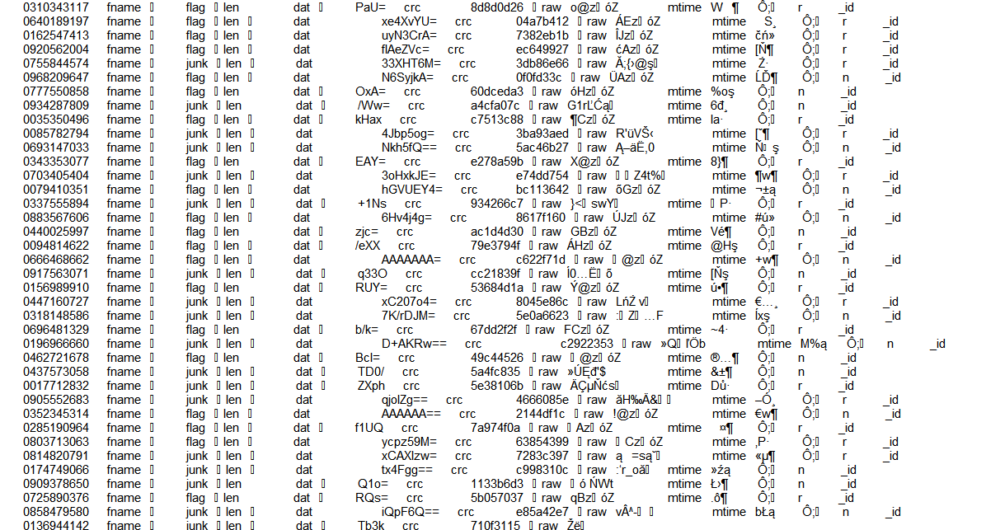

## One Bad Son (Forensics, 127p)
	tl;dr get data from bson, concact flag png

Supplied files:

[One_Bad_Son](One_Bad_Son)

It turns out that windbg formats binary data pretty well (cat/hexump/xxd output wasn't so clear):



After some googling, the data turned out to be a [BSON](https://en.wikipedia.org/wiki/BSON), a format that's used mainly in MongoDB. 

Our first guess was to try to load the dump into mongo using a recovery tool, but that turned out to be pointless.

Taking a step back, we've decided to convert the file to a standard JSON structured file using a python script:


``` python

import base64
import codecs
import bson

with codecs.open("./One_Bad_Son", "rb") as input_file:
    data = input_file.read()
    data = '\x72\x00\x00' + data
    loaded = bson.decode_all(data)
    with codecs.open("out.txt", "w") as output_file:
        output_file.write("[\n")
        for d in loaded:
            output_file.write(repr(d)+"\n")
        output_file.write("]\n")
```

This is how a single row looked like:

`{u'raw': 100000000000000L, u'len': 2, u'dat': u'iVA=', u'crc': u'c0f36009', u'fname': u'flag', u'mtime': datetime.datetime(48652, 6, 24, 12, 40, 10, 460000), u'_id': u'0262404638'}`

What's interesting, is that the data from 2 first rows sorted by `raw` fields creates `PNG`, so there's a png image encoded in that json!

So we have to decode all unique `flag` rows sorted by their `raw` field:

``` python
used_id = set()
ordered = sorted(loaded, key=lambda di: int(di['raw']))

flag_data = []
for d in ordered:
    id = d['raw']
    if id not in used_id and d['fname'] == 'flag':
        base = d['dat']
        decoded = base64.b64decode(base)
        flag_data.append(decoded)
        used_id.add(id)
with codecs.open("out.png", "wb") as output_file:
    output_file.write("".join(flag_data))
```


And the output is:


