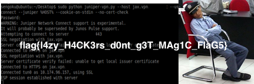

## Sleeping guard (Crypto, 50p)

###ENG
[PL](#pl-version)

In the task we get code:

```python
import base64
from twisted.internet import reactor, protocol
import os

PORT = 9013

import struct
def get_bytes_from_file(filename):  
    return open(filename, "rb").read()  
    
KEY = "[CENSORED]"

def length_encryption_key():
    return len(KEY)

def get_magic_png():
    image = get_bytes_from_file("./sleeping.png")
    encoded_string = base64.b64encode(image)
    key_len = length_encryption_key()
    print 'Sending magic....'
    if key_len != 12:
        return ''
    return encoded_string 
    

class MyServer(protocol.Protocol):
    def connectionMade(self):
        resp = get_magic_png()
        self.transport.write(resp)

class MyServerFactory(protocol.Factory):
    protocol = MyServer

factory = MyServerFactory()
reactor.listenTCP(PORT, factory)
reactor.run()
```

Which sends a png file over network, but we can see that there is some encryption involved and the key len is 12.
Connecting to the server returns the encrypted data.
12 bytes is a lot to brute-force, but we know it should be a png so we know the first 8 bytes of the header: `[137, 80, 78, 71, 13, 10, 26, 10]`.
We assumed this might be simply a XOR "encryption", therefore we can xor the first 8 bytes of the data we have with expected value and thus we get the xor key values.
Next we xored everything with 12 bytes key (missing 4 bytes were 0) and we checked if the file contents look reasonable, and they did!
There were some metadata that looked fine so our guess about the xor was correct.
We could now brute-force the missing 4 bytes, but we noticed that we have: `http://XXVXw3.org` in the data (X is some non-printable char).
We assumed this should be `http://www.w3.org` and therefore we could simply recover the missing 4 bytes of the key.
Then we just decrypted the whole file:

```python
import base64
import binascii
import codecs
import socket


def get_initial_key(decoded):
    expected = [137, 80, 78, 71, 13, 10, 26, 10]
    xor_key = [-1 for i in range(12)]
    for i in range(8):
        xor_key[i] = ord(decoded[i]) ^ expected[i]
    print(xor_key)


def decrypt(decoded):
    xor_key = [87, 111, 65, 104, 95, 65, 95, 75, 101, 121, 33, 63] # recovered key
    result = ""
    for i in range(len(decoded)):
        result += chr(ord(decoded[i]) ^ xor_key[i % 12])
    print(xor_key)
    return result


url = "crypto.chal.csaw.io"
port = 8000
s = socket.socket(socket.AF_INET, socket.SOCK_STREAM)
s.connect((url, port))
data = ""

while True:
    data += s.recv(9999)
    if data.endswith("VyYEJhvvHSvn"):
        break
try:
    decoded = base64.b64decode(data)
    decrypted = decrypt(decoded)
    with codecs.open("img.png", "wb") as output_file:
        output_file.write(decrypted)
except Exception as ex:
    print ex
```

and got:




###PL version

W zadaniu dostajemy kod:

```python
import base64
from twisted.internet import reactor, protocol
import os

PORT = 9013

import struct
def get_bytes_from_file(filename):  
    return open(filename, "rb").read()  
    
KEY = "[CENSORED]"

def length_encryption_key():
    return len(KEY)

def get_magic_png():
    image = get_bytes_from_file("./sleeping.png")
    encoded_string = base64.b64encode(image)
    key_len = length_encryption_key()
    print 'Sending magic....'
    if key_len != 12:
        return ''
    return encoded_string 
    

class MyServer(protocol.Protocol):
    def connectionMade(self):
        resp = get_magic_png()
        self.transport.write(resp)

class MyServerFactory(protocol.Factory):
    protocol = MyServer

factory = MyServerFactory()
reactor.listenTCP(PORT, factory)
reactor.run()
```

Który wysyła plik png przez sieć, ale zadanie sugeruje ze plik jest zaszyfrowany a klucz ma 12 bajtów.
Po połączeniu do serwera dostajemy dane.
12 bajtów to za dużo na brute-force ale wiemy ze to png więc znamy pierwsze 8 bajtów nagłówka: `[137, 80, 78, 71, 13, 10, 26, 10]`.
Następnie założyliśmy że to może być zwykłe "szyfrowanie" XORem więc xorowaliśmy pierwsze 8 bajtów danych z oczekiwanymi wartościami dla png żeby dostać klucz.
Następnie xorowaliśmy cały plik 12 bajtowym kluczem (brakujące 4 bajty jako 0) i sprawdziliśmy czy zawartość pliku ma sens, i miała!
W pliku były jakieś meta-dane które wyglądały sensownie, więc mieliśmy racje z XORem.
Teraz moglibyśmy brutować brakujące 4 bajty ale zauważyliśmy w meta-danych : `http://XXVXw3.org` (zamiast X były nie-drukowalne znaki).
Założyliśmy że miało to być `http://www.w3.org` więc mogliśmy po prostu odzyskać za pomocą xora brakujące 4 bajty klucza.
Następnie odszyfrowalismy cały plik:

```python
import base64
import binascii
import codecs
import socket


def get_initial_key(decoded):
    expected = [137, 80, 78, 71, 13, 10, 26, 10]
    xor_key = [-1 for i in range(12)]
    for i in range(8):
        xor_key[i] = ord(decoded[i]) ^ expected[i]
    print(xor_key)


def decrypt(decoded):
    xor_key = [87, 111, 65, 104, 95, 65, 95, 75, 101, 121, 33, 63] # recovered key
    result = ""
    for i in range(len(decoded)):
        result += chr(ord(decoded[i]) ^ xor_key[i % 12])
    print(xor_key)
    return result


url = "crypto.chal.csaw.io"
port = 8000
s = socket.socket(socket.AF_INET, socket.SOCK_STREAM)
s.connect((url, port))
data = ""

while True:
    data += s.recv(9999)
    if data.endswith("VyYEJhvvHSvn"):
        break
try:
    decoded = base64.b64decode(data)
    decrypted = decrypt(decoded)
    with codecs.open("img.png", "wb") as output_file:
        output_file.write(decrypted)
except Exception as ex:
    print ex
```

I dostaliśmy:

